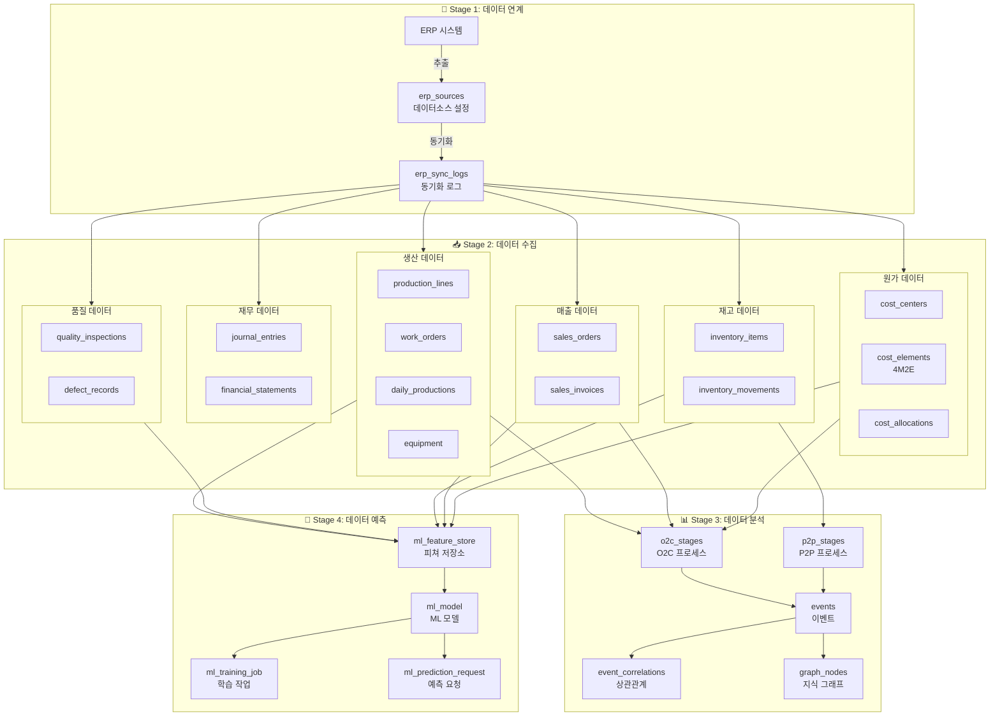

# AI & BI DeepSeeHub Platform 데이터베이스 테이블 정의서

## 📋 개요

- **데이터베이스**: PostgreSQL
- **네이밍 스타일**: snake_case
- **테이블 프리픽스**: 각 앱 별로 다름 (ml_, production_, quality_, business_process_ 등)
- **문자셋**: UTF-8
- **시간대**: UTC

---

## 🔄 데이터 파이프라인 아키텍처

```
┌─────────────────────────────────────────────────────────────────────────────┐
│                   AI & BI DeepSeeHub Platform 데이터 파이프라인                │
├─────────────────────────────────────────────────────────────────────────────┤
│                                                                             │
│  ┌──────────────┐    ┌──────────────┐    ┌──────────────┐    ┌──────────────┐│
│  │  데이터 연계   │ -> │  데이터 수집   │ -> │  데이터 분석   │ -> │  데이터 예측   ││
│  │ Data Linkage │    │ Data Collect  │    │ Data Analyze │    │ Data Predict ││
│  └──────────────┘    └──────────────┘    └──────────────┘    └──────────────┘│
│         │                   │                   │                   │        │
│         ▼                   ▼                   ▼                   ▼        │
│  ┌──────────────┐    ┌──────────────┐    ┌──────────────┐    ┌──────────────┐│
│  │ ERP 연동     │    │ 생산 데이터   │    │ 비즈니스 프로세스│   │ ML 모델      ││
│  │ 외부 시스템   │    │ 품질 데이터   │    │ 이벤트 분석   │    │ 예측 결과     ││
│  │              │    │ 재고/매출/재무│    │ 지식 그래프   │    │ 강화학습      ││
│  └──────────────┘    └──────────────┘    └──────────────┘    └──────────────┘│
│                                                                             │
└─────────────────────────────────────────────────────────────────────────────┘
```

### 데이터 파이프라인 단계별 상세

| 단계 | 설명 | 주요 테이블 | 처리 프로세스 |
|------|------|-----------|-------------|
| **1. 데이터 연계** | 외부 시스템 연결 및 동기화 | `erp_sources`, `erp_sync_logs`, `erp_mappings` | - ERP 연결 설정<br>- 데이터 추출<br>- 동기화 모니터링 |
| **2. 데이터 수집** | 비즈니스 데이터 수집 및 저장 | `production_*`, `quality_*`, `sales_*`, `inventory_*`, `financial_*`, `cost_*` | - 생산 실적 수집<br>- 품질 검사 데이터<br>- 재고/매출/재무 데이터<br>- 4M2E 원가 데이터 |
| **3. 데이터 분석** | 수집된 데이터 분석 및 패턴 발견 | `business_process_*`, `events_*`, `event_correlations`, `knowledge_graph_*` | - O2C/P2P 프로세스 분석<br>- 이벤트 상관관계 분석<br>- 지식 그래프 구축 |
| **4. 데이터 예측** | ML 기반 예측 및 의사결정 지원 | `ml_model`, `ml_training_job`, `ml_prediction_request`, `ml_feature_store`, `ml_experiment` | - 모델 학습<br>- 실시간 예측<br>- 강화학습 최적화<br>- 피쳐 관리 |

---

## 🗃️ 전체 테이블 목록 (파이프라인 순)

### 🔗 Stage 1: 데이터 연계 (Data Linkage)
#### ERP 연동 (erp_sync_)
1. `erp_sources` - ERP 데이터소스
2. `erp_sync_logs` - 동기화 로그
3. `erp_mappings` - 필드 매핑

### 📥 Stage 2: 데이터 수집 (Data Collection)
#### 생산 (production_)
1. `production_lines` - 생산 라인
2. `work_orders` - 작업 지시서
3. `daily_productions` - 일일 생산 실적
4. `equipment` - 설비

#### 품질 (quality_)
1. `quality_inspections` - 품질 검사
2. `defect_types` - 불량 유형
3. `defect_records` - 불량 기록
4. `customer_complaints` - 고객 클레임

#### 재고 (inventory_)
1. `inventory_items` - 재고 품목
2. `inventory_movements` - 재고 이동
3. `warehouse_locations` - 창고 위치

#### 매출 (sales_)
1. `sales_orders` - 매출 주문
2. `sales_invoices` - 매출 송장
3. `sales_performance` - 매출 실적

#### 재무 (financial_)
1. `accounting_periods` - 회계 기간
2. `journal_entries` - 전기
3. `ledger_accounts` - 원장
4. `financial_statements` - 재무제표

#### 원가 (cost_)
1. `cost_centers` - 코스트 센터
2. `cost_elements` - 코스트 요소 (4M2E)
3. `cost_allocations` - 코스 배분
4. `standard_costs` - 표준 원가

### 📊 Stage 3: 데이터 분석 (Data Analysis)
#### 비즈니스 프로세스 (business_process_)
1. `o2c_stages` - O2C 스테이지
2. `o2c_orders` - O2C 주문
3. `o2c_issues` - O2C 이슈
4. `p2p_stages` - P2P 스테이지
5. `p2p_orders` - P2P 주문

#### 이벤트 (events_)
1. `events` - 이벤트
2. `event_correlations` - 이벤트 상관관계
3. `alerts` - 알림

#### 지식 그래프 (knowledge_graph_)
1. `graph_nodes` - 그래프 노드
2. `graph_edges` - 그래프 엣지
3. `graph_traversals` - 탐색 기록

### 🤖 Stage 4: 데이터 예측 (Data Prediction)
#### ML 파이프라인 (ml_pipeline_)
1. `ml_model` - ML 모델
2. `ml_training_job` - 학습 작업
3. `ml_prediction_request` - 예측 요청
4. `ml_feature_store` - 피쳐 저장소
5. `ml_experiment` - ML 실험

#### 거버넌스 (governance_)
1. `approval_workflows` - 승인 워크플로우
2. `approval_requests` - 승인 요청
3. `audit_logs` - 감사 로그

---

## 📊 ERD (Entity Relationship Diagram)

```mermaid
erDiagram
    %% ========== Stage 1: 데이터 연계 ==========
    erp_sources ||--o{ erp_sync_logs : "records syncs"
    erp_sources ||--o{ erp_mappings : "has mappings"

    %% ========== Stage 2: 데이터 수집 ==========
    %% 생산
    production_lines ||--o{ work_orders : "receives"
    production_lines ||--o{ daily_productions : "tracks"
    production_lines ||--o{ equipment : "contains"

    %% 품질
    quality_inspections ||--o{ defect_records : "has defects"
    defect_types ||--o{ defect_records : "classifies"

    %% 재고
    warehouse_locations ||--o{ inventory_items : "stores"
    inventory_items ||--o{ inventory_movements : "tracks movement"

    %% 매출
    sales_orders ||--o{ sales_invoices : "generates"

    %% 재무
    accounting_periods ||--o{ journal_entries : "contains"
    ledger_accounts ||--o{ journal_entries : "records"

    %% 원가
    cost_centers ||--o{ cost_allocations : "receives"
    cost_elements ||--o{ cost_allocations : "allocates"
    cost_centers ||--o{ cost_centers : "parent-child"
    cost_elements ||--o{ standard_costs : "defines"

    %% ========== Stage 3: 데이터 분석 ==========
    %% 비즈니스 프로세스
    o2c_stages ||--o{ o2c_orders : "manages"
    o2c_stages ||--o{ o2c_issues : "reports"

    %% 이벤트
    events ||--o{ event_correlations : "correlates with"
    events ||--o{ alerts : "triggers"

    %% 지식 그래프
    graph_nodes ||--o{ graph_edges : "connects"
    graph_nodes ||--o{ graph_traversals : "visited in"

    %% ========== Stage 4: 데이터 예측 ==========
    %% ML 파이프라인
    ml_model ||--o{ ml_training_job : "trains"
    ml_model ||--o{ ml_prediction_request : "predicts"
    ml_model ||--o{ ml_experiment : "experiments"
    ml_feature_store ||--o{ ml_prediction_request : "provides features"

    %% 거버넌스
    approval_workflows ||--o{ approval_requests : "processes"
```



## 📊 테이블 간 데이터 흐름도



---

## 📊 상세 테이블 정의

### 🔗 Stage 1: 데이터 연계 (Data Linkage)

#### ERP 연동 (erp_sync_)

##### 1.1 erp_sources (ERP 데이터소스)
| 컬럼명 | 데이터타입 | 제약조건 | 설명 |
|--------|-----------|----------|------|
| id | INT | PK | ID |
| name | VARCHAR(100) | NOT NULL | 데이터소스명 |
| source_type | VARCHAR(20) | NOT NULL | 소스 유형 (YH, OTHER, API, FILE) |
| host | VARCHAR(255) | | 호스트 |
| port | INT | | 포트 |
| database | VARCHAR(100) | | 데이터베이스명 |
| schema | VARCHAR(100) | | 스키마 |
| username | VARCHAR(100) | | 사용자명 |
| password | VARCHAR(255) | | 비밀번호 (암호화) |
| table_mappings | JSON | DEFAULT {} | 테이블 매핑 |
| is_active | BOOLEAN | DEFAULT TRUE | 활성 여부 |
| last_sync | DATETIME | | 최종 동기 시간 |
| created_at | DATETIME | AUTO | 생성일 |
| updated_at | DATETIME | AUTO | 수정일 |

**인덱스**:
- `idx_erp_sources_type`: (source_type)
- `idx_erp_sources_active`: (is_active)

**예상 건수**: 5~20개

##### 1.2 erp_sync_logs (동기화 로그)
| 컬럼명 | 데이터타입 | 제약조건 | 설명 |
|--------|-----------|----------|------|
| id | BIGINT | PK | ID |
| source_id | INT | FK(erp_sources) | ERP 소스 ID |
| sync_type | VARCHAR(20) | NOT NULL | 동기화 유형 (full, incremental, real-time) |
| status | VARCHAR(20) | NOT NULL | 상태 (success, failed, running) |
| records_processed | INT | DEFAULT 0 | 처리 레코드 수 |
| records_failed | INT | DEFAULT 0 | 실패 레코드 수 |
| started_at | DATETIME | NOT NULL | 시작 시간 |
| completed_at | DATETIME | | 완료 시간 |
| error_message | TEXT | | 에러 메시지 |
| created_at | DATETIME | AUTO | 생성일 |

**인덱스**:
- `idx_erp_sync_source_status`: (source_id, status)
- `idx_erp_sync_started_at`: (started_at)

**예상 건수**: 10,000~100,000건

##### 1.3 erp_mappings (필드 매핑)
| 컬럼명 | 데이터타입 | 제약조건 | 설명 |
|--------|-----------|----------|------|
| id | BIGINT | PK | ID |
| source_id | INT | FK(erp_sources) | ERP 소스 ID |
| source_table | VARCHAR(100) | NOT NULL | 소스 테이블 |
| source_column | VARCHAR(100) | NOT NULL | 소스 컬럼 |
| target_table | VARCHAR(100) | NOT NULL | 타겟 테이블 |
| target_column | VARCHAR(100) | NOT NULL | 타겟 컬럼 |
| transformation_rule | TEXT | | 변환 규칙 |
| is_active | BOOLEAN | DEFAULT TRUE | 활성 여부 |
| created_at | DATETIME | AUTO | 생성일 |
| updated_at | DATETIME | AUTO | 수정일 |

**예상 건수**: 100~500개

---

### 📥 Stage 2: 데이터 수집 (Data Collection)

#### 생산 (production_)

##### 2.1 production_lines (생산 라인)
| 컬럼명 | 데이터타입 | 제약조건 | 설명 |
|--------|-----------|----------|------|
| id | INT | PK | ID |
| name | VARCHAR(100) | NOT NULL | 라인명 |
| code | VARCHAR(50) | UNIQUE, NOT NULL | 라인 코드 |
| location | VARCHAR(200) | | 위치 |
| capacity | INT | NOT NULL, MIN(0) | 일일 생산능력 |
| is_active | BOOLEAN | DEFAULT TRUE | 가동 여부 |
| created_at | DATETIME | AUTO | 생성일 |
| updated_at | DATETIME | AUTO | 수정일 |

**예상 건수**: 10~50개

##### 2.2 work_orders (작업 지시서)
| 컬럼명 | 데이터타입 | 제약조건 | 설명 |
|--------|-----------|----------|------|
| id | INT | PK | ID |
| order_number | VARCHAR(50) | UNIQUE, NOT NULL | 작업지시 번호 |
| production_line_id | INT | FK(production_lines) | 생산 라인 ID |
| product_name | VARCHAR(200) | NOT NULL | 제품명 |
| product_code | VARCHAR(100) | NOT NULL | 제품 코드 |
| target_quantity | INT | NOT NULL, MIN(1) | 목표 수량 |
| actual_quantity | INT | DEFAULT 0, MIN(0) | 실제 생산량 |
| defect_quantity | INT | DEFAULT 0, MIN(0) | 불량 수량 |
| status | VARCHAR(20) | DEFAULT 'planned' | 상태 (planned, in_progress, completed, cancelled) |
| planned_start | DATETIME | NOT NULL | 계획 시작일 |
| planned_end | DATETIME | NOT NULL | 계획 종료일 |
| actual_start | DATETIME | | 실제 시작일 |
| actual_end | DATETIME | | 실제 종료일 |
| notes | TEXT | | 비고 |
| created_at | DATETIME | AUTO | 생성일 |
| updated_at | DATETIME | AUTO | 수정일 |

**인덱스**:
- `idx_work_orders_line_status`: (production_line_id, status)
- `idx_work_orders_dates`: (planned_start, planned_end)

**예상 건수**: 1,000~5,000건

##### 2.3 daily_productions (일일 생산 실적)
| 컬럼명 | 데이터타입 | 제약조건 | 설명 |
|--------|-----------|----------|------|
| id | INT | PK | ID |
| production_line_id | INT | FK(production_lines) | 생산 라인 ID |
| production_date | DATE | NOT NULL | 생산일자 |
| target_quantity | INT | NOT NULL | 목표 생산량 |
| actual_quantity | INT | NOT NULL | 실제 생산량 |
| defect_quantity | INT | DEFAULT 0 | 불량 수량 |
| operating_hours | DECIMAL(5,2) | DEFAULT 0 | 가동 시간 |
| downtime_hours | DECIMAL(5,2) | DEFAULT 0 | 비가동 시간 |
| efficiency | DECIMAL(5,2) | DEFAULT 0 | 생산 효율(%) |
| created_at | DATETIME | AUTO | 생성일 |
| updated_at | DATETIME | AUTO | 수정일 |

**유니크**: (production_line_id, production_date)

**예상 건수**: 10,000~50,000건

##### 2.4 equipment (설비)
| 컬럼명 | 데이터타입 | 제약조건 | 설명 |
|--------|-----------|----------|------|
| id | INT | PK | ID |
| name | VARCHAR(100) | NOT NULL | 설비명 |
| code | VARCHAR(50) | UNIQUE, NOT NULL | 설비 코드 |
| production_line_id | INT | FK(production_lines) | 생산 라인 ID |
| manufacturer | VARCHAR(200) | | 제조사 |
| model | VARCHAR(200) | | 모델명 |
| purchase_date | DATE | | 구매일자 |
| status | VARCHAR(20) | DEFAULT 'idle' | 상태 (running, idle, maintenance, breakdown) |
| last_maintenance | DATE | | 최근 정비일 |
| next_maintenance | DATE | | 다음 정비 예정일 |
| created_at | DATETIME | AUTO | 생성일 |
| updated_at | DATETIME | AUTO | 수정일 |

**예상 건수**: 50~200개

---

#### 품질 (quality_)

##### 3.1 quality_inspections (품질 검사)
| 컬럼명 | 데이터타입 | 제약조건 | 설명 |
|--------|-----------|----------|------|
| id | INT | PK | ID |
| inspection_number | VARCHAR(50) | UNIQUE, NOT NULL | 검사 번호 |
| inspection_type | VARCHAR(20) | NOT NULL | 검사 유형 (incoming, in_process, final, outgoing) |
| product_name | VARCHAR(200) | NOT NULL | 제품명 |
| product_code | VARCHAR(100) | NOT NULL | 제품 코드 |
| lot_number | VARCHAR(100) | NOT NULL | LOT 번호 |
| inspection_date | DATE | NOT NULL | 검사일자 |
| inspector | VARCHAR(100) | NOT NULL | 검사자 |
| sample_size | INT | NOT NULL, MIN(1) | 샘플 수량 |
| defect_count | INT | DEFAULT 0, MIN(0) | 불량 수량 |
| result | VARCHAR(20) | NOT NULL | 검사 결과 (pass, fail, conditional) |
| notes | TEXT | | 비고 |
| created_at | DATETIME | AUTO | 생성일 |
| updated_at | DATETIME | AUTO | 수정일 |

**예상 건수**: 10,000~50,000건

##### 3.2 defect_types (불량 유형)
| 컬럼명 | 데이터타입 | 제약조건 | 설명 |
|--------|-----------|----------|------|
| id | INT | PK | ID |
| name | VARCHAR(100) | NOT NULL | 불량 유형명 |
| code | VARCHAR(50) | UNIQUE, NOT NULL | 코드 |
| description | TEXT | | 설명 |
| severity | VARCHAR(20) | NOT NULL | 심각도 (critical, major, minor) |
| created_at | DATETIME | AUTO | 생성일 |
| updated_at | DATETIME | AUTO | 수정일 |

**예상 건수**: 50~200개

##### 3.3 defect_records (불량 기록)
| 컬럼명 | 데이터타입 | 제약조건 | 설명 |
|--------|-----------|----------|------|
| id | INT | PK | ID |
| inspection_id | INT | FK(quality_inspections) | 검사 ID |
| defect_type_id | INT | FK(defect_types) | 불량 유형 ID |
| quantity | INT | NOT NULL, MIN(1) | 불량 수량 |
| location | VARCHAR(200) | | 발생 위치 |
| description | TEXT | | 상세 설명 |
| corrective_action | TEXT | | 시정 조치 |
| created_at | DATETIME | AUTO | 생성일 |
| updated_at | DATETIME | AUTO | 수정일 |

**예상 건수**: 20,000~100,000건

##### 3.4 customer_complaints (고객 클레임)
| 컬럼명 | 데이터타입 | 제약조건 | 설명 |
|--------|-----------|----------|------|
| id | INT | PK | ID |
| complaint_number | VARCHAR(50) | UNIQUE, NOT NULL | 클레임 번호 |
| customer_name | VARCHAR(200) | NOT NULL | 고객명 |
| product_name | VARCHAR(200) | NOT NULL | 제품명 |
| product_code | VARCHAR(100) | NOT NULL | 제품 코드 |
| complaint_date | DATE | NOT NULL | 접수일자 |
| description | TEXT | NOT NULL | 내용 |
| severity | VARCHAR(20) | NOT NULL | 심각도 (high, medium, low) |
| status | VARCHAR(20) | DEFAULT 'received' | 처리 상태 (received, investigating, resolving, resolved, closed) |
| assigned_to | VARCHAR(100) | | 담당자 |
| root_cause | TEXT | | 근본 원인 |
| corrective_action | TEXT | | 시정 조치 |
| preventive_action | TEXT | | 예방 조치 |
| resolution_date | DATE | | 완료일자 |
| created_at | DATETIME | AUTO | 생성일 |
| updated_at | DATETIME | AUTO | 수정일 |

**예상 건수**: 500~5,000건

---

#### 재고 (inventory_)

##### 4.1 inventory_items (재고 품목)
| 컬럼명 | 데이터타입 | 제약조건 | 설명 |
|--------|-----------|----------|------|
| id | INT | PK | ID |
| item_code | VARCHAR(50) | UNIQUE, NOT NULL | 품목 코드 |
| item_name | VARCHAR(200) | NOT NULL | 품목명 |
| warehouse_location_id | INT | FK(warehouse_locations) | 창고 위치 ID |
| category | VARCHAR(100) | | 카테고리 |
| unit | VARCHAR(20) | | 단위 |
| quantity_on_hand | INT | DEFAULT 0 | 현재고량 |
| reorder_point | INT | | 재주문 포인트 |
| unit_cost | DECIMAL(15,2) | NOT NULL | 단위당 원가 |
| created_at | DATETIME | AUTO | 생성일 |
| updated_at | DATETIME | AUTO | 수정일 |

**예상 건수**: 1,000~10,000개

##### 4.2 inventory_movements (재고 이동)
| 컬럼명 | 데이터타입 | 제약조건 | 설명 |
|--------|-----------|----------|------|
| id | BIGINT | PK | ID |
| item_id | INT | FK(inventory_items) | 품목 ID |
| movement_type | VARCHAR(20) | NOT NULL | 이동 유형 (receipt, issue, transfer, adjustment) |
| quantity | INT | NOT NULL | 수량 |
| reference | VARCHAR(100) | | 참조 번호 |
| movement_date | DATETIME | NOT NULL | 이동일 |
| notes | TEXT | | 비고 |
| created_at | DATETIME | AUTO | 생성일 |

**인덱스**:
- `idx_inventory_movements_item_date`: (item_id, movement_date)

**예상 건수**: 50,000~500,000건

##### 4.3 warehouse_locations (창고 위치)
| 컬럼명 | 데이터타입 | 제약조건 | 설명 |
|--------|-----------|----------|------|
| id | INT | PK | ID |
| code | VARCHAR(50) | UNIQUE, NOT NULL | 위치 코드 |
| name | VARCHAR(100) | NOT NULL | 위치명 |
| warehouse | VARCHAR(100) | | 창고명 |
| zone | VARCHAR(50) | | 존 |
| aisle | VARCHAR(20) | | 아일 |
| shelf | VARCHAR(20) | | 선반 |
| bin | VARCHAR(20) | | 빈 |
| capacity | INT | | 수용량 |
| is_active | BOOLEAN | DEFAULT TRUE | 활성 여부 |
| created_at | DATETIME | AUTO | 생성일 |
| updated_at | DATETIME | AUTO | 수정일 |

**예상 건수**: 100~500개

---

#### 매출 (sales_)

##### 5.1 sales_orders (매출 주문)
| 컬럼명 | 데이터타입 | 제약조건 | 설명 |
|--------|-----------|----------|------|
| id | BIGINT | PK | ID |
| order_number | VARCHAR(50) | UNIQUE, NOT NULL | 주문 번호 |
| customer_name | VARCHAR(200) | NOT NULL | 고객명 |
| customer_code | VARCHAR(50) | | 고객 코드 |
| order_date | DATE | NOT NULL | 주문일 |
| delivery_date | DATE | | 납품일 |
| status | VARCHAR(20) | DEFAULT 'pending' | 상태 (pending, confirmed, shipped, delivered, cancelled) |
| total_amount | BIGINT | NOT NULL | 총 금액(원) |
| notes | TEXT | | 비고 |
| created_at | DATETIME | AUTO | 생성일 |
| updated_at | DATETIME | AUTO | 수정일 |

**인덱스**:
- `idx_sales_orders_date`: (order_date)
- `idx_sales_orders_status`: (status)

**예상 건수**: 10,000~50,000건

##### 5.2 sales_invoices (매출 송장)
| 컬럼명 | 데이터타입 | 제약조건 | 설명 |
|--------|-----------|----------|------|
| id | BIGINT | PK | ID |
| invoice_number | VARCHAR(50) | UNIQUE, NOT NULL | 송장 번호 |
| order_id | BIGINT | FK(sales_orders) | 주문 ID |
| invoice_date | DATE | NOT NULL | 송장일 |
| due_date | DATE | | 지급 기한 |
| amount | BIGINT | NOT NULL | 금액(원) |
| tax_amount | BIGINT | DEFAULT 0 | 부가세(원) |
| status | VARCHAR(20) | DEFAULT 'pending' | 상태 (pending, paid, overdue) |
| created_at | DATETIME | AUTO | 생성일 |
| updated_at | DATETIME | AUTO | 수정일 |

**예상 건수**: 10,000~50,000건

##### 5.3 sales_performance (매출 실적)
| 컬럼명 | 데이터타입 | 제약조건 | 설명 |
|--------|-----------|----------|------|
| id | BIGINT | PK | ID |
| period_type | VARCHAR(20) | NOT NULL | 기간 유형 (daily, weekly, monthly, yearly) |
| period_value | VARCHAR(50) | NOT NULL | 기간 값 |
| revenue | BIGINT | NOT NULL | 매출(원) |
| orders_count | INT | DEFAULT 0 | 주문 수 |
| average_order_value | BIGINT | | 평균 주문 금액(원) |
| gross_profit | BIGINT | | 매출총이익(원) |
| gross_profit_margin | DECIMAL(5,2) | | 매출총이익율(%) |
| created_at | DATETIME | AUTO | 생성일 |
| updated_at | DATETIME | AUTO | 수정일 |

**유니크**: (period_type, period_value)

**예상 건수**: 1,000~5,000건

---

#### 재무 (financial_)

##### 6.1 accounting_periods (회계 기간)
| 컬럼명 | 데이터타입 | 제약조건 | 설명 |
|--------|-----------|----------|------|
| id | INT | PK | ID |
| period_code | VARCHAR(20) | UNIQUE, NOT NULL | 기간 코드 |
| period_type | VARCHAR(20) | NOT NULL | 기간 유형 (monthly, quarterly, yearly) |
| start_date | DATE | NOT NULL | 시작일 |
| end_date | DATE | NOT NULL | 종료일 |
| is_closed | BOOLEAN | DEFAULT FALSE | 마감 여부 |
| closed_at | DATETIME | | 마감일 |
| created_at | DATETIME | AUTO | 생성일 |
| updated_at | DATETIME | AUTO | 수정일 |

**예상 건수**: 100~500개

##### 6.2 journal_entries (전기)
| 컬럼명 | 데이터타입 | 제약조건 | 설명 |
|--------|-----------|----------|------|
| id | BIGINT | PK | ID |
| entry_number | VARCHAR(50) | UNIQUE, NOT NULL | 전표 번호 |
| period_id | INT | FK(accounting_periods) | 회계 기간 ID |
| account_id | INT | FK(ledger_accounts) | 계정 ID |
| entry_date | DATE | NOT NULL | 전기일 |
| debit_amount | BIGINT | DEFAULT 0 | 차변 금액(원) |
| credit_amount | BIGINT | DEFAULT 0 | 대변 금액(원) |
| description | TEXT | | 적요 |
| reference_type | VARCHAR(50) | | 참조 유형 |
| reference_id | VARCHAR(100) | | 참조 ID |
| created_at | DATETIME | AUTO | 생성일 |

**인덱스**:
- `idx_journal_entries_period`: (period_id)
- `idx_journal_entries_account`: (account_id)

**예상 건수**: 100,000~1,000,000건

##### 6.3 ledger_accounts (원장)
| 컬럼명 | 데이터타입 | 제약조건 | 설명 |
|--------|-----------|----------|------|
| id | INT | PK | ID |
| account_code | VARCHAR(20) | UNIQUE, NOT NULL | 계정 코드 |
| account_name | VARCHAR(100) | NOT NULL | 계정명 |
| account_type | VARCHAR(20) | NOT NULL | 계정 유형 (asset, liability, equity, revenue, expense) |
| parent_id | INT | FK(ledger_accounts) | 상위 계정 ID |
| level | INT | DEFAULT 1 | 계정 레벨 |
| is_active | BOOLEAN | DEFAULT TRUE | 활성 여부 |
| created_at | DATETIME | AUTO | 생성일 |
| updated_at | DATETIME | AUTO | 수정일 |

**예상 건수**: 200~1,000개

##### 6.4 financial_statements (재무제표)
| 컬럼명 | 데이터타입 | 제약조건 | 설명 |
|--------|-----------|----------|------|
| id | BIGINT | PK | ID |
| statement_type | VARCHAR(20) | NOT NULL | 재무제표 유형 (balance_sheet, income_statement, cash_flow) |
| period_id | INT | FK(accounting_periods) | 회계 기간 ID |
| line_item_code | VARCHAR(50) | NOT NULL | 항목 코드 |
| line_item_name | VARCHAR(100) | NOT NULL | 항목명 |
| amount | BIGINT | NOT NULL | 금액(원) |
| display_order | INT | DEFAULT 0 | 표시 순서 |
| created_at | DATETIME | AUTO | 생성일 |
| updated_at | DATETIME | AUTO | 수정일 |

**유니크**: (statement_type, period_id, line_item_code)

**예상 건수**: 5,000~20,000건

---

#### 원가 (cost_)

##### 7.1 cost_centers (코스트 센터)
| 컬럼명 | 데이터타입 | 제약조건 | 설명 |
|--------|-----------|----------|------|
| id | INT | PK | ID |
| code | VARCHAR(20) | UNIQUE, NOT NULL | 코스트 센터 코드 |
| name | VARCHAR(100) | NOT NULL | 코스트 센터명 |
| type | VARCHAR(20) | NOT NULL | 유형 (production, quality, sales, inventory, finance, equipment, etc.) |
| parent_id | INT | FK(cost_centers) | 상위 코스트 센터 ID |
| manager | VARCHAR(100) | | 담당자 |
| budget | BIGINT | | 예산 |
| created_at | DATETIME | AUTO | 생성일 |
| updated_at | DATETIME | AUTO | 수정일 |

**예상 건수**: 50~200개

##### 7.2 cost_elements (코스트 요소 - 4M2E)
| 컬럼명 | 데이터타입 | 제약조건 | 설명 |
|--------|-----------|----------|------|
| id | INT | PK | ID |
| code | VARCHAR(20) | UNIQUE, NOT NULL | 코스트 요소 코드 |
| dimension | VARCHAR(20) | NOT NULL | 차원 (MAN, MACHINE, MATERIAL, METHOD, ENVIRO, ENERGY) |
| name | VARCHAR(100) | NOT NULL | 코스트 요소명 |
| description | TEXT | | 설명 |
| unit | VARCHAR(20) | | 단위 |
| unit_cost | DECIMAL(15,2) | NOT NULL | 단위당 원가 |
| created_at | DATETIME | AUTO | 생성일 |
| updated_at | DATETIME | AUTO | 수정일 |

**예상 건수**: 100~500개

##### 7.3 cost_allocations (코스 배분)
| 컬럼명 | 데이터타입 | 제약조건 | 설명 |
|--------|-----------|----------|------|
| id | BIGINT | PK | ID |
| period_type | VARCHAR(20) | NOT NULL | 기간 유형 (monthly, yearly) |
| period_value | VARCHAR(20) | NOT NULL | 기간 값 |
| cost_center_id | INT | FK(cost_centers) | 코스트 센터 ID |
| cost_element_id | INT | FK(cost_elements) | 코스트 요소 ID |
| allocated_amount | BIGINT | NOT NULL | 배분 금액 |
| allocation_basis | VARCHAR(100) | | 배분 기준 |
| created_at | DATETIME | AUTO | 생성일 |
| updated_at | DATETIME | AUTO | 수정일 |

**인덱스**:
- `idx_cost_allocations_period`: (period_type, period_value)
- `idx_cost_allocations_center`: (cost_center_id)

**예상 건수**: 10,000~50,000건

##### 7.4 standard_costs (표준 원가)
| 컬럼명 | 데이터타입 | 제약조건 | 설명 |
|--------|-----------|----------|------|
| id | BIGINT | PK | ID |
| cost_element_id | INT | FK(cost_elements) | 코스트 요소 ID |
| item_code | VARCHAR(50) | | 품목 코드 |
| standard_quantity | DECIMAL(10,2) | NOT NULL | 표준 소요량 |
| standard_cost | DECIMAL(15,2) | NOT NULL | 표준 단가(원) |
| effective_date | DATE | NOT NULL | 적용 시작일 |
| expiry_date | DATE | | 적용 종료일 |
| created_at | DATETIME | AUTO | 생성일 |
| updated_at | DATETIME | AUTO | 수정일 |

**예상 건수**: 1,000~10,000건

---

### 📊 Stage 3: 데이터 분석 (Data Analysis)

#### 비즈니스 프로세스 (business_process_)

##### 8.1 o2c_stages (O2C 스테이지)
| 컬럼명 | 데이터타입 | 제약조건 | 설명 |
|--------|-----------|----------|------|
| id | INT | PK | ID |
| period_type | VARCHAR(20) | DEFAULT 'monthly' | 기간 유형 |
| stage_id | VARCHAR(50) | NOT NULL | 스테이지 ID (order_entry, production, delivery, billing, payment) |
| status | VARCHAR(20) | DEFAULT 'pending' | 상태 (pending, in_progress, completed, delayed) |
| order | INT | NOT NULL | 순서 |
| duration | INT | NOT NULL | 소요 시간(시간) |
| estimated_duration | INT | NOT NULL | 예상 시간(시간) |
| volume | INT | NOT NULL | 처리 건수 |
| value | BIGINT | NOT NULL | 처리 금액(원) |
| created_at | DATETIME | AUTO | 생성일 |
| updated_at | DATETIME | AUTO | 수정일 |

**유니크**: (period_type, stage_id)

**예상 건수**: 500~2,000건

##### 8.2 o2c_orders (O2C 주문)
| 컬럼명 | 데이터타입 | 제약조건 | 설명 |
|--------|-----------|----------|------|
| id | INT | PK | ID |
| order_id | VARCHAR(50) | UNIQUE, NOT NULL | 주문 ID |
| customer | VARCHAR(200) | NOT NULL | 고객명 |
| product | VARCHAR(200) | NOT NULL | 제품명 |
| quantity | INT | NOT NULL | 주문 수량 |
| amount | BIGINT | NOT NULL | 주문 금액(원) |
| stage | VARCHAR(20) | NOT NULL | 현재 스테이지 |
| status | VARCHAR(20) | NOT NULL | 상태 |
| order_date | DATE | NOT NULL | 주문일 |
| promised_date | DATE | NOT NULL | 약속 날짜 |
| actual_date | DATE | | 실제 날짜 |
| notes | TEXT | | 비고 |
| created_at | DATETIME | AUTO | 생성일 |
| updated_at | DATETIME | AUTO | 수정일 |

**예상 건수**: 5,000~20,000건

##### 8.3 o2c_issues (O2C 이슈)
| 컬럼명 | 데이터타입 | 제약조건 | 설명 |
|--------|-----------|----------|------|
| id | INT | PK | ID |
| stage_id | INT | FK(o2c_stages) | 스테이지 ID |
| issue_id | VARCHAR(50) | UNIQUE, NOT NULL | 이슈 ID |
| issue_type | VARCHAR(20) | NOT NULL | 이슈 유형 (delay, quality, cost, capacity) |
| severity | VARCHAR(20) | NOT NULL | 심각도 (low, medium, high) |
| description | TEXT | NOT NULL | 설명 |
| affected_orders | INT | DEFAULT 0 | 영향받은 주문 수 |
| resolved | BOOLEAN | DEFAULT FALSE | 해결 여부 |
| resolved_at | DATETIME | NULL | 해결일 |
| created_at | DATETIME | AUTO | 생성일 |
| updated_at | DATETIME | AUTO | 수정일 |

**예상 건수**: 500~5,000건

##### 8.4 p2p_stages (P2P 스테이지)
| 컬럼명 | 데이터타입 | 제약조건 | 설명 |
|--------|-----------|----------|------|
| id | INT | PK | ID |
| period_type | VARCHAR(20) | DEFAULT 'monthly' | 기간 유형 |
| stage_id | VARCHAR(50) | NOT NULL | 스테이지 ID (requisition, quotation, po_creation, receiving, invoice, payment) |
| status | VARCHAR(20) | DEFAULT 'pending' | 상태 |
| order | INT | NOT NULL | 순서 |
| duration | INT | NOT NULL | 소요 시간(시간) |
| estimated_duration | INT | NOT NULL | 예상 시간(시간) |
| volume | INT | NOT NULL | 처리 건수 |
| value | BIGINT | NOT NULL | 처리 금액(원) |
| created_at | DATETIME | AUTO | 생성일 |
| updated_at | DATETIME | AUTO | 수정일 |

**예상 건수**: 500~2,000건

##### 8.5 p2p_orders (P2P 주문)
| 컬럼명 | 데이터타입 | 제약조건 | 설명 |
|--------|-----------|----------|------|
| id | INT | PK | ID |
| order_id | VARCHAR(50) | UNIQUE, NOT NULL | 주문 ID |
| supplier | VARCHAR(200) | NOT NULL | 공급업체명 |
| material | VARCHAR(200) | NOT NULL | 자재명 |
| quantity | INT | NOT NULL | 주문 수량 |
| amount | BIGINT | NOT NULL | 주문 금액(원) |
| stage | VARCHAR(20) | NOT NULL | 현재 스테이지 |
| status | VARCHAR(20) | NOT NULL | 상태 |
| order_date | DATE | NOT NULL | 주문일 |
| promised_date | DATE | NOT NULL | 약속 날짜 |
| actual_date | DATE | | 실제 날짜 |
| notes | TEXT | | 비고 |
| created_at | DATETIME | AUTO | 생성일 |
| updated_at | DATETIME | AUTO | 수정일 |

**예상 건수**: 5,000~20,000건

---

#### 이벤트 (events_)

##### 9.1 events (이벤트)
| 컬럼명 | 데이터타입 | 제약조건 | 설명 |
|--------|-----------|----------|------|
| id | BIGINT | PK | ID |
| event_id | VARCHAR(100) | UNIQUE, NOT NULL | 이벤트 ID |
| event_type | VARCHAR(50) | NOT NULL | 이벤트 유형 |
| severity | VARCHAR(20) | NOT NULL | 심각도 (low, medium, high, critical) |
| title | VARCHAR(200) | NOT NULL | 제목 |
| description | TEXT | NOT NULL | 설명 |
| source | VARCHAR(100) | | 발생원 |
| status | VARCHAR(20) | DEFAULT 'open' | 상태 (open, investigating, resolved, closed) |
| occurred_at | DATETIME | NOT NULL | 발생 시간 |
| resolved_at | DATETIME | | 해결 시간 |
| assigned_to | VARCHAR(100) | | 담당자 |
| created_at | DATETIME | AUTO | 생성일 |
| updated_at | DATETIME | AUTO | 수정일 |

**인덱스**:
- `idx_events_type_severity`: (event_type, severity)
- `idx_events_status`: (status)
- `idx_events_occurred_at`: (occurred_at)

**예상 건수**: 1,000~10,000건

##### 9.2 event_correlations (이벤트 상관관계)
| 컬럼명 | 데이터타입 | 제약조건 | 설명 |
|--------|-----------|----------|------|
| id | BIGINT | PK | ID |
| event_id_1 | BIGINT | FK(events) | 이벤트 ID 1 |
| event_id_2 | BIGINT | FK(events) | 이벤트 ID 2 |
| correlation_score | FLOAT | NOT NULL | 상관 점수 |
| relationship_type | VARCHAR(50) | NOT NULL | 관계 유형 (causal, coincidental, temporal) |
| discovered_at | DATETIME | AUTO | 발견 시간 |
| created_at | DATETIME | AUTO | 생성일 |

**인덱스**:
- `idx_event_correlations_score`: (correlation_score)

**예상 건수**: 5,000~50,000건

##### 9.3 alerts (알림)
| 컬럼명 | 데이터타입 | 제약조건 | 설명 |
|--------|-----------|----------|------|
| id | BIGINT | PK | ID |
| alert_id | VARCHAR(100) | UNIQUE, NOT NULL | 알림 ID |
| event_id | BIGINT | FK(events) | 이벤트 ID |
| alert_type | VARCHAR(50) | NOT NULL | 알림 유형 |
| severity | VARCHAR(20) | NOT NULL | 심각도 |
| title | VARCHAR(200) | NOT NULL | 제목 |
| message | TEXT | NOT NULL | 메시지 |
| status | VARCHAR(20) | DEFAULT 'pending' | 상태 (pending, sent, acknowledged, resolved) |
| sent_at | DATETIME | | 발송 시간 |
| acknowledged_at | DATETIME | | 확인 시간 |
| created_at | DATETIME | AUTO | 생성일 |
| updated_at | DATETIME | AUTO | 수정일 |

**예상 건수**: 5,000~50,000건

---

#### 지식 그래프 (knowledge_graph_)

##### 10.1 graph_nodes (그래프 노드)
| 컬럼명 | 데이터타입 | 제약조건 | 설명 |
|--------|-----------|----------|------|
| id | BIGINT | PK | ID |
| node_id | VARCHAR(100) | UNIQUE, NOT NULL | 노드 ID |
| node_type | VARCHAR(50) | NOT NULL | 노드 유형 (entity, event, attribute, etc.) |
| label | VARCHAR(200) | NOT NULL | 라벨 |
| properties | JSON | DEFAULT {} | 속성 |
| x | FLOAT | | X 좌표 |
| y | FLOAT | | Y 좌표 |
| created_at | DATETIME | AUTO | 생성일 |
| updated_at | DATETIME | AUTO | 수정일 |

**인덱스**:
- `idx_graph_nodes_type`: (node_type)

**예상 건수**: 10,000~100,000건

##### 10.2 graph_edges (그래프 엣지)
| 컬럼명 | 데이터타입 | 제약조건 | 설명 |
|--------|-----------|----------|------|
| id | BIGINT | PK | ID |
| source_id | BIGINT | FK(graph_nodes) | 소스 노드 ID |
| target_id | BIGINT | FK(graph_nodes) | 타겟 노드 ID |
| edge_type | VARCHAR(50) | NOT NULL | 엣지 유형 (causes, influences, relates_to) |
| weight | FLOAT | DEFAULT 1.0 | 가중치 |
| properties | JSON | DEFAULT {} | 속성 |
| created_at | DATETIME | AUTO | 생성일 |

**인덱스**:
- `idx_graph_edges_source`: (source_id)
- `idx_graph_edges_target`: (target_id)
- `idx_graph_edges_type`: (edge_type)

**예상 건수**: 50,000~500,000건

##### 10.3 graph_traversals (탐색 기록)
| 컬럼명 | 데이터타입 | 제약조건 | 설명 |
|--------|-----------|----------|------|
| id | BIGINT | PK | ID |
| traversal_id | VARCHAR(100) | UNIQUE, NOT NULL | 탐색 ID |
| start_node_id | BIGINT | FK(graph_nodes) | 시작 노드 ID |
| end_node_id | BIGINT | FK(graph_nodes) | 종료 노드 ID |
| path | JSON | DEFAULT [] | 경로 |
| traversal_depth | INT | DEFAULT 1 | 탐색 깊이 |
| nodes_visited | INT | DEFAULT 0 | 방문 노드 수 |
| execution_time_ms | INT | | 실행 시간(ms) |
| created_at | DATETIME | AUTO | 생성일 |

**예상 건수**: 10,000~100,000건

---

### 🤖 Stage 4: 데이터 예측 (Data Prediction)

#### ML 파이프라인 (ml_pipeline_)

##### 11.1 ml_model (ML 모델)
| 컬럼명 | 데이터타입 | 제약조건 | 설명 |
|--------|-----------|----------|------|
| id | UUID | PK | 모델 고유 ID |
| name | VARCHAR(200) | NOT NULL | 모델명 |
| code | VARCHAR(100) | UNIQUE, NOT NULL | 모델 코드 |
| version | VARCHAR(50) | DEFAULT '1.0.0' | 버전 |
| model_type | VARCHAR(50) | NOT NULL | 모델 유형 (regression, classification, time_series, clustering, anomaly_detection, forecasting) |
| algorithm | VARCHAR(100) | NOT NULL | 알고리즘 |
| target_feature | VARCHAR(100) | NOT NULL | 타겟 피처 |
| features | JSON | DEFAULT [] | 피처 목록 |
| model_file | FILE | NULL | 모델 파일 경로 |
| hyperparameters | JSON | DEFAULT {} | 하이퍼파라미터 |
| metrics | JSON | DEFAULT {} | 성능 지표 |
| trained_at | DATETIME | NULL | 학습일 |
| training_samples | INT | DEFAULT 0 | 학습 데이터 수 |
| training_time_ms | INT | DEFAULT 0 | 학습 시간(ms) |
| status | VARCHAR(20) | DEFAULT 'training' | 상태 (training, trained, deployed, failed, archived) |
| error_message | TEXT | | 에러 메시지 |
| is_deployed | BOOLEAN | DEFAULT FALSE | 배포 여부 |
| deployed_at | DATETIME | NULL | 배포일 |
| description | TEXT | | 설명 |
| created_by | VARCHAR(100) | | 생성자 |
| created_at | DATETIME | AUTO | 생성일 |
| updated_at | DATETIME | AUTO | 수정일 |

**인덱스**:
- `idx_ml_model_type_status`: (model_type, status)
- `idx_ml_model_code_version`: (code, version)
- `idx_ml_model_is_deployed`: (is_deployed)

**예상 건수**: 100~500개

##### 11.2 ml_training_job (학습 작업)
| 컬럼명 | 데이터타입 | 제약조건 | 설명 |
|--------|-----------|----------|------|
| id | UUID | PK | 작업 고유 ID |
| model_id | UUID | FK(ml_model) | ML 모델 ID |
| job_name | VARCHAR(200) | NOT NULL | 작업명 |
| job_type | VARCHAR(50) | NOT NULL | 작업 유형 |
| parameters | JSON | DEFAULT {} | 학습 파라미터 |
| data_source | VARCHAR(200) | | 데이터 소스 |
| status | VARCHAR(20) | DEFAULT 'pending' | 상태 (pending, running, completed, failed, cancelled) |
| progress | INT | DEFAULT 0 | 진행률(%) |
| current_step | VARCHAR(100) | | 현재 단계 |
| result | JSON | NULL | 결과 |
| error_message | TEXT | | 에러 메시지 |
| started_at | DATETIME | NULL | 시작일 |
| completed_at | DATETIME | NULL | 완료일 |
| duration_ms | INT | NULL | 실행 시간(ms) |
| cpu_usage | FLOAT | NULL | CPU 사용률(%) |
| memory_usage_mb | FLOAT | NULL | 메모리 사용량(MB) |
| created_at | DATETIME | AUTO | 생성일 |

**인덱스**:
- `idx_ml_training_status_created`: (status, -created_at)
- `idx_ml_training_model_created`: (model_id, -created_at)

**예상 건수**: 1,000~10,000건

##### 11.3 ml_prediction_request (예측 요청)
| 컬럼명 | 데이터타입 | 제약조건 | 설명 |
|--------|-----------|----------|------|
| id | UUID | PK | 요청 고유 ID |
| model_id | UUID | FK(ml_model) | ML 모델 ID |
| request_id | VARCHAR(100) | UNIQUE, NOT NULL | 요청 ID |
| input_data | JSON | NOT NULL | 입력 데이터 |
| prediction_result | JSON | DEFAULT {} | 예측 결과 |
| inference_time_ms | INT | | 추론 시간(ms) |
| requested_by | VARCHAR(100) | | 요청자 |
| request_source | VARCHAR(100) | | 요청 소스 |
| created_at | DATETIME | AUTO | 생성일 |

**인덱스**:
- `idx_ml_prediction_model_created`: (model_id, -created_at)
- `idx_ml_prediction_request_id`: (request_id)

**예상 건수**: 10,000~100,000건

##### 11.4 ml_feature_store (피쳐 저장소)
| 컬럼명 | 데이터타입 | 제약조건 | 설명 |
|--------|-----------|----------|------|
| id | UUID | PK | 피쳐 고유 ID |
| name | VARCHAR(100) | UNIQUE, NOT NULL | 피쳐명 |
| display_name | VARCHAR(200) | NOT NULL | 표시명 |
| feature_type | VARCHAR(20) | NOT NULL | 피쳐 유형 (numerical, categorical, text, datetime, boolean) |
| source_table | VARCHAR(100) | NOT NULL | 소스 테이블 |
| source_column | VARCHAR(100) | NOT NULL | 소스 컬럼 |
| description | TEXT | | 설명 |
| data_type | VARCHAR(50) | | 데이터 타입 |
| statistics | JSON | DEFAULT {} | 통계 정보 (mean, std, min, max) |
| transformation | JSON | DEFAULT {} | 변환 방법 |
| is_active | BOOLEAN | DEFAULT TRUE | 활성 여부 |
| created_at | DATETIME | AUTO | 생성일 |
| updated_at | DATETIME | AUTO | 수정일 |

**인덱스**:
- `idx_ml_feature_name`: (name)
- `idx_ml_feature_type`: (feature_type)
- `idx_ml_feature_source`: (source_table)

**예상 건수**: 200~1,000개

##### 11.5 ml_experiment (ML 실험)
| 컬럼명 | 데이터타입 | 제약조건 | 설명 |
|--------|-----------|----------|------|
| id | UUID | PK | 실험 고유 ID |
| name | VARCHAR(200) | NOT NULL | 실험명 |
| description | TEXT | | 설명 |
| parameters | JSON | DEFAULT {} | 파라미터 |
| metrics | JSON | DEFAULT {} | 지표 |
| model_id | UUID | FK(ml_model) | ML 모델 ID |
| status | VARCHAR(20) | DEFAULT 'running' | 상태 (running, completed, failed) |
| artifacts | JSON | DEFAULT {} | 아티팩트 |
| logs | TEXT | | 로그 |
| started_at | DATETIME | AUTO | 시작일 |
| completed_at | DATETIME | NULL | 완료일 |

**예상 건수**: 1,000~10,000건

---

#### 거버넌스 (governance_)

##### 12.1 approval_workflows (승인 워크플로우)
| 컬럼명 | 데이터타입 | 제약조건 | 설명 |
|--------|-----------|----------|------|
| id | INT | PK | ID |
| workflow_code | VARCHAR(50) | UNIQUE, NOT NULL | 워크플로우 코드 |
| name | VARCHAR(100) | NOT NULL | 워크플로우명 |
| description | TEXT | | 설명 |
| version | VARCHAR(20) | DEFAULT '1.0' | 버전 |
| approvers | JSON | NOT NULL | 승인자 목록 |
| steps | JSON | NOT NULL | 스텝 정의 |
| is_active | BOOLEAN | DEFAULT TRUE | 활성 여부 |
| created_at | DATETIME | AUTO | 생성일 |
| updated_at | DATETIME | AUTO | 수정일 |

**예상 건수**: 20~100개

##### 12.2 approval_requests (승인 요청)
| 컬럼명 | 데이터타입 | 제약조건 | 설명 |
|--------|-----------|----------|------|
| id | BIGINT | PK | ID |
| request_id | VARCHAR(100) | UNIQUE, NOT NULL | 요청 ID |
| workflow_id | INT | FK(approval_workflows) | 워크플로우 ID |
| requester | VARCHAR(100) | NOT NULL | 요청자 |
| title | VARCHAR(200) | NOT NULL | 제목 |
| description | TEXT | NOT NULL | 설명 |
| request_data | JSON | NOT NULL | 요청 데이터 |
| current_step | VARCHAR(50) | NOT NULL | 현재 단계 |
| status | VARCHAR(20) | DEFAULT 'pending' | 상태 (pending, approved, rejected, cancelled) |
| comments | JSON | DEFAULT [] | 의견 |
| created_at | DATETIME | AUTO | 생성일 |
| updated_at | DATETIME | AUTO | 수정일 |

**인덱스**:
- `idx_approval_requests_workflow`: (workflow_id)
- `idx_approval_requests_status`: (status)

**예상 건수**: 500~5,000건

##### 12.3 audit_logs (감사 로그)
| 컬럼명 | 데이터타입 | 제약조건 | 설명 |
|--------|-----------|----------|------|
| id | BIGINT | PK | ID |
| user_id | VARCHAR(100) | NOT NULL | 사용자 ID |
| action | VARCHAR(100) | NOT NULL | 액션 |
| entity_type | VARCHAR(50) | | 엔티티 유형 |
| entity_id | VARCHAR(100) | | 엔티티 ID |
| old_values | JSON | | 이전 값 |
| new_values | JSON | | 새로운 값 |
| ip_address | VARCHAR(50) | | IP 주소 |
| user_agent | VARCHAR(255) | | 사용자 에이전트 |
| created_at | DATETIME | AUTO | 생성일 |

**인덱스**:
- `idx_audit_logs_user`: (user_id)
- `idx_audit_logs_entity`: (entity_type, entity_id)
- `idx_audit_logs_created`: (created_at)

**예상 건수**: 100,000~1,000,000건

---

## 🔗 관계 정의 (Foreign Keys)

```sql
-- ========== Stage 1: 데이터 연계 ==========
ALTER TABLE erp_sync_logs ADD CONSTRAINT fk_erp_sync_log_source
    FOREIGN KEY (source_id) REFERENCES erp_sources(id) ON DELETE CASCADE;

ALTER TABLE erp_mappings ADD CONSTRAINT fk_erp_mapping_source
    FOREIGN KEY (source_id) REFERENCES erp_sources(id) ON DELETE CASCADE;

-- ========== Stage 2: 데이터 수집 ==========
-- 생산
ALTER TABLE work_orders ADD CONSTRAINT fk_workorder_line
    FOREIGN KEY (production_line_id) REFERENCES production_lines(id) ON DELETE CASCADE;

ALTER TABLE daily_productions ADD CONSTRAINT fk_daily_production_line
    FOREIGN KEY (production_line_id) REFERENCES production_lines(id) ON DELETE CASCADE;

ALTER TABLE equipment ADD CONSTRAINT fk_equipment_line
    FOREIGN KEY (production_line_id) REFERENCES production_lines(id) ON DELETE CASCADE;

-- 품질
ALTER TABLE defect_records ADD CONSTRAINT fk_defect_record_inspection
    FOREIGN KEY (inspection_id) REFERENCES quality_inspections(id) ON DELETE CASCADE;

ALTER TABLE defect_records ADD CONSTRAINT fk_defect_record_type
    FOREIGN KEY (defect_type_id) REFERENCES defect_types(id) ON DELETE PROTECT;

-- 재고
ALTER TABLE inventory_items ADD CONSTRAINT fk_inventory_item_location
    FOREIGN KEY (warehouse_location_id) REFERENCES warehouse_locations(id) ON DELETE SET NULL;

ALTER TABLE inventory_movements ADD CONSTRAINT fk_inventory_movement_item
    FOREIGN KEY (item_id) REFERENCES inventory_items(id) ON DELETE CASCADE;

-- 매출
ALTER TABLE sales_invoices ADD CONSTRAINT fk_sales_invoice_order
    FOREIGN KEY (order_id) REFERENCES sales_orders(id) ON DELETE CASCADE;

-- 재무
ALTER TABLE journal_entries ADD CONSTRAINT fk_journal_entry_period
    FOREIGN KEY (period_id) REFERENCES accounting_periods(id) ON DELETE RESTRICT;

ALTER TABLE journal_entries ADD CONSTRAINT fk_journal_entry_account
    FOREIGN KEY (account_id) REFERENCES ledger_accounts(id) ON DELETE RESTRICT;

ALTER TABLE ledger_accounts ADD CONSTRAINT fk_ledger_account_parent
    FOREIGN KEY (parent_id) REFERENCES ledger_accounts(id) ON DELETE SET NULL;

ALTER TABLE financial_statements ADD CONSTRAINT fk_financial_statement_period
    FOREIGN KEY (period_id) REFERENCES accounting_periods(id) ON DELETE CASCADE;

-- 원가
ALTER TABLE cost_centers ADD CONSTRAINT fk_cost_center_parent
    FOREIGN KEY (parent_id) REFERENCES cost_centers(id) ON DELETE SET NULL;

ALTER TABLE cost_allocations ADD CONSTRAINT fk_cost_allocation_center
    FOREIGN KEY (cost_center_id) REFERENCES cost_centers(id) ON DELETE CASCADE;

ALTER TABLE cost_allocations ADD CONSTRAINT fk_cost_allocation_element
    FOREIGN KEY (cost_element_id) REFERENCES cost_elements(id) ON DELETE CASCADE;

ALTER TABLE standard_costs ADD CONSTRAINT fk_standard_cost_element
    FOREIGN KEY (cost_element_id) REFERENCES cost_elements(id) ON DELETE CASCADE;

-- ========== Stage 3: 데이터 분석 ==========
-- 비즈니스 프로세스
ALTER TABLE o2c_issues ADD CONSTRAINT fk_o2c_issue_stage
    FOREIGN KEY (stage_id) REFERENCES o2c_stages(id) ON DELETE CASCADE;

-- 이벤트
ALTER TABLE event_correlations ADD CONSTRAINT fk_event_correlation_event1
    FOREIGN KEY (event_id_1) REFERENCES events(id) ON DELETE CASCADE;

ALTER TABLE event_correlations ADD CONSTRAINT fk_event_correlation_event2
    FOREIGN KEY (event_id_2) REFERENCES events(id) ON DELETE CASCADE;

ALTER TABLE alerts ADD CONSTRAINT fk_alert_event
    FOREIGN KEY (event_id) REFERENCES events(id) ON DELETE CASCADE;

-- 지식 그래프
ALTER TABLE graph_edges ADD CONSTRAINT fk_graph_edge_source
    FOREIGN KEY (source_id) REFERENCES graph_nodes(id) ON DELETE CASCADE;

ALTER TABLE graph_edges ADD CONSTRAINT fk_graph_edge_target
    FOREIGN KEY (target_id) REFERENCES graph_nodes(id) ON DELETE CASCADE;

ALTER TABLE graph_traversals ADD CONSTRAINT fk_traversal_start_node
    FOREIGN KEY (start_node_id) REFERENCES graph_nodes(id) ON DELETE CASCADE;

ALTER TABLE graph_traversals ADD CONSTRAINT fk_traversal_end_node
    FOREIGN KEY (end_node_id) REFERENCES graph_nodes(id) ON DELETE CASCADE;

-- ========== Stage 4: 데이터 예측 ==========
-- ML 파이프라인
ALTER TABLE ml_training_job ADD CONSTRAINT fk_training_job_model
    FOREIGN KEY (model_id) REFERENCES ml_model(id) ON DELETE CASCADE;

ALTER TABLE ml_prediction_request ADD CONSTRAINT fk_prediction_model
    FOREIGN KEY (model_id) REFERENCES ml_model(id) ON DELETE CASCADE;

ALTER TABLE ml_experiment ADD CONSTRAINT fk_experiment_model
    FOREIGN KEY (model_id) REFERENCES ml_model(id) ON DELETE CASCADE;

-- 거버넌스
ALTER TABLE approval_requests ADD CONSTRAINT fk_approval_request_workflow
    FOREIGN KEY (workflow_id) REFERENCES approval_workflows(id) ON DELETE CASCADE;
```

---

## 📊 테이블별 건수 추정

| 스테이지 | 테이블명 | 예상 건수 | 비고 |
|---------|---------|-----------|------|
| **Stage 1** | erp_sources | 5~20 | ERP 데이터소스 |
| | erp_sync_logs | 10,000~100,000 | 동기화 로그 |
| | erp_mappings | 100~500 | 필드 매핑 |
| **Stage 2** | production_lines | 10~50 | 생산 라인 |
| | work_orders | 1,000~5,000 | 작업 지시 |
| | daily_productions | 10,000~50,000 | 일일 실적 |
| | equipment | 50~200 | 설비 |
| | quality_inspections | 10,000~50,000 | 검사 기록 |
| | defect_records | 20,000~100,000 | 불량 기록 |
| | inventory_items | 1,000~10,000 | 재고 품목 |
| | inventory_movements | 50,000~500,000 | 재고 이동 |
| | sales_orders | 10,000~50,000 | 매출 주문 |
| | journal_entries | 100,000~1,000,000 | 전표 |
| | cost_allocations | 10,000~50,000 | 원가 배분 |
| **Stage 3** | o2c_orders | 5,000~20,000 | O2C 주문 |
| | events | 1,000~10,000 | 이벤트 |
| | event_correlations | 5,000~50,000 | 이벤트 상관관계 |
| | graph_nodes | 10,000~100,000 | 그래프 노드 |
| | graph_edges | 50,000~500,000 | 그래프 엣지 |
| **Stage 4** | ml_model | 100~500 | ML 모델 |
| | ml_training_job | 1,000~10,000 | 학습 이력 |
| | ml_prediction_request | 10,000~100,000 | 예측 요청 |
| | approval_requests | 500~5,000 | 승인 요청 |

---

## 📝 데이터 파이프라인 요약

```
┌─────────────────────────────────────────────────────────────────────────────┐
│                          데이터 파이프라인 요약                               │
├─────────────────────────────────────────────────────────────────────────────┤
│                                                                             │
│  1단계: 데이터 연계 (Data Linkage)                                           │
│     - ERP 시스템 연결                                                        │
│     - 데이터 추출 및 변환                                                    │
│     - 동기화 모니터링                                                        │
│                                                                             │
│  2단계: 데이터 수집 (Data Collection)                                        │
│     - 생산/품질/재고/매출/재무/원가 데이터 수집                               │
│     - 4M2E 기반 원가 데이터                                                 │
│     - 실시간 데이터 수집                                                     │
│                                                                             │
│  3단계: 데이터 분석 (Data Analysis)                                          │
│     - O2C/P2P 비즈니스 프로세스 분석                                        │
│     - 이벤트 상관관계 분석                                                  │
│     - 지식 그래프 기반 패턴 발견                                             │
│                                                                             │
│  4단계: 데이터 예측 (Data Prediction)                                        │
│     - ML 모델 학습 및 배포                                                  │
│     - 실시간 예측                                                           │
│     - 강화학습 기반 최적화                                                  │
│     - 피쳐 저장소 관리                                                      │
│                                                                             │
└─────────────────────────────────────────────────────────────────────────────┘
```

---

**문서 버전**: 2.0
**최종 수정일**: 2026-04-01
**수정 내용**: 데이터 파이프라인 흐름(연계→수집→분석→예측) 기반 스키마 재구성
