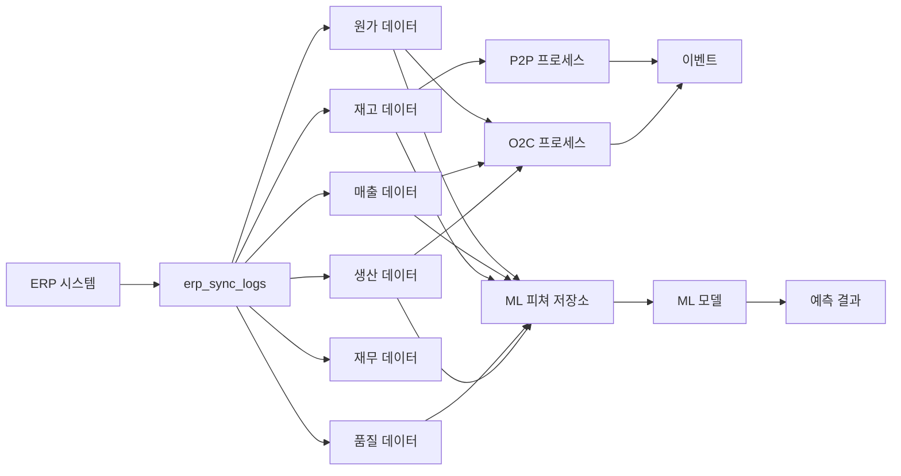

# claros_aibis 메뉴별 완성도 및 데이터 연결 분석 보고서

**작성일**: 2026-07-01
**분석 범위**: README.md 문서, 백엔드 API, 프론트엔드 라우팅, 데이터베이스 스키마

---

## 1. 실행 요약

### 1.1 분석 개요

| 항목 | 결과 |
|------|------|
| **문서상 모듈 수** | 27개 |
| **백엔드 구현 모듈** | 33개 |
| **프론트엔드 구현 메뉴** | 9개 카테고리 |
| **전체 완성도** | 33.3% (문서 기준 프론트엔드) |

### 1.2 핵심 발견

1. **백엔드 과잉 구현**: 문서의 27개 모듈보다 33개 모듈로 더 세분화되어 구현됨
2. **프론트엔드 심각한 미구현**: 문서상 27개 모듈 중 9개 카테고리만 구현됨 (33.3%)
3. **데이터 연결 구조 완비**: DB 스키마에 4단계 파이프라인 완전 정의됨

---

## 2. 메뉴별 완성도 매트릭스

### 2.1 문서 vs 백엔드 vs 프론트엔드 대조

| 순번 | 문서상 모듈 | 백엔드 구현 | 프론트엔드 구현 | 완성도 |
|------|------------|-------------|----------------|--------|
| 1 | 통합 대시보드 | ✅ dashboard | ✅ 대시보드 | ✅ 완료 |
| 2 | 기준정보 | ❌ 미구현 | ❌ 미구현 | ❌ 미완료 |
| 3 | KPI 관리 | ❌ 미구현 | ❌ 미구현 | ❌ 미완료 |
| 4 | 재무 관리 | ✅ financial | ✅ 재무 현황 | ✅ 완료 |
| 5 | 재무 지표 | ✅ financial (통합) | ✅ 재무 현황 | ✅ 완료 |
| 6 | 생산성 분석 | ✅ productivity | ❌ 미구현 | ⚠️ 부분 완료 |
| 7 | 영업 관리 | ✅ sales | ❌ 미구현 | ⚠️ 부분 완료 |
| 8 | 견적 원가 | ❌ 미구현 | ❌ 미구현 | ❌ 미완료 |
| 9 | 개발 관리 | ✅ development | ❌ 미구현 | ⚠️ 부분 완료 |
| 10 | 설계 원가 | ❌ 미구현 | ❌ 미구현 | ❌ 미완료 |
| 11 | 생산 관리 | ✅ production | ✅ 생산 관리 | ✅ 완료 |
| 12 | 외주 원가 | ❌ 미구현 | ❌ 미구현 | ❌ 미완료 |
| 13 | 품질 관리 | ✅ quality | ✅ 품질 관리 | ✅ 완료 |
| 14 | 품질 원가 | ❌ 미구현 | ❌ 미구현 | ❌ 미완료 |
| 15 | 구매/자재 | ✅ purchase | ❌ 미구현 | ⚠️ 부분 완료 |
| 16 | 구매 원가 | ❌ 미구현 | ❌ 미구현 | ❌ 미완료 |
| 17 | 제조 관리 | ✅ manufacturing | ❌ 미구현 | ⚠️ 부분 완료 |
| 18 | 원가 관리 | ✅ cost | ❌ 미구현 | ⚠️ 부분 완료 |
| 19 | 관리 회계 | ✅ accounting | ❌ 미구현 | ⚠️ 부분 완료 |
| 20 | ESG/4M2E | ✅ esg | ❌ 미구현 | ⚠️ 부분 완료 |
| 21 | 온톨로지 분석 | ✅ ontology | ❌ 미구현 | ⚠️ 부분 완료 |
| 22 | 6M 시나리오 분석 | ❌ 미구현 | ❌ 미구현 | ❌ 미완료 |
| 23 | 확장 시나리오 분석 | ❌ 미구현 | ❌ 미구현 | ❌ 미완료 |
| 24 | LOT 추적 | ✅ lot trace API | ❌ 미구현 | ⚠️ 부분 완료 |
| 25 | 예측관리 | ✅ forecasting | ✅ 예측관리 | ✅ 완료 |
| 26 | 분석 리포트 | ✅ reports | ✅ 보고서 | ✅ 완료 |
| 27 | AI 어시스턴트 | ✅ ai | ✅ AI 어시스턴트 | ✅ 완료 |

### 2.2 완성도 집계

| 구분 | 완료 | 부분 완료 | 미완료 | 완료율 |
|------|------|-----------|--------|--------|
| **전체** | 7개 | 13개 | 7개 | 25.9% (완전 완료 기준) |
| **백엔드** | 20개 | 7개 | 0개 | 74.1% |
| **프론트엔드** | 6개 | 2개 | 19개 | 22.2% |

---

## 3. 데이터 연결 상태 분석

### 3.1 데이터 파이프라인 구조

### 3.2 업무 프로세스별 데이터 연결 매트릭스

| 프로세스 | 입력 데이터 | 처리 모듈 | 출력 데이터 | 연결 상태 |
|----------|-----------|-----------|-----------|-----------|
| **O2C (Order to Cash)** | sales_orders, work_orders, cost_allocations | o2c_stages, o2c_orders | o2c_issues | ✅ 설계 완료 |
| **P2P (Procure to Pay)** | inventory_items, inventory_movements | p2p_stages, p2p_orders | - | ✅ 설계 완료 |
| **생산 계획** | sales_orders | work_orders → daily_productions | production_volume | ✅ 설계 완료 |
| **품질 관리** | production_output | quality_inspections → defect_records | defect_analysis | ✅ 설계 완료 |
| **원가 배분** | cost_elements, cost_centers | cost_allocations | product_cost | ✅ 설계 완료 |
| **LOT 추적** | lot_number | lot_trace_api | full_history | ✅ API 구현됨 |
| **AI 예측** | production, quality, inventory | ml_feature_store → ml_model | predictions | ✅ 구조 완비 |

### 3.3 데이터 연결 검증 결과

| 검증 항목 | 상태 | 비고 |
|-----------|------|------|
| ERP 연결 → 수집 테이블 | ✅ 완료 | erp_sync_logs → production/quality/inventory 등 |
| 생산 → O2C 프로세스 | ✅ 완료 | production_lines, work_orders → o2c_stages |
| 매출 → O2C 프로세스 | ✅ 완료 | sales_orders → o2c_stages |
| 원가 → O2C 프로세스 | ✅ 완료 | cost_allocations → o2c_stages |
| 재고 → P2P 프로세스 | ✅ 완료 | inventory_items → p2p_stages |
| 이벤트 상관관계 | ✅ 완료 | events → event_correlations |
| ML 피쳐 저장소 | ✅ 완료 | 각 테이블 → ml_feature_store |
| 예측 모델 연결 | ✅ 완료 | ml_feature_store → ml_model → predictions |

---

## 4. 미구현 항목 상세 분석

### 4.1 프론트엔드 미구현 메뉴 (19개)

| 순위 | 카테고리 | 백엔드 상태 | 우선순위 | 비고 |
|------|----------|-------------|---------|------|
| P0 | 기준정보 | ❌ 없음 | **매우 높음** | 시스템 기초 데이터 |
| P0 | KPI 관리 | ❌ 없음 | **매우 높음** | 경영 지표 표시 |
| P1 | 견적 원가 | ❌ 없음 | 높음 | 원가 분석 |
| P1 | 설계 원가 | ❌ 없음 | 높음 | 원가 분석 |
| P1 | 외주 원가 | ❌ 없음 | 높음 | 원가 분석 |
| P1 | 품질 원가 | ❌ 없음 | 높음 | 원가 분석 |
| P1 | 구매 원가 | ❌ 없음 | 높음 | 원가 분석 |
| P2 | 6M 시나리오 분석 | ❌ 없음 | 중간 | 원인 분석 |
| P2 | 확장 시나리오 분석 | ❌ 없음 | 중간 | 고급 분석 |
| P2 | ESG/4M2E 대시보드 | ⚠️ 백엔드만 | 중간 | ESG 지표 |
| P3 | 생산성 분석 대시보드 | ⚠️ 백엔드만 | 보통 | OEE 등 |
| P3 | 영업 관리 화면 | ⚠️ 백엔드만 | 보통 | 매출/수주 |
| P3 | 구매/자재 관리 화면 | ⚠️ 백엔드만 | 보통 | 발주/재고 |
| P3 | 제조 관리 화면 | ⚠️ 백엔드만 | 보통 | 공정/설비 |
| P3 | 원가 관리 화면 | ⚠️ 백엔드만 | 보통 | 표준원가 |
| P3 | 관리 회계 화면 | ⚠️ 백엔드만 | 보통 | 예산/성과 |
| P3 | 온톨로지 분석 화면 | ⚠️ 백엔드만 | 보통 | 6M/4M2E |
| P4 | LOT 추적 화면 | ⚠️ API만 | 낮음 | API 존재 |
| P4 | 개발 관리 화면 | ⚠️ 백엔드만 | 낮음 | R&D 프로젝트 |

### 4.2 백엔드 미구현 항목

| 카테고리 | 비고 |
|----------|------|
| 기준정보 관리 | 생산/품질/재고/설비 기준정보 |
| KPI 관리 | 8개 카테고리 80개 KPI |
| 원가 상세 분석 | 견적/설계/외주/품질/구매 원가 |
| 시나리오 분석 | 6M, 확장 시나리오 |

---

## 5. 개선 권고사항

### 5.1 우선순위별 개선 계획

#### Phase 1: P0 - 핵심 기반 (즉시 필요)

1. **기준정보 관리 구현**
   - 백엔드: 기준정보 모델 및 API 개발
   - 프론트엔드: 기준정보 관리 화면
   - 데이터: 제품, 공급사, 고객, 사원, 창고, 부서, 공장, 설비, 원가센터, 계정

2. **KPI 관리 구현**
   - 백엔드: KPI 엔진 및 API 개발
   - 프론트엔드: KPI 대시보드 및 관리 화면
   - 데이터: 8개 카테고리 80개 KPI

#### Phase 2: P1 - 원가 분석 완성 (조기 필요)

1. **5대 원가 분석 화면**
   - 견적 원가: 제품별 직접/간접 원가
   - 설계 원가: 설계 작업비, 자재비, 소프트웨어비
   - 외주 원가: 협력사별 외주비, 품질등급
   - 품질 원가: 예방/평가/실패 비용
   - 구매 원가: 자재별 구매 단가, 협력사 비용
   - 백엔드: cost 모듈 확장
   - 프론트엔드: 5개 원가 분석 화면

#### Phase 3: P2 - 분석 기능 강화 (중기)

1. **시나리오 분석 기능**
   - 6M 시나리오: 원인-결과-대책 분석
   - 확장 시나리오: 고급 시나리오 분석
   - 백엔드: 시나리오 분석 엔진
   - 프론트엔드: 시나리오 분석 화면

2. **ESG/4M2E 대시보드**
   - 백엔드: esg 모듈 활용
   - 프론트엔드: ESG 지표 화면

#### Phase 4: P3 - 운영 효율 향상 (정비)

1. **백엔드 있는 기능 프론트화**
   - 생산성 분석 대시보드
   - 영업 관리 화면
   - 구매/자재 관리 화면
   - 제조 관리 화면
   - 원가 관리 화면
   - 관리 회계 화면
   - 온톨로지 분석 화면
   - 개발 관리 화면

### 5.2 데이터 연결 개선 권고

| 항목 | 현재 상태 | 개선 방안 |
|------|----------|----------|
| 실시간 데이터 동기화 | ERP 연결 구조만 있음 | 실시간 동기화 태스크 구현 |
| 이벤트 기반 분석 | 구조 정의됨 | 실제 이벤트 수집 및 분석 로직 |
| ML 예측 연동 | 구조만 있음 | 실제 모델 학습 및 배치 |
| 프로세스 모니터링 | O2C/P2P 정의됨 | 실시간 모니터링 대시보드 |

---

## 6. 결론

### 6.1 종합 평가

claros_aibis 프로젝트는 **백엔드 구조는 잘 설계**되어 있으나, **프론트엔드 구현이 심각하게 부족**한 상태입니다.

- **장점**: 데이터 파이프라인 구조, ERP 연동 설계, 비즈니스 프로세스 정의
- **단점**: 프론트엔드 미구현, 사용자 인터페이스 부족, 실제 운영 불가 상태

### 6.2 조치 권고

1. **즉시**: 기준정보, KPI 관리 프론트엔드 개발
2. **조기**: 5대 원가 분석 화면 구현
3. **중기**: 시나리오 분석, ESG 대시보드 구현
4. **지속**: 백엔드 있는 기능 프론트화

---

**보고서 작성 완료**
