# Netplus MIS-AI Database ERD (Mermaid)

This document contains Mermaid diagrams that can be rendered in:
- GitHub/GitLab
- VS Code (with Mermaid extension)
- [Mermaid Live Editor](https://mermaid.live)

---

## 1. Module Overview

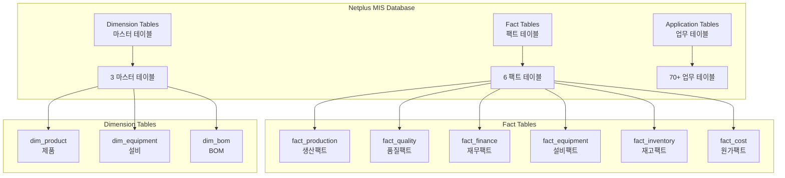

---

## 2. Core Relationships

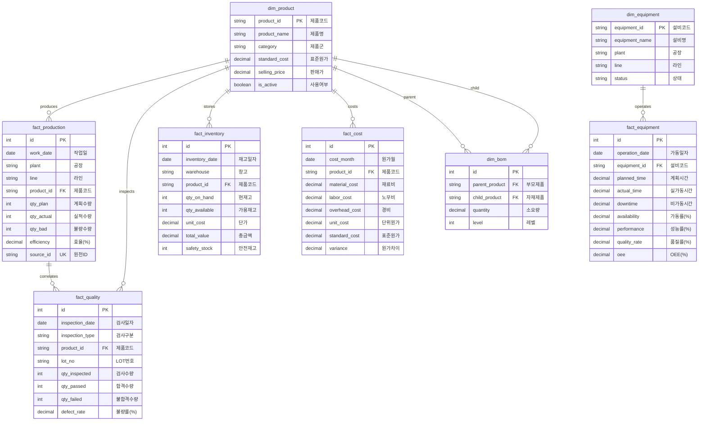

---

## 3. Module-wise ERD

### 3.1 Quality Module (품질)

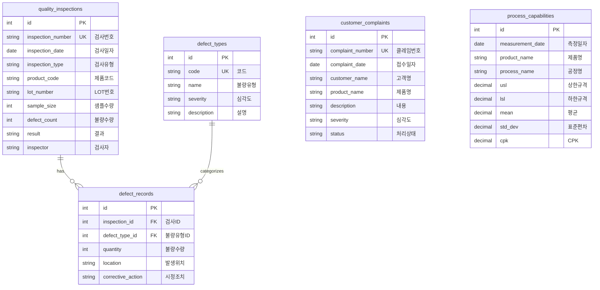

### 3.2 Sales Module (영업)

```mermaid
erDiagram
    sales_monthly {
        int id PK
        int fiscal_year "회계연도"
        int fiscal_month "회계월"
        decimal target_amount "목표매출"
        decimal actual_amount "실제매출"
        decimal achievement_rate "달성률"
        int new_customers "신규거래처"
        decimal contract_rate "계약성사율"
    }

    sales_product {
        int id PK
        int fiscal_year "회계연도"
        int fiscal_month "회계월"
        string product_code "제품코드"
        decimal sales_amount "매출액"
        int sales_quantity "판매수량"
        decimal share_rate "비중"
    }

    sales_customer_tier {
        int id PK
        int fiscal_year "회계연도"
        int fiscal_month "회계월"
        string tier "등급"
        int customer_count "고객수"
        decimal sales_amount "매출액"
    }

    sales_pipeline {
        int id PK
        int fiscal_year "회계연도"
        int fiscal_month "회계월"
        string stage "단계"
        int opportunity_count "기회건수"
        decimal total_value "총금액"
        decimal conversion_rate "전환율"
    }

    sales_team_performance {
        int id PK
        int fiscal_year "회계연도"
        int fiscal_month "회계월"
        string salesperson_name "영업사원명"
        decimal target_amount "목표"
        decimal actual_amount "실적"
        int deal_count "계약건수"
        decimal conversion_rate "성사율"
    }

    sales_top_customer {
        int id PK
        int fiscal_year "회계연도"
        int fiscal_month "회계월"
        string customer_code "거래처코드"
        string customer_name "거래처명"
        decimal revenue "매출액"
        string status "상태"
    }
```

### 3.3 Ontology Module (온톨로지)

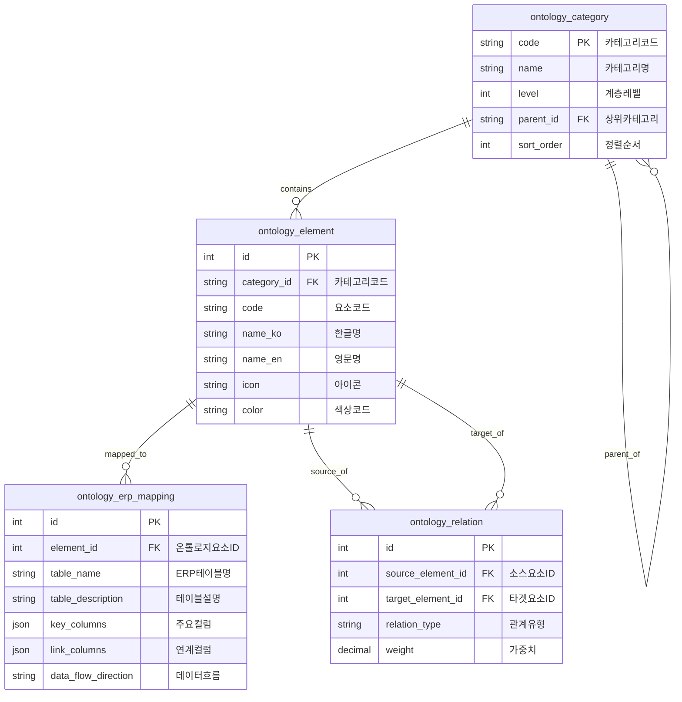

### 3.4 Cost Module (원가)

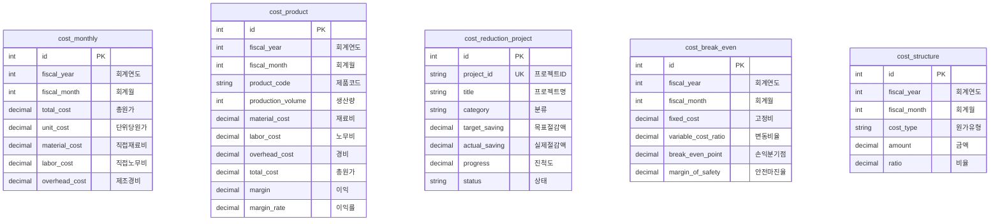

### 3.5 ESG Module (ESG경영)

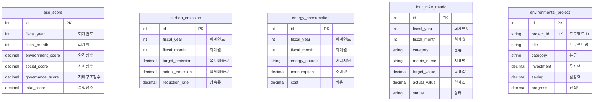

---

## 4. Data Flow Architecture

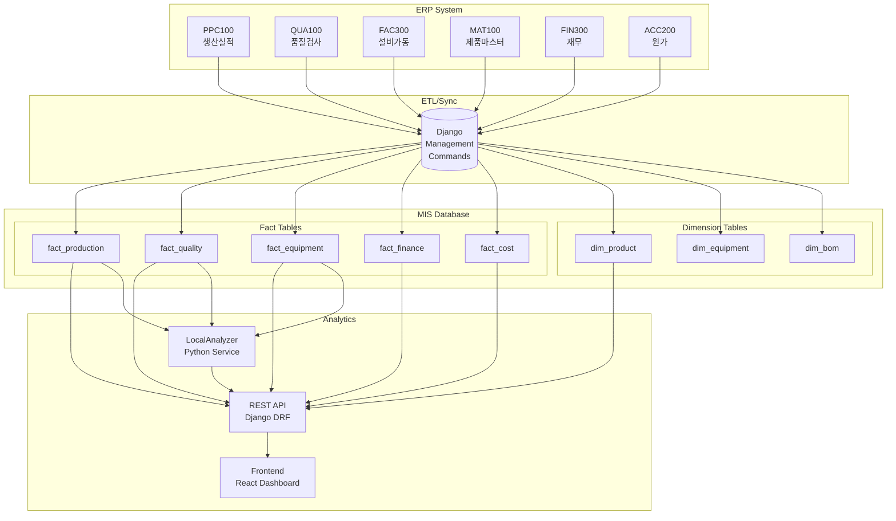

---

## 5. 6M/4M2E Ontology Structure

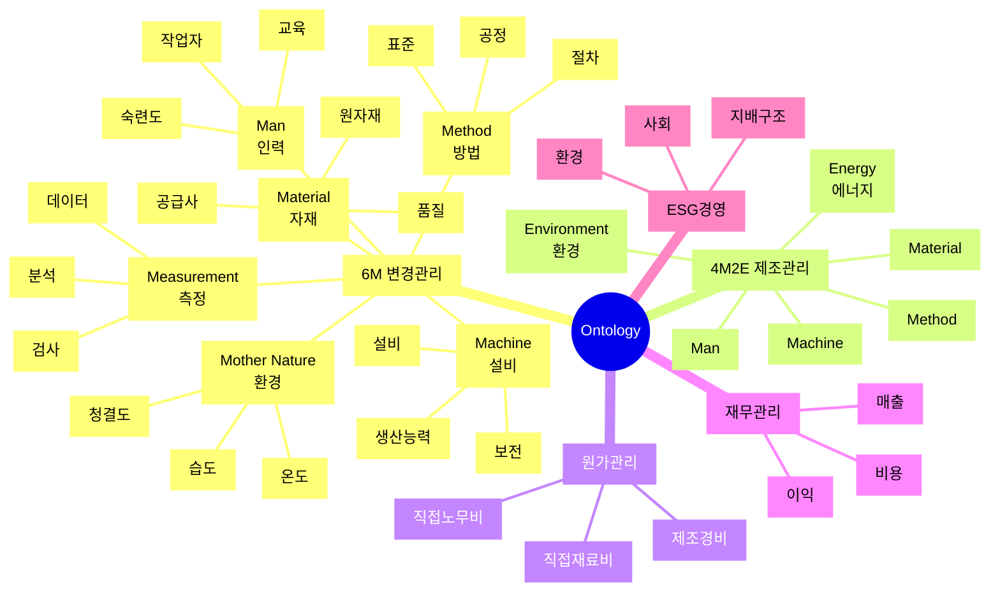

---

## 6. Complete Module Map

```mermaid
graph TB
    subgraph "Netplus MIS-AI Dashboard"
        direction TB

        subgraph "Financial Module"
            FM1[Financial Statements]
            FM2[Financial Ratios]
            FM3[Fact Finance]
        end

        subgraph "Production Module"
            PM1[Production Lines]
            PM2[Work Orders]
            PM3[Daily Productions]
            PM4[Equipment]
            PM5[Fact Production]
            PM6[Fact Equipment]
            PM7[Dim Product]
            PM8[Dim Equipment]
            PM9[Dim BOM]
        end

        subgraph "Quality Module"
            QM1[Quality Inspections]
            QM2[Defect Types]
            QM3[Defect Records]
            QM4[Customer Complaints]
            QM5[Process Capabilities]
            QM6[Fact Quality]
        end

        subgraph "Sales Module"
            SM1[Sales Monthly]
            SM2[Sales Product]
            SM3[Sales Customer Tier]
            SM4[Sales Pipeline]
            SM5[Sales Team Performance]
            SM6[Top Customer]
        end

        subgraph "Purchase Module"
            PUM1[Purchase Monthly]
            PUM2[Inventory]
            PUM3[Purchase Order]
            PUM4[Supplier]
            PUM5[Material Price]
            PUM6[Inventory Turnover]
            PUM7[Fact Inventory]
        end

        subgraph "Manufacturing Module"
            MM1[Workshop Status]
            MM2[Cycle Time]
            MM3[OEE Metric]
            MM4[Manpower Allocation]
            MM5[Work Standard]
            MM6[Equipment Downtime]
        end

        subgraph "Cost Module"
            CM1[Monthly Cost]
            CM2[Product Cost]
            CM3[Cost Reduction Project]
            CM4[Cost Driver]
            CM5[Breakeven Analysis]
            CM6[Cost Structure]
            CM7[Fact Cost]
        end

        subgraph "ESG Module"
            EM1[ESG Score]
            EM2[Carbon Emission]
            EM3[Energy Consumption]
            EM4[4M2E Metric]
            EM5[Environmental Project]
            EM6[Social Responsibility]
            EM7[Governance Metric]
        end

        subgraph "Accounting Module"
            AM1[Budget vs Actual]
            AM2[Department Profitability]
            AM3[KPI Performance]
            AM4[Financial Ratio Analysis]
            AM5[Budget Allocation]
            AM6[Investment ROI]
        end

        subgraph "Productivity Module"
            PRM1[Hourly Production]
            PRM2[Line Utilization]
            PRM3[Worker Productivity]
            PRM4[OEE Component]
            PRM5[Production Efficiency]
            PRM6[Daily Summary]
        end

        subgraph "Development Module"
            DM1[R&D Project]
            DM2[Innovation Metric]
            DM3[Patent]
            DM4[R&D Personnel]
            DM5[Technology Roadmap]
            DM6[R&D Budget]
        end

        subgraph "Reports Module"
            RM1[Executive Summary]
            RM2[Department Comparison]
            RM3[Key Metric Summary]
            RM4[Risk/Opportunity]
            RM5[Recommendation]
            RM6[Monthly Report]
        end

        subgraph "Ontology Module"
            OM1[Ontology Category]
            OM2[Ontology Element]
            OM3[ERP Mapping]
            OM4[Ontology Relation]
            OM5[Data Flow Metrics]
            OM6[Analysis Log]
        end
    end
```

---

## 7. Star Schema Pattern

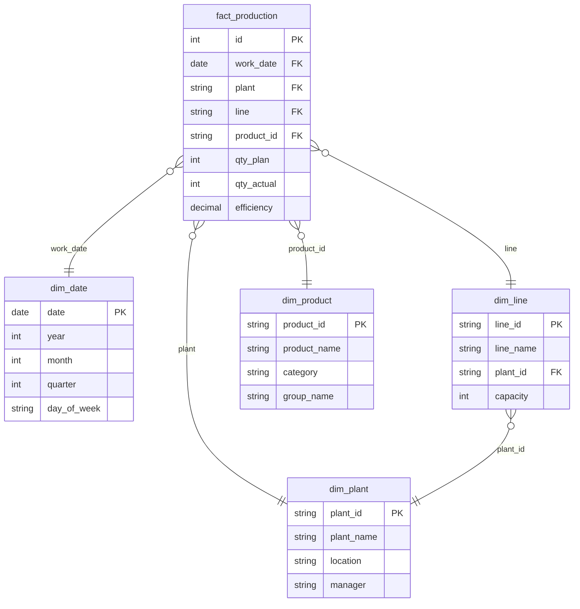

---

## Notes

1. **PK**: Primary Key
2. **FK**: Foreign Key
3. **UK**: Unique Key
4. **IDX**: Indexed Column

To render these diagrams:
- Save as `.md` file
- Open in GitHub/GitLab
- Or use VS Code with Mermaid extension
- Or visit https://mermaid.live
