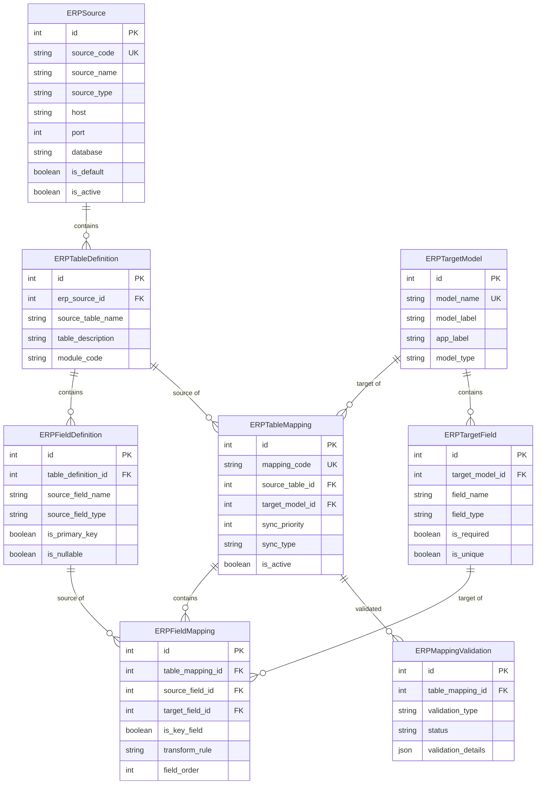

# 데이터베이스 스키마 정의서 v2.0

## 문서 정보

| 항목 | 내용 |
|------|------|
| 문서명 | 데이터베이스 스키마 정의서 |
| 버전 | 2.0.0 |
| 작성일 | 2026-03-03 |
| 작성자 | Claude AI |

---

## 1. 개요

### 1.1 데이터베이스 구성

| 데이터베이스 | 용도 | 비고 |
|-------------|------|------|
| PostgreSQL | 운영 (YH ERP) | 133.186.214.219:27455 |
| MS SQL | FOM ERP (예정) | 133.186.214.219:27455 |
| SQLite | 개발/테스트 | Django 기본 DB |

### 1.2 ERP 매핑 관리 시스템 스키마

이기종 ERP 연계 매핑 관리를 위한 스키마 정의

---

## 2. 데이터 통계

### 2.1 현재 데이터 현황

| 항목 | 수량 |
|------|------|
| ERP 소스 | 1 (YH) |
| 소스 테이블 정의 | 90 |
| 소스 필드 정의 | 1,533 |
| 타겟 모델 | 124 |
| 타겟 필드 | 1,913 |
| 테이블 매핑 | 162 |
| 필드 매핑 | 1,618 |

### 2.2 모듈별 타겟 모델 분포

| 앱 라벨 | 모델 수 | 테이블 매핑 | 필드 매핑 |
|---------|---------|------------|------------|
| etc | 34 | 34 | 650 |
| production | 20 | 22 | 315 |
| quality | 13 | 14 | 293 |
| sales | 10 | 11 | 109 |
| financial | 10 | 12 | 77 |
| purchase | 9 | 11 | 59 |
| dashboard | 8 | 26 | 12 |
| kpi | 9 | 17 | 18 |
| logistics | 2 | 2 | 31 |
| productivity | 2 | 4 | 4 |
| common | 3 | 3 | 31 |
| hr | 1 | 1 | 16 |
| development | 1 | 1 | 2 |
| esg | 1 | 1 | 0 |
| traceability | 1 | 3 | 1 |

---

## 3. 테이블 정의

### 3.1 erp_source

ERP 시스템 소스 정의

| 컬럼명 | 타입 | NULL | PK | FK | 설명 |
|--------|------|------|----|----|------|
| id | INTEGER | N | Y | - | 기본키 (Auto Increment) |
| source_code | VARCHAR(20) | N | - | - | 소스 코드 (YH, FOM, SAP 등) |
| source_name | VARCHAR(100) | N | - | - | 소스명 |
| source_type | VARCHAR(20) | N | - | - | 소스 타입 (postgresql, mssql, mysql, oracle, api, sqlite) |
| description | TEXT | Y | - | - | 설명 |
| host | VARCHAR(255) | Y | - | - | 호스트 주소 |
| port | INTEGER | Y | - | - | 포트 번호 |
| database | VARCHAR(100) | Y | - | - | 데이터베이스명 |
| schema_name | VARCHAR(100) | Y | - | - | 스키마명 |
| username | VARCHAR(100) | Y | - | - | 사용자명 |
| password | VARCHAR(255) | Y | - | - | 비밀번호 (암호화) |
| is_default | BOOLEAN | N | - | - | 기본 소스 여부 |
| is_active | BOOLEAN | N | - | - | 활성화 여부 |
| created_at | TIMESTAMP | N | - | - | 생성일시 |
| updated_at | TIMESTAMP | N | - | - | 수정일시 |

**인덱스:**
- `idx_source_code`: source_code (UNIQUE)
- `idx_is_default_active`: is_default, is_active

---

### 3.2 erp_table_definition

ERP 테이블 정의 (소스별 테이블 메타데이터)

| 컬럼명 | 타입 | NULL | PK | FK | 설명 |
|--------|------|------|----|----|------|
| id | INTEGER | N | Y | - | 기본키 (Auto Increment) |
| erp_source_id | INTEGER | N | - | erp_source.id | ERP 소스 ID |
| source_table_name | VARCHAR(100) | N | - | - | 소스 테이블명 |
| table_description | VARCHAR(255) | Y | - | - | 테이블 설명 |
| module_code | VARCHAR(50) | N | - | - | 모듈 코드 (SD, PP, QM, MM, FI, HR, CO) |
| module_name | VARCHAR(100) | Y | - | - | 모듈명 |
| record_count | INTEGER | Y | - | - | 레코드 수 |
| last_synced_at | TIMESTAMP | Y | - | - | 마지막 동기화 시간 |
| created_at | TIMESTAMP | N | - | - | 생성일시 |
| updated_at | TIMESTAMP | N | - | - | 수정일시 |

**인덱스:**
- `idx_erp_source_table`: erp_source_id, source_table_name (UNIQUE)
- `idx_module_code`: module_code

---

### 3.3 erp_field_definition

ERP 필드 정의 (테이블별 컬럼 메타데이터)

| 컬럼명 | 타입 | NULL | PK | FK | 설명 |
|--------|------|------|----|----|------|
| id | INTEGER | N | Y | - | 기본키 (Auto Increment) |
| table_definition_id | INTEGER | N | - | erp_table_definition.id | 테이블 정의 ID |
| source_field_name | VARCHAR(100) | N | - | - | 소스 필드명 |
| source_field_type | VARCHAR(50) | N | - | - | 소스 필드 타입 |
| field_description | VARCHAR(255) | Y | - | - | 필드 설명 |
| is_primary_key | BOOLEAN | N | - | - | 기본키 여부 |
| is_nullable | BOOLEAN | N | - | - | NULL 허용 여부 |
| is_foreign_key | BOOLEAN | N | - | - | 외래키 여부 |
| referenced_table | VARCHAR(100) | Y | - | - | 참조 테이블 |
| referenced_field | VARCHAR(100) | Y | - | - | 참조 필드 |
| field_position | INTEGER | N | - | - | 필드 순서 |
| created_at | TIMESTAMP | N | - | - | 생성일시 |

**인덱스:**
- `idx_table_field`: table_definition_id, source_field_name (UNIQUE)
- `idx_field_position`: table_definition_id, field_position

---

### 3.4 erp_target_model

MIS 타겟 모델 정의

| 컬럼명 | 타입 | NULL | PK | FK | 설명 |
|--------|------|------|----|----|------|
| id | INTEGER | N | Y | - | 기본키 (Auto Increment) |
| model_name | VARCHAR(100) | N | - | - | Django 모델명 (app.ModelName) |
| model_label | VARCHAR(100) | N | - | - | 모델 라벨 |
| app_label | VARCHAR(50) | N | - | - | 앱 라벨 (sales, production, quality, etc) |
| model_type | VARCHAR(20) | N | - | - | 모델 타입 (fact, dimension, snapshot, aggregate) |
| db_table_name | VARCHAR(100) | N | - | - | DB 테이블명 |
| description | TEXT | Y | - | - | 설명 |
| created_at | TIMESTAMP | N | - | - | 생성일시 |
| updated_at | TIMESTAMP | N | - | - | 수정일시 |

**인덱스:**
- `idx_model_name`: model_name (UNIQUE)
- `idx_app_label`: app_label
- `idx_model_type`: model_type

---

### 3.5 erp_target_field

MIS 타겟 필드 정의

| 컬럼명 | 타입 | NULL | PK | FK | 설명 |
|--------|------|------|----|----|------|
| id | INTEGER | N | Y | - | 기본키 (Auto Increment) |
| target_model_id | INTEGER | N | - | erp_target_model.id | 타겟 모델 ID |
| field_name | VARCHAR(100) | N | - | - | 필드명 |
| field_type | VARCHAR(50) | N | - | - | 필드 타입 (CharField, IntegerField, DecimalField, DateField, etc.) |
| field_label | VARCHAR(100) | Y | - | - | 필드 라벨 |
| is_required | BOOLEAN | N | - | - | 필수 여부 |
| is_unique | BOOLEAN | N | - | - | 유니크 여부 |
| max_length | INTEGER | Y | - | - | 최대 길이 |
| decimal_places | INTEGER | Y | - | - | 소수점 자리 |
| created_at | TIMESTAMP | N | - | - | 생성일시 |

**인덱스:**
- `idx_model_field`: target_model_id, field_name (UNIQUE)

---

### 3.6 erp_table_mapping

ERP 테이블 매핑 (소스 테이블 → 타겟 모델)

| 컬럼명 | 타입 | NULL | PK | FK | 설명 |
|--------|------|------|----|----|------|
| id | INTEGER | N | Y | - | 기본키 (Auto Increment) |
| mapping_code | VARCHAR(100) | N | - | - | 매핑 코드 (고유) |
| source_table_id | INTEGER | N | - | erp_table_definition.id | 소스 테이블 ID |
| target_model_id | INTEGER | N | - | erp_target_model.id | 타겟 모델 ID |
| mapping_name | VARCHAR(200) | N | - | - | 매핑명 |
| description | TEXT | Y | - | - | 설명 |
| sync_priority | INTEGER | N | - | - | 동기화 우선순위 (1:필수, 2:중요, 3:일반, 4:확장) |
| sync_type | VARCHAR(20) | N | - | - | 동기화 타입 (full, incremental, cdc) |
| sync_schedule | VARCHAR(50) | Y | - | - | 동기화 스케줄 (cron 표현식) |
| is_active | BOOLEAN | N | - | - | 활성화 여부 |
| date_column | VARCHAR(100) | Y | - | - | 날짜 컬럼명 (증분 동기화용) |
| custom_query | TEXT | Y | - | - | 사용자 정의 쿼리 |
| last_sync_at | TIMESTAMP | Y | - | - | 마지막 동기화 시간 |
| last_sync_status | VARCHAR(20) | Y | - | - | 마지막 동기화 상태 |
| total_sync_count | INTEGER | N | - | - | 총 동기화 횟수 |
| created_at | TIMESTAMP | N | - | - | 생성일시 |
| updated_at | TIMESTAMP | N | - | - | 수정일시 |
| created_by | VARCHAR(100) | Y | - | - | 생성자 |

**인덱스:**
- `idx_mapping_code`: mapping_code (UNIQUE)
- `idx_source_target`: source_table_id, target_model_id (UNIQUE)
- `idx_sync_priority`: sync_priority, is_active

---

### 3.7 erp_field_mapping

ERP 필드 매핑 (소스 필드 → 타겟 필드)

| 컬럼명 | 타입 | NULL | PK | FK | 설명 |
|--------|------|------|----|----|------|
| id | INTEGER | N | Y | - | 기본키 (Auto Increment) |
| table_mapping_id | INTEGER | N | - | erp_table_mapping.id | 테이블 매핑 ID |
| source_field_id | INTEGER | N | - | erp_field_definition.id | 소스 필드 ID |
| target_field_id | INTEGER | N | - | erp_target_field.id | 타겟 필드 ID |
| is_key_field | BOOLEAN | N | - | - | 키 필드 여부 |
| is_required | BOOLEAN | N | - | - | 필수 매핑 여부 |
| transform_rule | VARCHAR(20) | N | - | - | 변환 규칙 (none, upper, lower, trim, date_format, decimal_cast, concat, lookup, custom) |
| transform_expression | TEXT | Y | - | - | 변환 표현식 (JSON) |
| default_value | VARCHAR(255) | Y | - | - | 기본값 |
| validation_rule | TEXT | Y | - | - | 검증 규칙 |
| error_handling | VARCHAR(50) | N | - | - | 오류 처리 (skip, log, abort) |
| field_order | INTEGER | N | - | - | 필드 순서 |
| created_at | TIMESTAMP | N | - | - | 생성일시 |

**인덱스:**
- `idx_table_source`: table_mapping_id, source_field_id (UNIQUE)
- `idx_field_order`: table_mapping_id, field_order

---

### 3.8 erp_mapping_validation

매핑 검증 기록

| 컬럼명 | 타입 | NULL | PK | FK | 설명 |
|--------|------|------|----|----|------|
| id | INTEGER | N | Y | - | 기본키 (Auto Increment) |
| table_mapping_id | INTEGER | N | - | erp_table_mapping.id | 테이블 매핑 ID |
| validation_type | VARCHAR(50) | N | - | - | 검증 타입 (structure, data, connection) |
| status | VARCHAR(20) | N | - | - | 상태 (passed, failed, warning) |
| validation_details | JSON | N | - | - | 검증 상세 |
| error_message | TEXT | Y | - | - | 오류 메시지 |
| validated_at | TIMESTAMP | N | - | - | 검증일시 |

**인덱스:**
- `idx_mapping_validated`: table_mapping_id, validated_at

---

## 4. 관계도

### 4.1 ERD (Mermaid)



### 4.2 텍스트 관계도

```
erp_source (1) ──< (N) erp_table_definition (1) ──< (N) erp_field_definition
                      │
                      │
                      └──< (N) erp_table_mapping (1) ──> (1) erp_target_model
                                                            │
                                                            └──< (N) erp_target_field

erp_table_mapping (1) ──< (N) erp_field_mapping
                               │
                               ├──> erp_field_definition (1)
                               └──> erp_target_field (1)

erp_table_mapping (1) ──< (N) erp_mapping_validation
```

---

## 5. YH ERP 소스 테이블 목록

### 5.1 영업 (Sales - SD)

| 테이블명 | 설명 | 주요 필드 |
|---------|------|-----------|
| SDY100_YH | 영업연월별계획 | plan_mon, cust_nm, itm_nm, plan_qty, plan_amt |
| SDA500_YH | 수주상세 | plan_no, dlv_dt, cust_nm, itm_cd, out_qty |
| SDA510_YH | 출하상세 | dlv_dt, cust_nm, itm_nm, out_qty |
| SDB150_YH | 배차계획 | ship_date, car_no, driver |
| SDP300_YH | 판매관리 | sale_date, cust_nm, item_nm, sale_qty |

### 5.2 생산 (Production - PP)

| 테이블명 | 설명 | 주요 필드 |
|---------|------|-----------|
| PPB120_YH | 생산실적 | out_dt, fac_cd, wc_cd, itm_nm, plan_qty, prd_qty |
| PPB125_YH | 생산입고 | out_dt, itm_cd, in_qty |
| PPB121_YH | 생산계획 | plan_dt, itm_cd, plan_qty |
| PPC120_YH | 작업지시 | work_no, work_dt, item_cd |
| PPC130_YH | 공정능력 | prc_cd, capc_qty |
| PPC140_YH | 작업장정보 | wc_cd, wc_nm |
| PPC150_YH | 공정정보 | prc_cd, prc_nm |
| PPD250_YH | 설비정보 | fac_cd, fac_nm |
| PPI100_YH | 생산실적현황 | prod_dt, prod_qty |
| PPI150_YH | 공정생산실적 | prc_cd, prod_qty |
| PPI160_YH | 설별생산실적 | fac_cd, prod_qty |
| PPZ360_YH | 표준공시 | itm_cd, std_time |
| PPZ370_YH | 설비가동율 | fac_cd, oee_rate |
| MESTagValue_YH | MES 태그 값 | tag_date, tag_name, tag_value |
| BOM | BOM 정보 | parent_item, child_item, qty |
| MRP | MRP 정보 | item_cd, req_date, req_qty |

### 5.3 품질 (Quality - QM)

| 테이블명 | 설명 | 주요 필드 |
|---------|------|-----------|
| QMM140_YH | 검사결과 | iqc_dt, itm_cd, qc_qty, pass_qty, fail_qty |
| QMM200_YH | 불량정보 | req_dt, itm_nm, prc_nm, fail_qty |
| QMM210_YH | 불량상세 | fail_cd, fail_nm, fail_qty |
| QMM220_YH | 품질실적 | qc_dt, pass_rate |
| QMM300_YH | 검사기준 | itm_cd, qc_std |
| QMM310_YH | 검사결과상세 | qc_no, qc_item, qc_result |
| QMP130_YH | 공정능력 | prc_cd, cpk, cmk |
| QMT100_YH | 검사종류정보 | qc_type, qc_desc |
| QPM100_YH | 품질관리 | qc_dt, qc_result |
| QPM110_YH | 품질측정 | meas_dt, meas_val |
| QPM110_YH (export) | 품질측정 export | chk_dt, chk_item, chk_val |
| SPC | SPC 데이터 | spc_dt, spc_val |
| ShipmentInspection | 출하검사 | insp_dt, insp_item, insp_result |
| ShipmentDefect | 출하불량 | defect_dt, defect_qty |

### 5.4 구매 (Purchase - MM)

| 테이블명 | 설명 | 주요 필드 |
|---------|------|-----------|
| MMA100_YH | 구매현황 | ord_dt, sply_nm, itm_nm, ord_qty, ord_amt |
| MMA200_YH | 구매마스타 | sply_cd, sply_nm, sply_type |
| MMA300_YH | 구매입고 | gr_dt, itm_cd, gr_qty |
| MMY100_YH | 자재마스타 | itm_cd, itm_nm, itm_type |
| GAJ200_YH | 외주입고 | sub_dt, sub_qty |
| GAJ250_YH | 외주마스타 | sub_cd, sub_nm |
| LEB900_YH | 입고정보 | in_dt, itm_cd, in_qty |
| MaterialMaster | 자재마스터 확장 | item_cd, item_nm, spec |
| Supplier | 공급업체 | sup_cd, sup_nm, sup_type |
| SupplierEvaluation | 공급업체평가 | sup_cd, eval_date, eval_score |

### 5.5 물류 (Logistics - LE)

| 테이블명 | 설명 | 주요 필드 |
|---------|------|-----------|
| LEB950_YH | 재고현황 | stk_dt, itm_nm, stk_qty, wh_loc |
| LEB980_YH | 창고별재고 | wh_cd, wh_nm, stk_qty |

### 5.6 회계 (Financial - FI)

| 테이블명 | 설명 | 주요 필드 |
|---------|------|-----------|
| CAM200_YH | 회계전표 | slip_dt, acct_nm, dr_amt, cr_amt |
| CAM300_YH | 원장정보 | acct_cd, acct_nm, bal_amt |
| CAM900_YH | 재무제표 | fs_dt, fs_item, fs_amt |
| CAM910_YH | 재무비율 | ratio_cd, ratio_val |
| COS700_YH | 비용관리 | exp_cd, exp_amt |
| BAA100_YH | 통화정보 | curr_cd, curr_nm |
| BAA110_YH | 예산정보 | budget_cd, budget_amt |
| BAA120_YH | 회계단위 | unit_cd, unit_nm |
| AccountLedger | 계정원장 | acct_cd, tran_dt, dr_amt, cr_amt |
| BudgetVsActual | 예산실적대비 | budget_amt, actual_amt, var_amt |
| DepartmentProfitability | 부문별수익성 | dept_cd, revenue, cost, profit |
| ProductCost | 제품원가 | item_cd, mat_cost, lab_cost |
| WorkInProcess | 재공품정보 | item_cd, wip_qty |

### 5.7 인사 (HR - HR)

| 테이블명 | 설명 | 주요 필드 |
|---------|------|-----------|
| DCB100_YH | 사원정보 | emp_no, emp_nm, dept_cd, hire_dt |

### 5.8 공통 (Common - CO)

| 테이블명 | 설명 | 주요 필드 |
|---------|------|-----------|
| COS100_YH | 거래처정보 | cust_cd, cust_nm, cust_type |
| COS200_YH | 품목정보 | itm_cd, itm_nm, itm_spec |
| COS210_YH | 품목그룹 | grp_cd, grp_nm |
| COS220_YH | 창고정보 | wh_cd, wh_nm, wh_loc |
| COS230_YH | 사업장정보 | site_cd, site_nm |
| COS240_YH | 부서정보 | dept_cd, dept_nm |
| COS300_YH | 프로젝트정보 | prj_cd, prj_nm |
| COS310_YH | WBS정보 | wbs_cd, wbs_nm |
| COS340_YH | 공정정보 | prc_cd, prc_nm |
| COS350_YH | 설비정보 | fac_cd, fac_nm |
| COS400_YH | 협력사정보 | sub_cd, sub_nm, sub_type |
| COS405_YH | 협력사등급 | sub_cd, grade |
| COS410_YH | 공정코드 | prc_cd, prc_nm |
| COS415_YH | 설비그룹 | fac_grp, fac_grp_nm |
| COS420_YH | 작업장그룹 | wc_grp, wc_grp_nm |
| COS500_YH | 영업담당자 | sale_emp, sale_emp_nm |
| COS510_YH | 영업조직 | sale_org, sale_org_nm |
| COS520_YH | 영업지역 | sale_area, sale_area_nm |
| COS550_YH | 결제조건 | pay_cond, pay_cond_nm |
| COS560_YH | 배송조건 | ship_cond, ship_cond_nm |
| COS600_YH | 단위정보 | unit_cd, unit_nm |
| COS900_YH | 회계연도 | fis_year, fis_st_dt |
| CO220_YH | 거래처분류 | cust_clss, cust_clss_nm |
| CO230_YH | 국가정보 | nation_cd, nation_nm |
| CO240_YH | 지역정보 | area_cd, area_nm |
| DAA100_YH | 영업채널 | chn_cd, chn_nm |
| DAA200_YH | 물류채널 | log_chn, log_chn_nm |

### 5.9 기타 (ETC)

| 테이블명 | 설명 | 주요 필드 |
|---------|------|-----------|
| PPB130_YH | 생산부가정보 | prod_dt, add_info |
| PPB131_YH | 생산공시정보 | itm_cd, std_time |
| PPC200_YH | 작업장별능력 | wc_cd, capc_qty |

---

## 6. 타겟 모델 상세

### 6.1 Dashboard 레이어 (8개 모델)

#### dashboard.ExecutiveSummary
경영진단용 요약 대시보드

| 필드명 | 타입 | 설명 |
|--------|------|------|
| period_type | CharField | 기간 유형 (daily, weekly, monthly) |
| period_value | CharField | 기간 값 |
| total_sales | DecimalField | 총 매출 |
| total_profit | DecimalField | 총 이익 |
| profit_margin | DecimalField | 이익률 (%) |
| total_orders | IntegerField | 총 주문수 |
| production_rate | DecimalField | 생산 달성률 (%) |
| quality_rate | DecimalField | 품질 합격률 (%) |
| inventory_turnover | DecimalField | 재고 회전율 |
| employee_count | IntegerField | 직원수 |
| safety_incidents | IntegerField | 안전사고 건수 |

**소스 매핑:**
- SDY100_YH → total_sales, total_orders
- PPB120_YH → production_rate
- QMM140_YH → quality_rate
- LEB950_YH → inventory_turnover
- MMA200_YH → employee_count (공급업체 수 참조)

#### dashboard.SalesDashboard
영업 관리 대시보드

| 필드명 | 타입 | 설명 |
|--------|------|------|
| date | DateField | 날짜 |
| daily_sales | DecimalField | 일 매출 |
| monthly_sales | DecimalField | 월 누적 매출 |
| order_count | IntegerField | 주문 건수 |
| delivery_count | IntegerField | 출하 건수 |
| pending_orders | IntegerField | 미출하 주문 |
| top_customers | TextField | TOP 거래처 |
| top_products | TextField | TOP 품목 |
| region_sales | TextField | 지역별 매출 |
| vs_last_year | DecimalField | 전년동기대비 (%) |
| vs_target | DecimalField | 목표대비 (%) |

#### dashboard.ProductionDashboard
생산 관리 대시보드

| 필드명 | 타입 | 설명 |
|--------|------|------|
| date | DateField | 날짜 |
| factory_code | CharField | 공장 코드 |
| line_code | CharField | 라인 코드 |
| plan_qty | DecimalField | 계획 수량 |
| production_qty | DecimalField | 생산 수량 |
| good_qty | DecimalField | 양품 수량 |
| defect_qty | DecimalField | 불량 수량 |
| yield_rate | DecimalField | 수율 (%) |
| achievement_rate | DecimalField | 달성률 (%) |
| oee_rate | DecimalField | 설비비율 (%) |
| downtime_minutes | IntegerField | 비가동 시간(분) |
| manpower_count | IntegerField | 투입 인원 |

#### dashboard.QualityDashboard
품질 관리 대시보드

| 필드명 | 타입 | 설명 |
|--------|------|------|
| date | DateField | 날짜 |
| inspect_count | IntegerField | 검사 건수 |
| pass_count | IntegerField | 합격 건수 |
| fail_count | IntegerField | 불량 건수 |
| pass_rate | DecimalField | 합격률 (%) |
| defect_rate | DecimalField | 불량률 (%) |
| rework_count | IntegerField | 재작업 건수 |
| customer_claim_count | IntegerField | 클레임 건수 |
| top_defects | TextField | TOP 불량유형 |
| inspector_performance | TextField | 검사원별 성과 |
| claim_cost | DecimalField | 클레임 비용 |

#### dashboard.InventoryDashboard
재고 관리 대시보드

| 필드명 | 타입 | 설명 |
|--------|------|------|
| asof_date | DateField | 기준일자 |
| warehouse_code | CharField | 창고 코드 |
| total_items | IntegerField | 총 품목수 |
| total_stock_qty | DecimalField | 총 재고 수량 |
| total_stock_value | DecimalField | 총 재고 금액 |
| overstock_items | IntegerField | 과대재고 품목수 |
| stockout_items | IntegerField | 품절 품목수 |
| slow_moving_items | IntegerField | 느속품목수 |
| avg_stock_days | DecimalField | 평균 재고일수 |
| incoming_count | IntegerField | 입고예정 건수 |
| outgoing_count | IntegerField | 출고예정 건수 |

#### dashboard.ProcurementDashboard
구매 관리 대시보드

| 필드명 | 타입 | 설명 |
|--------|------|------|
| date | DateField | 날짜 |
| po_count | IntegerField | 발주 건수 |
| po_amount | DecimalField | 발주 금액 |
| gr_count | IntegerField | 입고 건수 |
| gr_amount | DecimalField | 입고 금액 |
| pending_po_count | IntegerField | 미입고 건수 |
| on_time_delivery_rate | DecimalField | 납기준수률 (%) |
| supplier_performance | TextField | 공급업체별 성과 |
| top_suppliers | TextField | TOP 공급업체 |
| category_purchase | TextField | 카테고리별 구매 |
| vs_last_month | DecimalField | 전월대비 (%) |

#### dashboard.FinancialDashboard
재무/회계 대시보드

| 필드명 | 타입 | 설명 |
|--------|------|------|
| fiscal_year | CharField | 회계연도 |
| fiscal_month | CharField | 회계월 |
| revenue | DecimalField | 매출액 |
| cost_of_sales | DecimalField | 매출원가 |
| gross_profit | DecimalField | 매출총이익 |
| operating_expenses | DecimalField | 판관비 |
| operating_profit | DecimalField | 영업이익 |
| net_profit | DecimalField | 당기순이익 |
| current_assets | DecimalField | 유동자산 |
| current_liabilities | DecimalField | 유동부채 |
| cash_balance | DecimalField | 현금잔고 |
| accounts_receivable | DecimalField | 미수금 |
| accounts_payable | DecimalField | 미지급금 |

#### dashboard.HRDashboard
인사/HR 대시보드

| 필드명 | 타입 | 설명 |
|--------|------|------|
| asof_date | DateField | 기준일자 |
| total_employees | IntegerField | 총 직원수 |
| new_hires | IntegerField | 신규 입사 |
| resignations | IntegerField | 퇴사자 |
| resignation_rate | DecimalField | 퇴사율 (%) |
| attendance_rate | DecimalField | 출근률 (%) |
| overtime_hours | DecimalField | 연장 시간 |
| training_hours | DecimalField | 교육 시간 |
| department_stats | TextField | 부서별 인력 |
| salary_expense | DecimalField | 급여 비용 |
| recruitment_count | IntegerField | 채용 건수 |

### 6.2 KPI 레이어 (9개 모델)

#### kpi.SalesPerformance
영업 실적 분석

| 필드명 | 타입 | 설명 |
|--------|------|------|
| period_value | CharField | 기간 값 |
| customer_name | CharField | 거래처명 |
| item_name | CharField | 품목명 |
| plan_qty | DecimalField | 계획 수량 |
| plan_amount | DecimalField | 계획 금액 |
| sales_qty | DecimalField | 판매 수량 |
| sales_amount | DecimalField | 판매 금액 |
| achievement_rate | DecimalField | 달성률 (%) |

#### kpi.SalesTrend
영업 추이 분석

| 필드명 | 타입 | 설명 |
|--------|------|------|
| period_value | CharField | 기간 값 |
| amount | DecimalField | 금액 |
| vs_prev_period | DecimalField | 전기대비 (%) |
| vs_target | DecimalField | 목표대비 (%) |

#### kpi.ProductionPerformance
생산 실적 분석

| 필드명 | 타입 | 설명 |
|--------|------|------|
| production_date | DateField | 생산일자 |
| factory_code | CharField | 공장코드 |
| line_code | CharField | 라인코드 |
| item_name | CharField | 품목명 |
| plan_qty | DecimalField | 계획수량 |
| production_qty | DecimalField | 생산수량 |
| achievement_rate | DecimalField | 달성률 (%) |

#### kpi.EquipmentEfficiency
설비 효율 분석

| 필드명 | 타입 | 설명 |
|--------|------|------|
| measurement_date | DateField | 측정일자 |
| equipment_code | CharField | 설비코드 |
| availability_rate | DecimalField | 가동률 (%) |
| performance_rate | DecimalField | 성능률 (%) |
| quality_rate | DecimalField | 품질률 (%) |
| oee_value | DecimalField | OEE (%) |

#### kpi.QualityPerformance
품질 실적 분석

| 필드명 | 타입 | 설명 |
|--------|------|------|
| inspection_date | DateField | 검사일자 |
| inspect_qty | IntegerField | 검사수량 |
| pass_qty | IntegerField | 합격수량 |
| fail_qty | IntegerField | 불량수량 |
| pass_rate | DecimalField | 합격률 (%) |
| defect_rate | DecimalField | 불량률 (%) |

#### kpi.DefectAnalysis
불량 유형 분석

| 필드명 | 타입 | 설명 |
|--------|------|------|
| occurrence_date | DateField | 발생일자 |
| item_name | CharField | 품목명 |
| process_name | CharField | 공정명 |
| defect_type | CharField | 불량유형 |
| defect_qty | IntegerField | 불량수량 |
| defect_rate | DecimalField | 불량률 (%) |

#### kpi.InventoryStatus
재고 현황 분석

| 필드명 | 타입 | 설명 |
|--------|------|------|
| asof_date | DateField | 기준일자 |
| item_name | CharField | 품목명 |
| stock_qty | DecimalField | 재고수량 |
| stock_value | DecimalField | 재고금액 |
| turnover_rate | DecimalField | 회전율 |
| turnover_days | DecimalField | 회전일수 |

#### kpi.SupplierEvaluation
공급업체 평가

| 필드명 | 타입 | 설명 |
|--------|------|------|
| supplier_code | CharField | 공급업체코드 |
| supplier_name | CharField | 공급업체명 |
| supplier_type | CharField | 공급업체유형 |
| on_time_rate | DecimalField | 납기준수률 (%) |
| quality_rate | DecimalField | 품질합격률 (%) |
| price_score | DecimalField | 가격점수 |

#### kpi.FinancialSummary
재무제표 요약

| 필드명 | 타입 | 설명 |
|--------|------|------|
| fiscal_month | CharField | 회계월 |
| account_name | CharField | 계정과목 |
| debit_amount | DecimalField | 차변금액 |
| credit_amount | DecimalField | 대변금액 |
| balance | DecimalField | 잔액 |

### 6.3 추가 확장 모델 (14개)

#### sales.CustomerComplaint
고객 불만 처리

| 필드명 | 타입 | 설명 |
|--------|------|------|
| complaint_date | DateField | 불만일자 |
| customer_code | CharField | 거래처코드 |
| customer_name | CharField | 거래처명 |
| item_code | CharField | 품목코드 |
| complaint_type | CharField | 불만유형 |
| complaint_content | TextField | 불만내용 |
| status | CharField | 처리상태 |
| responsible_dept | CharField | 책임부서 |
| resolved_date | DateField | 해결일자 |
| response_days | IntegerField | 응답일수 |

#### sales.SalesPipeline
영업 파이프라인

| 필드명 | 타입 | 설명 |
|--------|------|------|
| opportunity_id | CharField | 기회ID |
| customer_code | CharField | 거래처코드 |
| customer_name | CharField | 거래처명 |
| item_code | CharField | 품목코드 |
| stage | CharField | 단계 |
| stage_name | CharField | 단계명 |
| probability | DecimalField | 성공확률 (%) |
| expected_amount | DecimalField | 기대금액 |
| expected_date | DateField | 예상날짜 |
| sales_person | CharField | 영업담당자 |
| created_date | DateField | 생성일자 |
| last_activity | DateField | 최근활동일 |

#### production.WorkOrderSchedule
작업 지시 관리

| 필드명 | 타입 | 설명 |
|--------|------|------|
| work_order_id | CharField | 작업지시ID |
| production_date | DateField | 생산일자 |
| line_code | CharField | 라인코드 |
| shift | CharField | 교대 |
| item_code | CharField | 품목코드 |
| item_name | CharField | 품목명 |
| planned_qty | DecimalField | 계획수량 |
| assigned_team | IntegerField | 배정인원 |
| estimated_hours | DecimalField | 예상공시 |
| status | CharField | 진행상태 |
| start_time | CharField | 시작시간 |
| end_time | CharField | 종료시간 |

#### production.CycleTimeAnalysis
사이클 타임 분석

| 필드명 | 타입 | 설명 |
|--------|------|------|
| production_date | DateField | 생산일자 |
| line_code | CharField | 라인코드 |
| shift | CharField | 교대 |
| item_code | CharField | 품목코드 |
| cycle_time_minutes | DecimalField | 사이클타임(분) |
| value_adding_time | DecimalField | 가공시간(분) |
| non_value_adding_time | DecimalField | 비가공시간(분) |
| efficiency_rate | DecimalField | 가동율 (%) |
| bottleneck_code | CharField | 병목코드 |

#### quality.CustomerClaim
고객 클레임 관리

| 필드명 | 타입 | 설명 |
|--------|------|------|
| claim_id | CharField | 클레임ID |
| claim_date | DateField | 접수일자 |
| customer_code | CharField | 거래처코드 |
| customer_name | CharField | 거래처명 |
| item_code | CharField | 품목코드 |
| claim_type | CharField | 클레임유형 |
| claim_quantity | DecimalField | 클레임수량 |
| claim_amount | DecimalField | 클레임금액 |
| disposition | CharField | 처리결과 |
| responsibility | CharField | 귀책부서 |
| resolved_date | DateField | 해결일자 |
| preventive_action | TextField | 예방조치 |

#### purchase.PurchaseOrderTracking
발주 추적 관리

| 필드명 | 타입 | 설명 |
|--------|------|------|
| po_number | CharField | 발주번호 |
| po_date | DateField | 발주일자 |
| supplier_code | CharField | 공급업체코드 |
| supplier_name | CharField | 공급업체명 |
| item_code | CharField | 품목코드 |
| item_name | CharField | 품목명 |
| order_quantity | DecimalField | 주문수량 |
| received_quantity | DecimalField | 입고수량 |
| remaining_quantity | DecimalField | 잔량 |
| unit_price | DecimalField | 단가 |
| amount | DecimalField | 금액 |
| status | CharField | 진행상태 |
| expected_delivery_date | DateField | 납기예정일 |
| actual_delivery_date | DateField | 실납기일자 |
| delay_days | IntegerField | 지연일수 |

#### purchase.InventoryTurnover
재고 회전율 분석

| 필드명 | 타입 | 설명 |
|--------|------|------|
| analysis_date | DateField | 분석일자 |
| warehouse_code | CharField | 창고코드 |
| item_code | CharField | 품목코드 |
| item_name | CharField | 품목명 |
| avg_inventory | DecimalField | 평균재고 |
| inventory_amount | DecimalField | 재고금액 |
| monthly_consumption | DecimalField | 월소비량 |
| turnover_rate | DecimalField | 회전율 |
| turnover_days | DecimalField | 회전일수 |
| abc_class | CharField | ABC등급 |
| last_sale_date | DateField | 최근판매일 |

#### financial.BudgetVsActual
예산 대 실적 비교

| 필드명 | 타입 | 설명 |
|--------|------|------|
| fiscal_year | CharField | 회계연도 |
| fiscal_month | CharField | 회계월 |
| department_code | CharField | 부서코드 |
| department_name | CharField | 부서명 |
| account_code | CharField | 계정코드 |
| account_name | CharField | 계정과목 |
| budget_amount | DecimalField | 예산금액 |
| actual_amount | DecimalField | 실적금액 |
| variance | DecimalField | 차이 |
| variance_rate | DecimalField | 차이율 (%) |
| ytd_budget | DecimalField | YTD 예산 |
| ytd_actual | DecimalField | YTD 실적 |
| ytd_variance_rate | DecimalField | YTD 차이율 (%) |

#### financial.DepartmentProfitability
부문별 수익성 분석

| 필드명 | 타입 | 설명 |
|--------|------|------|
| fiscal_year | CharField | 회계연도 |
| fiscal_month | CharField | 회계월 |
| department_code | CharField | 부서코드 |
| department_name | CharField | 부서명 |
| revenue | DecimalField | 매출액 |
| direct_cost | DecimalField | 직접원가 |
| indirect_cost | DecimalField | 간접원가 |
| gross_profit | DecimalField | 매출총이익 |
| operating_profit | DecimalField | 영업이익 |
| net_profit | DecimalField | 당기순이익 |
| revenue_per_employee | DecimalField | 인당매출 |
| profit_margin | DecimalField | 이익률 (%) |
| roi | DecimalField | ROI (%) |

#### esg.EnvironmentalImpact
환경 영향 분석

| 필드명 | 타입 | 설명 |
|--------|------|------|
| measurement_date | DateField | 측정일자 |
| factory_code | CharField | 공장코드 |
| energy_type | CharField | 에너지유형 |
| energy_consumption | DecimalField | 에너지소비량 |
| carbon_emissions | DecimalField | 탄소배출량(tCO2e) |
| electricity_usage | DecimalField | 전력사용량(kWh) |
| water_usage | DecimalField | 수도사용량(톤) |
| waste_generated | DecimalField | 폐기물 배출량 |
| recycled_amount | DecimalField | 재활용량 |
| environmental_cost | DecimalField | 환경비용 |
| compliance_status | CharField | 규제준수여부 |

#### productivity.HourlyProduction
시간별 생산 현황

| 필드명 | 타입 | 설명 |
|--------|------|------|
| measurement_date | DateField | 측정일자 |
| hour | IntegerField | 시간(0-23) |
| line_code | CharField | 라인코드 |
| shift | CharField | 교대 |
| item_code | CharField | 품목코드 |
| item_name | CharField | 품목명 |
| produced_quantity | DecimalField | 생산수량 |
| good_quantity | DecimalField | 양품수량 |
| defect_quantity | DecimalField | 불량수량 |
| yield_rate | DecimalField | 수율 (%) |
| oee | DecimalField | OEE (%) |
| manpower_count | IntegerField | 투입인원 |
| downtime_minutes | IntegerField | 비가동(분) |

#### productivity.LineUtilization
라인 가동률 분석

| 필드명 | 타입 | 설명 |
|--------|------|------|
| date | DateField | 날짜 |
| line_code | CharField | 라인코드 |
| line_name | CharField | 라인명 |
| shift | CharField | 교대 |
| planned_operating_time | IntegerField | 계획가동시간(분) |
| actual_operating_time | IntegerField | 실제가동시간(분) |
| down_time | IntegerField | 비가동시간(분) |
| availability_rate | DecimalField | 가동률 (%) |
| performance_rate | DecimalField | 성능률 (%) |
| quality_rate | DecimalField | 품질률 (%) |
| oee | DecimalField | OEE (%) |
| target_production_qty | DecimalField | 목표생산량 |
| actual_production_qty | DecimalField | 실생산량 |

#### development.RDProject
R&D 프로젝트 관리

| 필드명 | 타입 | 설명 |
|--------|------|------|
| project_id | CharField | 프로젝트ID |
| project_name | CharField | 프로젝트명 |
| project_type | CharField | 프로젝트유형 |
| start_date | DateField | 시작일자 |
| end_date | DateField | 종료일자 |
| project_manager | CharField | PM |
| team_members | TextField | 팀원 |
| budget | DecimalField | 예산 |
| spent_amount | DecimalField | 집행금액 |
| progress_rate | DecimalField | 진척률 (%) |
| status | CharField | 상태 |
| milestone_count | IntegerField | 마일스톤수 |
| completed_milestones | IntegerField | 완료마일스톤수 |

#### traceability.LotTracking
LOT 추적 정보

| 필드명 | 타입 | 설명 |
|--------|------|------|
| lot_number | CharField | LOT번호 |
| production_date | DateField | 생산일자 |
| item_code | CharField | 품목코드 |
| item_name | CharField | 품목명 |
| batch_number | CharField | 배치번호 |
| quantity | DecimalField | 수량 |
| warehouse_location | CharField | 창고위치 |
| current_status | CharField | 현재상태 |
| customer_code | CharField | 거래처코드 |
| delivery_date | DateField | 납품일자 |
| quality_check_result | CharField | 검사결과 |
| qc_number | CharField | 검사번호 |
| process_history | TextField | 공정이력 |
| raw_materials | TextField | 원자재료 |

---

## 7. 데이터 변환 규칙

### 7.1 필드 변환 규칙 유형

| 규칙 코드 | 설명 | 사용 예시 |
|----------|------|-----------|
| none | 변환 없음 | 기본 매핑 |
| upper | 대문자 변환 | 코드 필드 |
| lower | 소문자 변환 | 이메일 |
| trim | 공백 제거 | 문자열 필드 |
| date_format | 날짜 형식 변환 | YYYY-MM-DD |
| decimal_cast | 소수점 변환 | 수량, 금액 |
| concat | 문자열 연결 | 전체 주소 |
| lookup | 값 변환 (참조) | 코드 → 명 |
| custom | 사용자 정의 | JSON 표현식 |

### 7.2 데이터 타입 매핑

| 소스 타입 | 타겟 Django 필드 | 설명 |
|-----------|------------------|------|
| VARCHAR | CharField | 문자열 |
| INTEGER | IntegerField | 정수 |
| BIGINT | IntegerField | 큰 정수 |
| DECIMAL | DecimalField | 소수 |
| DATE | DateField | 날짜 |
| DATETIME | DateTimeField | 날짜시간 |
| TIMESTAMP | DateTimeField | 타임스탬프 |
| TEXT | TextField | 긴 텍스트 |
| BOOLEAN | BooleanField | 참/거짓 |

---

## 8. 데이터 동기화

### 8.1 동기화 타입

| 타입 | 설명 | 사용 대상 |
|------|------|-----------|
| full | 전체 데이터 동기화 | 마스터 데이터, 초기 로드 |
| incremental | 증분 동기화 (날짜 기반) | 일일 실적 데이터 |
| cdc | Change Data Capture | 실시간 동기화 (예정) |

### 8.2 동기화 우선순위

| 우선순위 | 설명 | 동기화 주기 |
|----------|------|------------|
| 1 (필수) | 핵심 업무 데이터 | 실시간 ~ 1시간 |
| 2 (중요) | 중요 운영 데이터 | 일일 |
| 3 (일반) | 일반 참조 데이터 | 주간 |
| 4 (확장) | 확장 분석 데이터 | 월간 |

### 8.3 동기화 상태

| 상태 | 설명 |
|------|------|
| pending | 대기 중 |
| running | 실행 중 |
| success | 성공 |
| error | 오류 |
| warning | 경고 (부분 성공) |

---

## 9. 변경 이력

### 버전 2.0.0 (2026-03-03)

- 124개 타겟 모델 정의 추가
- 162개 테이블 매핑 추가
- 1,618개 필드 매핑 추가
- Dashboard 레이어 (8개 모델) 추가
- KPI 레이어 (9개 모델) 추가
- 14개 확장 모델 추가
- 15개 앱 라벨 정의
- 90개 YH ERP 소스 테이블 정의
- 1,533개 소스 필드 정의

### 버전 1.0.0 (2026-02-28)

- 초기 스키마 정의
- ERP 연계 매핑 관리 테이블 추가

---

## 10. 참고 자료

- Django 모델 필드 참조: https://docs.djangoproject.com/en/5.0/ref/models/fields/
- PostgreSQL 데이터 타입: https://www.postgresql.org/docs/15/datatype.html
- ERP 모듈 코드: SD(영업), PP(생산), QM(품질), MM(구매), FI(회계), HR(인사), CO(공통)

---

**문서 버전**: 2.0.0
**최종 수정일**: 2026-03-03
**유지보수 담당**: Claude AI
