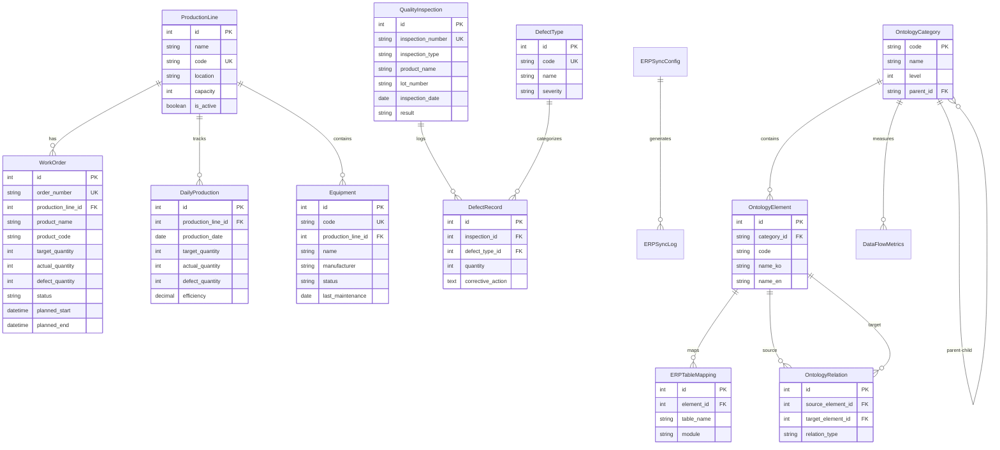
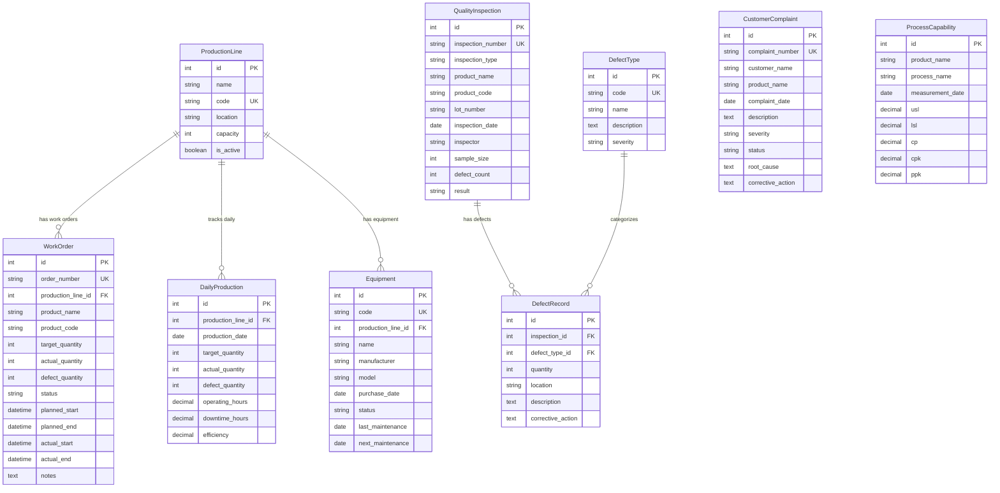
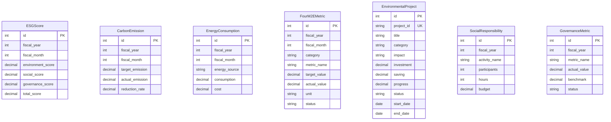
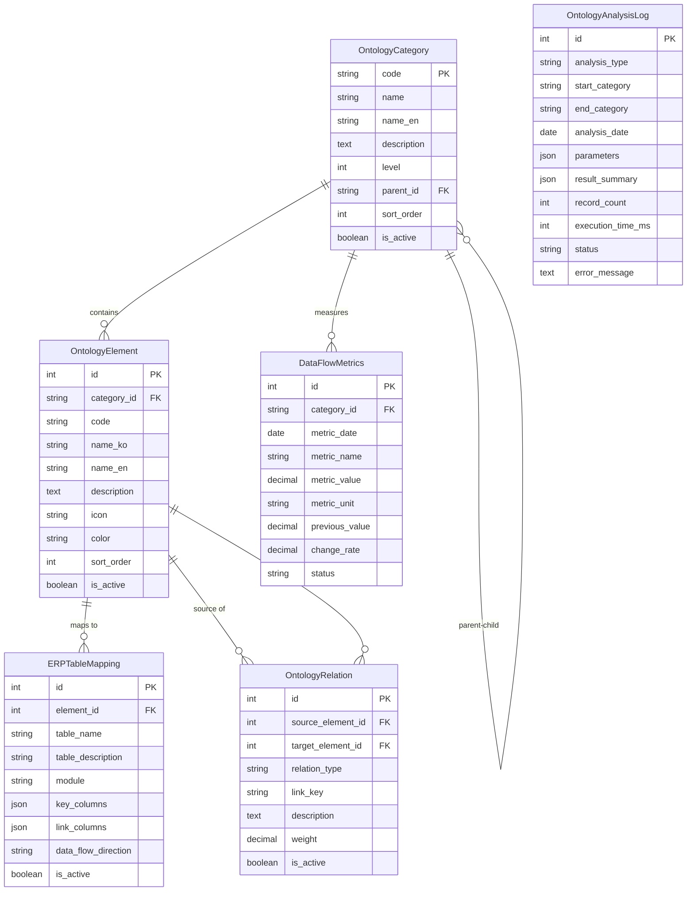

# Claros MIS-AI Dashboard 기술문서

## 1. 시스템 개요

### 1.1 프로젝트 정보
- **프로젝트명**: Claros MIS-AI Dashboard
- **대상 기업**: 유한산업
- **목적**: ERP(SAP) 데이터와 연동하여 경영정보 시각화 및 AI 기반 분석 제공
- **아키텍처**: Django Backend + React/TypeScript Frontend

### 1.2 기술 스택
| 구분 | 기술 |
|------|------|
| Backend | Django 4.x, Django REST Framework |
| Database | SQLite (개발) / MySQL (운영) |
| Frontend | React 18, TypeScript, Vite, TailwindCSS |
| AI/LLM | Text-to-SQL, Scenario Analysis, 5-Why Analysis |
| Charts | Recharts |

---

## 2. 데이터베이스 구조

### 2.1 앱(App) 구성
시스템은 총 14개의 Django 앱으로 구성됩니다:

| 앱 | 설명 | 테이블 수 |
|----|------|-----------|
| accounting | 예산 및 회계 관리 | 6 |
| production | 생산 관리 | 4 |
| quality | 품질 관리 | 5 |
| sales | 영업/매출 관리 | 6 |
| purchase | 구매/재고 관리 | 6 |
| esg | ESG 경영 지표 | 8 |
| cost | 원가 관리 | 6 |
| manufacturing | 제조 현장 관리 | 6 |
| productivity | 생산성 관리 | 6 |
| development | R&D 관리 | 6 |
| reports | 경영 보고서 | 6 |
| financial | 재무제표 | 2 |
| erp_sync | ERP 연동 | 22 |
| ontology | 온톨로지 | 6 |

---

## 3. 테이블 상세 정의

### 3.1 Accounting (회계 관리)

#### accounting_budget_actual
예산 vs 실적 비교 테이블

| 컬럼명 | 타입 | 설명 |
|--------|------|------|
| id | INTEGER | PK |
| fiscal_year | INTEGER | 회계연도 |
| fiscal_month | INTEGER | 회계월 (1-12) |
| category | VARCHAR(100) | 구분 |
| budget | DECIMAL(15,2) | 예산 (억원) |
| actual | DECIMAL(15,2) | 실적 (억원) |
| variance | DECIMAL(15,2) | 차이 (억원) |
| variance_rate | DECIMAL(5,2) | 차이율 (%) |
| created_at | DATETIME | 생성일시 |
| updated_at | DATETIME | 수정일시 |

#### accounting_department_profitability
부서별 수익성

| 컬럼명 | 타입 | 설명 |
|--------|------|------|
| id | INTEGER | PK |
| fiscal_year | INTEGER | 회계연도 |
| fiscal_month | INTEGER | 회계월 |
| department | VARCHAR(100) | 부서 |
| revenue | DECIMAL(15,2) | 매출 (억원) |
| cost | DECIMAL(15,2) | 비용 (억원) |
| profit | DECIMAL(15,2) | 이익 (억원) |
| margin | DECIMAL(5,2) | 수익률 (%) |

#### accounting_kpi_performance
KPI 성과 추적

| 컬럼명 | 타입 | 설명 |
|--------|------|------|
| id | INTEGER | PK |
| fiscal_year | INTEGER | 회계연도 |
| fiscal_month | INTEGER | 회계월 |
| kpi_name | VARCHAR(200) | KPI명 |
| target | DECIMAL(15,2) | 목표 |
| actual | DECIMAL(15,2) | 실적 |
| achievement_rate | DECIMAL(5,2) | 달성률 (%) |
| status | VARCHAR(20) | 상태 (achieved/on-track/at-risk/missed) |
| unit | VARCHAR(50) | 단위 |

#### accounting_financial_ratio
재무비율 분석

| 컬럼명 | 타입 | 설명 |
|--------|------|------|
| id | INTEGER | PK |
| fiscal_year | INTEGER | 회계연도 |
| fiscal_month | INTEGER | 회계월 |
| ratio_name | VARCHAR(100) | 비율명 |
| category | VARCHAR(20) | 분류 (profitability/stability/activity/growth) |
| value | DECIMAL(10,2) | 값 (%) |
| industry_avg | DECIMAL(10,2) | 업계평균 (%) |
| target | DECIMAL(10,2) | 목표 (%) |

#### accounting_budget_allocation
예산 배분

| 컬럼명 | 타입 | 설명 |
|--------|------|------|
| id | INTEGER | PK |
| fiscal_year | INTEGER | 회계연도 |
| department | VARCHAR(100) | 부서 |
| allocated_budget | DECIMAL(15,2) | 배정 예산 (억원) |
| used_budget | DECIMAL(15,2) | 사용 예산 (억원) |
| remaining_budget | DECIMAL(15,2) | 잔여 예산 (억원) |
| usage_rate | DECIMAL(5,2) | 사용률 (%) |

#### accounting_investment_roi
투자 ROI

| 컬럼명 | 타입 | 설명 |
|--------|------|------|
| id | INTEGER | PK |
| project_name | VARCHAR(200) | 프로젝트명 |
| investment_amount | DECIMAL(15,2) | 투자금액 (억원) |
| expected_return | DECIMAL(15,2) | 예상 수익 (억원) |
| actual_return | DECIMAL(15,2) | 실제 수익 (억원) |
| roi | DECIMAL(10,2) | ROI (%) |
| payback_period | DECIMAL(5,1) | 회수기간 (개월) |
| status | VARCHAR(20) | 상태 |
| start_date | DATE | 시작일 |
| end_date | DATE | 종료일 |

---

### 3.2 Production (생산 관리)

#### production_lines
생산 라인

| 컬럼명 | 타입 | 설명 |
|--------|------|------|
| id | INTEGER | PK |
| name | VARCHAR(100) | 라인명 |
| code | VARCHAR(50) | 라인 코드 (UK) |
| location | VARCHAR(200) | 위치 |
| capacity | INTEGER | 일일 생산능력 |
| is_active | BOOLEAN | 가동 여부 |

#### work_orders
작업 지시서

| 컬럼명 | 타입 | 설명 |
|--------|------|------|
| id | INTEGER | PK |
| order_number | VARCHAR(50) | 작업지시 번호 (UK) |
| production_line_id | INTEGER | FK → production_lines |
| product_name | VARCHAR(200) | 제품명 |
| product_code | VARCHAR(100) | 제품 코드 |
| target_quantity | INTEGER | 목표 수량 |
| actual_quantity | INTEGER | 실제 생산량 |
| defect_quantity | INTEGER | 불량 수량 |
| status | VARCHAR(20) | 상태 (planned/in_progress/completed/cancelled) |
| planned_start | DATETIME | 계획 시작일시 |
| planned_end | DATETIME | 계획 종료일시 |
| actual_start | DATETIME | 실제 시작일시 |
| actual_end | DATETIME | 실제 종료일시 |

#### daily_productions
일일 생산 실적

| 컬럼명 | 타입 | 설명 |
|--------|------|------|
| id | INTEGER | PK |
| production_line_id | INTEGER | FK → production_lines |
| production_date | DATE | 생산일자 |
| target_quantity | INTEGER | 목표 생산량 |
| actual_quantity | INTEGER | 실제 생산량 |
| defect_quantity | INTEGER | 불량 수량 |
| operating_hours | DECIMAL(5,2) | 가동 시간 |
| downtime_hours | DECIMAL(5,2) | 비가동 시간 |
| efficiency | DECIMAL(5,2) | 생산 효율 (%) |

#### equipment
생산 설비

| 컬럼명 | 타입 | 설명 |
|--------|------|------|
| id | INTEGER | PK |
| name | VARCHAR(100) | 설비명 |
| code | VARCHAR(50) | 설비 코드 (UK) |
| production_line_id | INTEGER | FK → production_lines |
| manufacturer | VARCHAR(200) | 제조사 |
| model | VARCHAR(200) | 모델명 |
| purchase_date | DATE | 구매일자 |
| status | VARCHAR(20) | 상태 (running/idle/maintenance/breakdown) |
| last_maintenance | DATE | 최근 정비일 |
| next_maintenance | DATE | 다음 정비 예정일 |

---

### 3.3 Quality (품질 관리)

#### quality_inspections
품질 검사

| 컬럼명 | 타입 | 설명 |
|--------|------|------|
| id | INTEGER | PK |
| inspection_number | VARCHAR(50) | 검사 번호 (UK) |
| inspection_type | VARCHAR(20) | 검사 유형 (incoming/in_process/final/outgoing) |
| product_name | VARCHAR(200) | 제품명 |
| product_code | VARCHAR(100) | 제품 코드 |
| lot_number | VARCHAR(100) | LOT 번호 |
| inspection_date | DATE | 검사일자 |
| inspector | VARCHAR(100) | 검사자 |
| sample_size | INTEGER | 샘플 수량 |
| defect_count | INTEGER | 불량 수량 |
| result | VARCHAR(20) | 검사 결과 (pass/fail/conditional) |
| notes | TEXT | 비고 |

#### defect_types
불량 유형

| 컬럼명 | 타입 | 설명 |
|--------|------|------|
| id | INTEGER | PK |
| name | VARCHAR(100) | 불량 유형 |
| code | VARCHAR(50) | 코드 (UK) |
| description | TEXT | 설명 |
| severity | VARCHAR(20) | 심각도 (critical/major/minor) |

#### defect_records
불량 기록

| 컬럼명 | 타입 | 설명 |
|--------|------|------|
| id | INTEGER | PK |
| inspection_id | INTEGER | FK → quality_inspections |
| defect_type_id | INTEGER | FK → defect_types |
| quantity | INTEGER | 불량 수량 |
| location | VARCHAR(200) | 발생 위치 |
| description | TEXT | 상세 설명 |
| corrective_action | TEXT | 시정 조치 |

#### customer_complaints
고객 클레임

| 컬럼명 | 타입 | 설명 |
|--------|------|------|
| id | INTEGER | PK |
| complaint_number | VARCHAR(50) | 클레임 번호 (UK) |
| customer_name | VARCHAR(200) | 고객명 |
| product_name | VARCHAR(200) | 제품명 |
| product_code | VARCHAR(100) | 제품 코드 |
| complaint_date | DATE | 접수일자 |
| description | TEXT | 내용 |
| severity | VARCHAR(20) | 심각도 (high/medium/low) |
| status | VARCHAR(20) | 처리 상태 |
| assigned_to | VARCHAR(100) | 담당자 |
| root_cause | TEXT | 근본 원인 |
| corrective_action | TEXT | 시정 조치 |
| preventive_action | TEXT | 예방 조치 |
| resolution_date | DATE | 완료일자 |

#### process_capabilities
공정 능력 (CPK)

| 컬럼명 | 타입 | 설명 |
|--------|------|------|
| id | INTEGER | PK |
| product_name | VARCHAR(200) | 제품명 |
| product_code | VARCHAR(100) | 제품 코드 |
| process_name | VARCHAR(200) | 공정명 |
| measurement_date | DATE | 측정일자 |
| usl | DECIMAL(10,3) | 상한 규격 |
| lsl | DECIMAL(10,3) | 하한 규격 |
| target | DECIMAL(10,3) | 목표값 |
| mean | DECIMAL(10,3) | 평균 |
| std_dev | DECIMAL(10,3) | 표준편차 |
| cp | DECIMAL(5,2) | CP |
| cpk | DECIMAL(5,2) | CPK |
| ppk | DECIMAL(5,2) | PPK |
| sample_size | INTEGER | 샘플 수 |

---

### 3.4 Sales (영업 관리)

#### sales_monthly
월별 매출

| 컬럼명 | 타입 | 설명 |
|--------|------|------|
| id | INTEGER | PK |
| fiscal_year | INTEGER | 회계연도 |
| fiscal_month | INTEGER | 회계월 |
| target_amount | DECIMAL(15,2) | 목표 매출 |
| actual_amount | DECIMAL(15,2) | 실제 매출 |
| achievement_rate | DECIMAL(5,2) | 달성률 (%) |
| new_customers | INTEGER | 신규 거래처 |
| contract_rate | DECIMAL(5,2) | 계약 성사율 (%) |
| pipeline_value | DECIMAL(15,2) | 파이프라인 금액 |

#### sales_product
제품별 매출

| 컬럼명 | 타입 | 설명 |
|--------|------|------|
| id | INTEGER | PK |
| fiscal_year | INTEGER | 회계연도 |
| fiscal_month | INTEGER | 회계월 |
| product_code | VARCHAR(50) | 제품코드 |
| product_name | VARCHAR(200) | 제품명 |
| sales_amount | DECIMAL(15,2) | 매출액 |
| sales_quantity | INTEGER | 판매수량 |
| share_rate | DECIMAL(5,2) | 비중 (%) |

#### sales_customer_tier
고객 등급별 매출

| 컬럼명 | 타입 | 설명 |
|--------|------|------|
| id | INTEGER | PK |
| fiscal_year | INTEGER | 회계연도 |
| fiscal_month | INTEGER | 회계월 |
| tier | VARCHAR(20) | 등급 (VIP/Gold/Silver/Bronze/New) |
| customer_count | INTEGER | 고객수 |
| sales_amount | DECIMAL(15,2) | 매출액 |
| share_rate | DECIMAL(5,2) | 비중 (%) |

#### sales_pipeline
영업 파이프라인

| 컬럼명 | 타입 | 설명 |
|--------|------|------|
| id | INTEGER | PK |
| stage | VARCHAR(20) | 단계 (lead/contact/proposal/negotiation/closing) |
| opportunity_count | INTEGER | 기회 건수 |
| total_value | DECIMAL(15,2) | 총 금액 |
| conversion_rate | DECIMAL(5,2) | 전환율 (%) |
| fiscal_year | INTEGER | 회계연도 |
| fiscal_month | INTEGER | 회계월 |

#### sales_team_performance
영업팀 성과

| 컬럼명 | 타입 | 설명 |
|--------|------|------|
| id | INTEGER | PK |
| fiscal_year | INTEGER | 회계연도 |
| fiscal_month | INTEGER | 회계월 |
| salesperson_name | VARCHAR(100) | 영업사원명 |
| target_amount | DECIMAL(15,2) | 목표 |
| actual_amount | DECIMAL(15,2) | 실적 |
| deal_count | INTEGER | 계약 건수 |
| conversion_rate | DECIMAL(5,2) | 성사율 (%) |

#### sales_top_customer
주요 거래처

| 컬럼명 | 타입 | 설명 |
|--------|------|------|
| id | INTEGER | PK |
| fiscal_year | INTEGER | 회계연도 |
| fiscal_month | INTEGER | 회계월 |
| customer_code | VARCHAR(50) | 거래처코드 |
| customer_name | VARCHAR(200) | 거래처명 |
| revenue | DECIMAL(15,2) | 매출액 |
| growth_rate | DECIMAL(5,2) | 성장률 (%) |
| status | VARCHAR(20) | 상태 (active/warning/hot/inactive) |

---

### 3.5 Purchase (구매 관리)

#### purchase_monthly
월별 구매액

| 컬럼명 | 타입 | 설명 |
|--------|------|------|
| id | INTEGER | PK |
| fiscal_year | INTEGER | 회계연도 |
| fiscal_month | INTEGER | 회계월 |
| purchase_amount | DECIMAL(15,2) | 구매액 |
| previous_month_change | DECIMAL(5,2) | 전월 대비 증감률 (%) |
| order_count | INTEGER | 발주 건수 |
| pending_orders | INTEGER | 입고 대기 건수 |

#### purchase_inventory
재고 현황

| 컬럼명 | 타입 | 설명 |
|--------|------|------|
| id | INTEGER | PK |
| item_code | VARCHAR(50) | 품목코드 |
| item_name | VARCHAR(200) | 품목명 |
| category | VARCHAR(1) | ABC 등급 (A/B/C) |
| current_stock | INTEGER | 현재 재고 |
| safety_stock | INTEGER | 안전 재고 |
| stock_value | DECIMAL(15,2) | 재고가치 |
| turnover_rate | DECIMAL(5,2) | 회전율 |
| status | VARCHAR(20) | 상태 (adequate/low/high/critical) |

#### purchase_order
발주 현황

| 컬럼명 | 타입 | 설명 |
|--------|------|------|
| id | INTEGER | PK |
| po_number | VARCHAR(50) | PO 번호 (UK) |
| supplier_name | VARCHAR(200) | 공급사 |
| item_name | VARCHAR(200) | 품목 |
| quantity | INTEGER | 수량 |
| unit_price | DECIMAL(12,2) | 단가 |
| total_amount | DECIMAL(15,2) | 총액 |
| order_date | DATE | 발주일 |
| delivery_date | DATE | 납기일 |
| status | VARCHAR(20) | 상태 (ordered/in-transit/received/delayed) |
| is_urgent | BOOLEAN | 긴급 여부 |

#### purchase_supplier
공급업체

| 컬럼명 | 타입 | 설명 |
|--------|------|------|
| id | INTEGER | PK |
| supplier_code | VARCHAR(50) | 업체코드 (UK) |
| supplier_name | VARCHAR(200) | 업체명 |
| quality_score | DECIMAL(5,2) | 품질 점수 |
| delivery_score | DECIMAL(5,2) | 납기 점수 |
| price_score | DECIMAL(5,2) | 가격 점수 |
| service_score | DECIMAL(5,2) | 서비스 점수 |
| total_score | DECIMAL(5,2) | 종합 점수 |
| grade | VARCHAR(1) | 등급 (A/B/C/D) |
| trend | VARCHAR(10) | 추세 (up/stable/down) |
| purchase_share | DECIMAL(5,2) | 구매 비중 (%) |

#### purchase_material_price
원자재 가격 동향

| 컬럼명 | 타입 | 설명 |
|--------|------|------|
| id | INTEGER | PK |
| fiscal_year | INTEGER | 회계연도 |
| fiscal_month | INTEGER | 회계월 |
| material_code | VARCHAR(50) | 원자재코드 |
| material_name | VARCHAR(200) | 원자재명 |
| unit_price | DECIMAL(12,2) | 단가 |
| previous_price | DECIMAL(12,2) | 전월 단가 |
| change_rate | DECIMAL(5,2) | 변동률 (%) |

#### purchase_inventory_turnover
재고 회전율

| 컬럼명 | 타입 | 설명 |
|--------|------|------|
| id | INTEGER | PK |
| fiscal_year | INTEGER | 회계연도 |
| fiscal_month | INTEGER | 회계월 |
| category | VARCHAR(20) | 분류 (raw/parts/finished/semi/consumable) |
| turnover_rate | DECIMAL(5,2) | 회전율 |
| days_in_inventory | INTEGER | 재고일수 |

---

### 3.6 ESG (ESG 경영)

#### esg_score
ESG 종합 점수

| 컬럼명 | 타입 | 설명 |
|--------|------|------|
| id | INTEGER | PK |
| fiscal_year | INTEGER | 회계연도 |
| fiscal_month | INTEGER | 회계월 |
| environment_score | DECIMAL(5,2) | 환경(E) 점수 |
| social_score | DECIMAL(5,2) | 사회(S) 점수 |
| governance_score | DECIMAL(5,2) | 지배구조(G) 점수 |
| total_score | DECIMAL(5,2) | 종합 점수 |

#### esg_carbon_emission
탄소 배출량

| 컬럼명 | 타입 | 설명 |
|--------|------|------|
| id | INTEGER | PK |
| fiscal_year | INTEGER | 회계연도 |
| fiscal_month | INTEGER | 회계월 |
| target_emission | DECIMAL(10,2) | 목표 배출량 (톤) |
| actual_emission | DECIMAL(10,2) | 실제 배출량 (톤) |
| reduction_rate | DECIMAL(5,2) | 감축률 (%) |

#### esg_energy_consumption
에너지 소비

| 컬럼명 | 타입 | 설명 |
|--------|------|------|
| id | INTEGER | PK |
| fiscal_year | INTEGER | 회계연도 |
| fiscal_month | INTEGER | 회계월 |
| energy_source | VARCHAR(20) | 에너지원 (electricity/gas/oil/steam/solar) |
| consumption | DECIMAL(10,2) | 소비량 (MWh) |
| cost | DECIMAL(10,2) | 비용 (백만원) |

#### esg_4m2e_metric
4M2E 지표

| 컬럼명 | 타입 | 설명 |
|--------|------|------|
| id | INTEGER | PK |
| fiscal_year | INTEGER | 회계연도 |
| fiscal_month | INTEGER | 회계월 |
| category | VARCHAR(20) | 분류 (man/machine/material/method/environment/energy) |
| metric_name | VARCHAR(100) | 지표명 |
| target_value | DECIMAL(10,2) | 목표값 |
| actual_value | DECIMAL(10,2) | 실제값 |
| unit | VARCHAR(20) | 단위 |
| status | VARCHAR(20) | 상태 (excellent/good/warning/critical) |

#### esg_environmental_project
환경 개선 프로젝트

| 컬럼명 | 타입 | 설명 |
|--------|------|------|
| id | INTEGER | PK |
| project_id | VARCHAR(50) | 프로젝트 ID (UK) |
| title | VARCHAR(200) | 프로젝트명 |
| category | VARCHAR(20) | 분류 (energy/environment/material/waste) |
| impact | VARCHAR(200) | 예상 효과 |
| investment | DECIMAL(10,2) | 투자액 (억원) |
| saving | DECIMAL(10,2) | 절감액 (억원) |
| progress | DECIMAL(5,2) | 진척도 (%) |
| status | VARCHAR(20) | 상태 |
| start_date | DATE | 시작일 |
| end_date | DATE | 종료일 |

#### esg_social_responsibility
사회적 책임 활동

| 컬럼명 | 타입 | 설명 |
|--------|------|------|
| id | INTEGER | PK |
| fiscal_year | INTEGER | 회계연도 |
| activity_name | VARCHAR(200) | 활동명 |
| participants | INTEGER | 참여 인원 |
| hours | INTEGER | 활동 시간 |
| budget | DECIMAL(10,2) | 예산 (백만원) |

#### esg_governance_metric
지배구조 지표

| 컬럼명 | 타입 | 설명 |
|--------|------|------|
| id | INTEGER | PK |
| fiscal_year | INTEGER | 회계연도 |
| metric_name | VARCHAR(100) | 지표명 |
| actual_value | DECIMAL(5,2) | 실제값 (%) |
| benchmark | DECIMAL(5,2) | 벤치마크 (%) |
| status | VARCHAR(20) | 상태 |

---

### 3.7 Cost (원가 관리)

#### cost_monthly
월별 원가

| 컬럼명 | 타입 | 설명 |
|--------|------|------|
| id | INTEGER | PK |
| fiscal_year | INTEGER | 회계연도 |
| fiscal_month | INTEGER | 회계월 |
| total_cost | DECIMAL(15,2) | 총원가 (억원) |
| unit_cost | DECIMAL(12,2) | 단위당 원가 (원) |
| material_cost | DECIMAL(15,2) | 직접재료비 |
| labor_cost | DECIMAL(15,2) | 직접노무비 |
| overhead_cost | DECIMAL(15,2) | 제조경비 |
| selling_admin_cost | DECIMAL(15,2) | 판매관리비 |

#### cost_product
제품별 원가

| 컬럼명 | 타입 | 설명 |
|--------|------|------|
| id | INTEGER | PK |
| fiscal_year | INTEGER | 회계연도 |
| fiscal_month | INTEGER | 회계월 |
| product_code | VARCHAR(50) | 제품코드 |
| product_name | VARCHAR(200) | 제품명 |
| production_volume | INTEGER | 생산량 |
| material_cost | DECIMAL(12,2) | 재료비 (원) |
| labor_cost | DECIMAL(12,2) | 노무비 (원) |
| overhead_cost | DECIMAL(12,2) | 경비 (원) |
| total_cost | DECIMAL(12,2) | 총원가 (원) |
| selling_price | DECIMAL(12,2) | 판매가 (원) |
| margin | DECIMAL(12,2) | 이익 (원) |
| margin_rate | DECIMAL(5,2) | 이익률 (%) |

#### cost_reduction_project
원가 절감 프로젝트

| 컬럼명 | 타입 | 설명 |
|--------|------|------|
| id | INTEGER | PK |
| project_id | VARCHAR(50) | 프로젝트 ID (UK) |
| title | VARCHAR(200) | 프로젝트명 |
| category | VARCHAR(20) | 분류 (material/labor/overhead) |
| target_saving | DECIMAL(10,2) | 목표 절감액 (억원) |
| actual_saving | DECIMAL(10,2) | 실제 절감액 (억원) |
| progress | DECIMAL(5,2) | 진척도 (%) |
| status | VARCHAR(20) | 상태 |
| responsible_person | VARCHAR(100) | 담당자 |
| due_date | DATE | 마감일 |

#### cost_driver
원가 동인

| 컬럼명 | 타입 | 설명 |
|--------|------|------|
| id | INTEGER | PK |
| fiscal_year | INTEGER | 회계연도 |
| fiscal_month | INTEGER | 회계월 |
| driver_name | VARCHAR(100) | 동인명 |
| impact_rate | DECIMAL(5,2) | 영향도 (%) |
| change_rate | DECIMAL(5,2) | 변동률 (%) |
| trend | VARCHAR(10) | 추세 (up/stable/down) |

#### cost_break_even
손익분기점 분석

| 컬럼명 | 타입 | 설명 |
|--------|------|------|
| id | INTEGER | PK |
| fiscal_year | INTEGER | 회계연도 |
| fiscal_month | INTEGER | 회계월 |
| fixed_cost | DECIMAL(15,2) | 고정비 (억원) |
| variable_cost_ratio | DECIMAL(5,2) | 변동비율 (%) |
| break_even_point | DECIMAL(15,2) | 손익분기점 (억원) |
| actual_sales | DECIMAL(15,2) | 실제 매출 (억원) |
| margin_of_safety | DECIMAL(5,2) | 안전마진율 (%) |

#### cost_structure
원가 구조

| 컬럼명 | 타입 | 설명 |
|--------|------|------|
| id | INTEGER | PK |
| fiscal_year | INTEGER | 회계연도 |
| fiscal_month | INTEGER | 회계월 |
| cost_type | VARCHAR(30) | 원가 유형 |
| amount | DECIMAL(15,2) | 금액 (억원) |
| ratio | DECIMAL(5,2) | 비율 (%) |

---

### 3.8 Manufacturing (제조 현장)

#### manufacturing_workshop_status
작업장 현황

| 컬럼명 | 타입 | 설명 |
|--------|------|------|
| id | INTEGER | PK |
| workshop_id | VARCHAR(50) | 작업장 ID (UK) |
| workshop_name | VARCHAR(100) | 작업장명 |
| status | VARCHAR(20) | 상태 (running/idle/maintenance/stopped) |
| current_product | VARCHAR(200) | 현재 생산품 |
| operator_count | INTEGER | 작업자 수 |
| target_output | INTEGER | 목표 생산량 |
| actual_output | INTEGER | 실제 생산량 |
| efficiency | DECIMAL(5,2) | 효율 (%) |
| last_updated | DATETIME | 최종 갱신 |

#### manufacturing_cycle_time
사이클 타임

| 컬럼명 | 타입 | 설명 |
|--------|------|------|
| id | INTEGER | PK |
| fiscal_year | INTEGER | 회계연도 |
| fiscal_month | INTEGER | 회계월 |
| process_name | VARCHAR(100) | 공정명 |
| standard_time | DECIMAL(10,2) | 표준 시간 (초) |
| actual_time | DECIMAL(10,2) | 실제 시간 (초) |
| variance | DECIMAL(10,2) | 편차 (초) |
| variance_rate | DECIMAL(5,2) | 편차율 (%) |

#### manufacturing_oee_metric
OEE 지표

| 컬럼명 | 타입 | 설명 |
|--------|------|------|
| id | INTEGER | PK |
| fiscal_year | INTEGER | 회계연도 |
| fiscal_month | INTEGER | 회계월 |
| equipment_id | VARCHAR(50) | 설비 ID |
| equipment_name | VARCHAR(100) | 설비명 |
| availability | DECIMAL(5,2) | 가동률 (%) |
| performance | DECIMAL(5,2) | 성능 (%) |
| quality | DECIMAL(5,2) | 품질 (%) |
| oee | DECIMAL(5,2) | OEE (%) |
| target_oee | DECIMAL(5,2) | 목표 OEE (%) |

#### manufacturing_manpower_allocation
인력 배치

| 컬럼명 | 타입 | 설명 |
|--------|------|------|
| id | INTEGER | PK |
| workshop | VARCHAR(100) | 작업장 |
| shift | VARCHAR(10) | 근무조 (day/night/swing) |
| allocated_workers | INTEGER | 배정 인원 |
| present_workers | INTEGER | 출근 인원 |
| absent_workers | INTEGER | 결근 인원 |
| overtime_workers | INTEGER | 잔업 인원 |
| attendance_rate | DECIMAL(5,2) | 출근률 (%) |
| date | DATE | 날짜 |

#### manufacturing_work_standard
작업 표준

| 컬럼명 | 타입 | 설명 |
|--------|------|------|
| id | INTEGER | PK |
| standard_id | VARCHAR(50) | 표준 ID (UK) |
| title | VARCHAR(200) | 제목 |
| process | VARCHAR(100) | 공정 |
| version | VARCHAR(20) | 버전 |
| status | VARCHAR(20) | 상태 (active/draft/obsolete) |
| standard_time | DECIMAL(10,2) | 표준 시간 (분) |
| required_skill_level | VARCHAR(50) | 필요 숙련도 |
| description | TEXT | 설명 |
| effective_date | DATE | 시행일 |

#### manufacturing_equipment_downtime
설비 다운타임

| 컬럼명 | 타입 | 설명 |
|--------|------|------|
| id | INTEGER | PK |
| equipment_id | VARCHAR(50) | 설비 ID |
| equipment_name | VARCHAR(100) | 설비명 |
| reason | VARCHAR(20) | 사유 (breakdown/maintenance/changeover/material/quality/other) |
| downtime_minutes | INTEGER | 다운타임 (분) |
| description | TEXT | 상세 설명 |
| start_time | DATETIME | 시작 시간 |
| end_time | DATETIME | 종료 시간 |

---

### 3.9 Development (R&D)

#### development_rd_project
R&D 프로젝트

| 컬럼명 | 타입 | 설명 |
|--------|------|------|
| id | INTEGER | PK |
| project_id | VARCHAR(50) | 프로젝트 ID (UK) |
| title | VARCHAR(200) | 프로젝트명 |
| description | TEXT | 설명 |
| status | VARCHAR(20) | 상태 (planning/research/development/testing/completed/cancelled) |
| priority | VARCHAR(10) | 우선순위 (high/medium/low) |
| progress | DECIMAL(5,2) | 진행률 (%) |
| budget | DECIMAL(15,2) | 예산 (억원) |
| spent | DECIMAL(15,2) | 사용액 (억원) |
| team_lead | VARCHAR(100) | 팀장 |
| team_size | INTEGER | 팀 인원 |
| start_date | DATE | 시작일 |
| target_date | DATE | 목표 완료일 |
| actual_end_date | DATE | 실제 완료일 |

#### development_innovation_metric
혁신 지표

| 컬럼명 | 타입 | 설명 |
|--------|------|------|
| id | INTEGER | PK |
| fiscal_year | INTEGER | 회계연도 |
| fiscal_month | INTEGER | 회계월 |
| category | VARCHAR(20) | 분류 (product/process/service/business) |
| metric_name | VARCHAR(100) | 지표명 |
| target_value | DECIMAL(15,2) | 목표값 |
| actual_value | DECIMAL(15,2) | 실적값 |
| achievement_rate | DECIMAL(5,2) | 달성률 (%) |
| unit | VARCHAR(50) | 단위 |

#### development_patent
특허/지식재산권

| 컬럼명 | 타입 | 설명 |
|--------|------|------|
| id | INTEGER | PK |
| registration_number | VARCHAR(100) | 등록번호 |
| application_number | VARCHAR(100) | 출원번호 (UK) |
| title | VARCHAR(300) | 명칭 |
| ip_type | VARCHAR(20) | 유형 (patent/utility/design/trademark) |
| status | VARCHAR(20) | 상태 (filed/pending/granted/rejected/expired) |
| inventor | VARCHAR(200) | 발명자 |
| applicant | VARCHAR(200) | 출원인 |
| application_date | DATE | 출원일 |
| registration_date | DATE | 등록일 |
| expiry_date | DATE | 만료일 |
| related_project | VARCHAR(200) | 관련 프로젝트 |

#### development_rd_personnel
R&D 인력

| 컬럼명 | 타입 | 설명 |
|--------|------|------|
| id | INTEGER | PK |
| employee_id | VARCHAR(50) | 사번 (UK) |
| name | VARCHAR(100) | 이름 |
| department | VARCHAR(100) | 부서 |
| position | VARCHAR(100) | 직위 |
| level | VARCHAR(20) | 등급 (junior/senior/lead/manager/director) |
| specialty | VARCHAR(200) | 전문분야 |
| years_of_experience | INTEGER | 경력 연수 |
| current_project | VARCHAR(200) | 현재 프로젝트 |
| publications | INTEGER | 논문 수 |
| patents | INTEGER | 특허 수 |
| join_date | DATE | 입사일 |

#### development_technology_roadmap
기술 로드맵

| 컬럼명 | 타입 | 설명 |
|--------|------|------|
| id | INTEGER | PK |
| technology_name | VARCHAR(200) | 기술명 |
| description | TEXT | 설명 |
| phase | VARCHAR(20) | 단계 (short-term/mid-term/long-term) |
| status | VARCHAR(20) | 상태 |
| progress | DECIMAL(5,2) | 진행률 (%) |
| target_year | INTEGER | 목표 연도 |
| expected_impact | TEXT | 기대 효과 |
| required_investment | DECIMAL(15,2) | 필요 투자액 (억원) |

#### development_rd_budget
R&D 예산

| 컬럼명 | 타입 | 설명 |
|--------|------|------|
| id | INTEGER | PK |
| fiscal_year | INTEGER | 회계연도 |
| category | VARCHAR(100) | 분류 |
| allocated_budget | DECIMAL(15,2) | 배정 예산 (억원) |
| spent_budget | DECIMAL(15,2) | 집행 예산 (억원) |
| remaining_budget | DECIMAL(15,2) | 잔여 예산 (억원) |
| execution_rate | DECIMAL(5,2) | 집행률 (%) |

---

### 3.10 Financial (재무)

#### financial_statements
재무제표

| 컬럼명 | 타입 | 설명 |
|--------|------|------|
| id | INTEGER | PK |
| statement_type | VARCHAR(20) | 재무제표 유형 (income/balance/cashflow) |
| fiscal_year | INTEGER | 회계연도 |
| fiscal_month | INTEGER | 회계월 |
| revenue | DECIMAL(15,2) | 매출액 |
| cost_of_sales | DECIMAL(15,2) | 매출원가 |
| gross_profit | DECIMAL(15,2) | 매출총이익 |
| operating_expenses | DECIMAL(15,2) | 판매관리비 |
| operating_income | DECIMAL(15,2) | 영업이익 |
| net_income | DECIMAL(15,2) | 당기순이익 |
| total_assets | DECIMAL(15,2) | 총자산 |
| current_assets | DECIMAL(15,2) | 유동자산 |
| non_current_assets | DECIMAL(15,2) | 비유동자산 |
| total_liabilities | DECIMAL(15,2) | 총부채 |
| total_equity | DECIMAL(15,2) | 총자본 |
| operating_cashflow | DECIMAL(15,2) | 영업활동 현금흐름 |
| investing_cashflow | DECIMAL(15,2) | 투자활동 현금흐름 |
| financing_cashflow | DECIMAL(15,2) | 재무활동 현금흐름 |

#### financial_ratios
재무비율

| 컬럼명 | 타입 | 설명 |
|--------|------|------|
| id | INTEGER | PK |
| fiscal_year | INTEGER | 회계연도 |
| fiscal_month | INTEGER | 회계월 |
| roe | DECIMAL(5,2) | ROE (%) - 자기자본이익률 |
| roa | DECIMAL(5,2) | ROA (%) - 총자산이익률 |
| operating_margin | DECIMAL(5,2) | 영업이익률 (%) |
| net_margin | DECIMAL(5,2) | 순이익률 (%) |
| debt_ratio | DECIMAL(5,2) | 부채비율 (%) |
| current_ratio | DECIMAL(5,2) | 유동비율 (%) |
| quick_ratio | DECIMAL(5,2) | 당좌비율 (%) |
| asset_turnover | DECIMAL(5,2) | 총자산회전율 |
| inventory_turnover | DECIMAL(5,2) | 재고자산회전율 |

---

### 3.11 Ontology (온톨로지)

#### ontology_category
온톨로지 카테고리

| 컬럼명 | 타입 | 설명 |
|--------|------|------|
| code | VARCHAR(10) | PK - 카테고리 코드 |
| name | VARCHAR(50) | 카테고리명 |
| name_en | VARCHAR(50) | 영문명 |
| description | TEXT | 설명 |
| level | INTEGER | 계층 레벨 |
| parent_id | VARCHAR(10) | FK → ontology_category (자기참조) |
| sort_order | INTEGER | 정렬순서 |
| is_active | BOOLEAN | 활성여부 |

#### ontology_element
온톨로지 요소

| 컬럼명 | 타입 | 설명 |
|--------|------|------|
| id | INTEGER | PK |
| category_id | VARCHAR(10) | FK → ontology_category |
| code | VARCHAR(20) | 요소 코드 |
| name_ko | VARCHAR(100) | 한글명 |
| name_en | VARCHAR(100) | 영문명 |
| description | TEXT | 설명 |
| icon | VARCHAR(50) | 아이콘 |
| color | VARCHAR(20) | 색상코드 |
| sort_order | INTEGER | 정렬순서 |
| is_active | BOOLEAN | 활성여부 |

#### ontology_erp_mapping
ERP 테이블 맵핑

| 컬럼명 | 타입 | 설명 |
|--------|------|------|
| id | INTEGER | PK |
| element_id | INTEGER | FK → ontology_element |
| table_name | VARCHAR(50) | ERP 테이블명 |
| table_description | VARCHAR(200) | 테이블 설명 |
| module | VARCHAR(50) | 모듈구분 |
| key_columns | JSON | 주요 컬럼 |
| link_columns | JSON | 연계 컬럼 |
| data_flow_direction | VARCHAR(10) | 데이터 흐름 (IN/OUT/BOTH) |
| is_active | BOOLEAN | 활성여부 |

#### ontology_relation
온톨로지 요소 간 관계

| 컬럼명 | 타입 | 설명 |
|--------|------|------|
| id | INTEGER | PK |
| source_element_id | INTEGER | FK → ontology_element |
| target_element_id | INTEGER | FK → ontology_element |
| relation_type | VARCHAR(20) | 관계 유형 (TRANSFORM/AGGREGATE/ALLOCATE/REFERENCE/CALCULATE/FLOW) |
| link_key | VARCHAR(100) | 연계 키 |
| description | TEXT | 설명 |
| weight | DECIMAL(5,2) | 가중치 |
| is_active | BOOLEAN | 활성여부 |

---

## 4. ERD (Entity Relationship Diagram)

### 4.1 전체 시스템 ERD (간략)



### 4.2 생산-품질 도메인 ERD



### 4.3 영업-재무 도메인 ERD

```mermaid
erDiagram
    MonthlySales {
        int id PK
        int fiscal_year
        int fiscal_month
        decimal target_amount
        decimal actual_amount
        decimal achievement_rate
        int new_customers
        decimal contract_rate
        decimal pipeline_value
    }

    ProductSales {
        int id PK
        int fiscal_year
        int fiscal_month
        string product_code
        string product_name
        decimal sales_amount
        int sales_quantity
        decimal share_rate
    }

    CustomerTier {
        int id PK
        int fiscal_year
        int fiscal_month
        string tier
        int customer_count
        decimal sales_amount
        decimal share_rate
    }

    SalesPipeline {
        int id PK
        string stage
        int opportunity_count
        decimal total_value
        decimal conversion_rate
        int fiscal_year
        int fiscal_month
    }

    SalesTeamPerformance {
        int id PK
        int fiscal_year
        int fiscal_month
        string salesperson_name
        decimal target_amount
        decimal actual_amount
        int deal_count
        decimal conversion_rate
    }

    TopCustomer {
        int id PK
        int fiscal_year
        int fiscal_month
        string customer_code
        string customer_name
        decimal revenue
        decimal growth_rate
        string status
    }

    FinancialStatement {
        int id PK
        string statement_type
        int fiscal_year
        int fiscal_month
        decimal revenue
        decimal cost_of_sales
        decimal gross_profit
        decimal operating_income
        decimal net_income
        decimal total_assets
        decimal total_liabilities
        decimal total_equity
    }

    FinancialRatio {
        int id PK
        int fiscal_year
        int fiscal_month
        decimal roe
        decimal roa
        decimal operating_margin
        decimal debt_ratio
        decimal current_ratio
        decimal asset_turnover
    }
```



### 4.4 원가-구매 도메인 ERD

```mermaid
erDiagram
    MonthlyCost {
        int id PK
        int fiscal_year
        int fiscal_month
        decimal total_cost
        decimal unit_cost
        decimal material_cost
        decimal labor_cost
        decimal overhead_cost
        decimal selling_admin_cost
    }

    ProductCost {
        int id PK
        int fiscal_year
        int fiscal_month
        string product_code
        string product_name
        int production_volume
        decimal material_cost
        decimal labor_cost
        decimal overhead_cost
        decimal total_cost
        decimal selling_price
        decimal margin
        decimal margin_rate
    }

    CostReductionProject {
        int id PK
        string project_id UK
        string title
        string category
        decimal target_saving
        decimal actual_saving
        decimal progress
        string status
        string responsible_person
        date due_date
    }

    CostDriver {
        int id PK
        int fiscal_year
        int fiscal_month
        string driver_name
        decimal impact_rate
        decimal change_rate
        string trend
    }

    BreakEvenAnalysis {
        int id PK
        int fiscal_year
        int fiscal_month
        decimal fixed_cost
        decimal variable_cost_ratio
        decimal break_even_point
        decimal actual_sales
        decimal margin_of_safety
    }

    MonthlyPurchase {
        int id PK
        int fiscal_year
        int fiscal_month
        decimal purchase_amount
        decimal previous_month_change
        int order_count
        int pending_orders
    }

    Inventory {
        int id PK
        string item_code
        string item_name
        string category
        int current_stock
        int safety_stock
        decimal stock_value
        decimal turnover_rate
        string status
    }

    PurchaseOrder {
        int id PK
        string po_number UK
        string supplier_name
        string item_name
        int quantity
        decimal unit_price
        decimal total_amount
        date order_date
        date delivery_date
        string status
        boolean is_urgent
    }

    Supplier {
        int id PK
        string supplier_code UK
        string supplier_name
        decimal quality_score
        decimal delivery_score
        decimal price_score
        decimal total_score
        string grade
        string trend
    }
```



### 4.5 ESG-4M2E 도메인 ERD



### 4.6 ERP 연동 도메인 ERD

```mermaid
erDiagram
    ERPSyncConfig ||--o{ ERPSyncLog : "generates"

    ERPSyncConfig {
        int config_id PK
        string erp_table UK
        string mis_model
        string sync_interval
        boolean is_active
        datetime last_sync_at
        text sync_query
        json field_mapping
    }

    ERPSyncLog {
        int sync_id PK
        string sync_type
        string target_table
        string status
        datetime started_at
        datetime finished_at
        int total_count
        int success_count
        int error_count
        text error_message
    }

    ERPSalesYearPlan {
        int id PK
        int plan_year
        int plan_rev
        string fac_cd
        int plan_mon
        string cust_cd
        int itm_id
        decimal plan_qty
        decimal plan_amt
    }

    ERPShipmentPlan ||--o{ ERPShipmentPlanItem : "contains"

    ERPShipmentPlan {
        string plan_no PK
        date dlv_dt
        string cust_cd
        string cust_nm
    }

    ERPShipmentPlanItem {
        string plan_no FK
        int plan_sq
        int itm_id
        string itm_cd
        decimal plan_qty
        decimal out_qty
    }

    ERPBOM {
        int bom_id PK
        int parent_itm_id
        int child_itm_id
        decimal bom_qty
        decimal loss_rt
        int bom_level
    }

    ERPMRP ||--o{ ERPMRPMaterial : "requires"

    ERPMRP {
        int mrp_id PK
        string mrp_no
        date mrp_dt
        string fac_cd
        date plan_fr_dt
        date plan_to_dt
    }

    ERPMRPMaterial {
        int mrp_id FK
        int mrp_sq
        int itm_id
        decimal req_qty
        decimal stk_qty
        decimal net_qty
    }

    ERPProductionResult {
        int prd_id PK
        date prd_dt
        string fac_cd
        string line_cd
        int itm_id
        decimal plan_qty
        decimal prd_qty
        decimal good_qty
        decimal bad_qty
    }

    ERPQualityItem {
        int itm_id PK
        string itm_cd
        string itm_nm
        string itm_spec
        string qc_bc
    }

    ERPShipmentInspection ||--o{ ERPShipmentDefect : "has defects"

    ERPShipmentInspection {
        string qc_no PK
        date qc_dt
        string fac_cd
        int itm_id
        string lot_no
        decimal qc_qty
        decimal pass_qty
        string qc_result
    }

    ERPShipmentDefect {
        string qc_no FK
        int defect_sq
        string defect_cd
        decimal defect_qty
        decimal defect_rt
    }

    ERPSupplier ||--o{ ERPSupplierEvaluation : "evaluated by"

    ERPSupplier {
        string sply_cd PK
        string sply_nm
        string biz_no
        string grade
        string use_yn
    }

    ERPSupplierEvaluation {
        int eval_id PK
        string sply_cd FK
        int eval_year
        decimal quality_score
        decimal delivery_score
        decimal total_score
        string grade
    }

    ERPLocation ||--o{ ERPLocationStock : "stores"

    ERPLocation {
        string loc_cd PK
        string loc_nm
        string fac_cd
        string wh_cd
        string use_yn
    }

    ERPLocationStock {
        int stock_id PK
        string loc_cd FK
        int itm_id
        string lot_no
        decimal stk_qty
    }
```



### 4.7 온톨로지 도메인 ERD



---

## 5. 데이터 흐름

### 5.1 ERP 데이터 동기화 흐름

```
SAP ERP (원격 MySQL)
    ↓ [API Scheduler]
ERP Sync 테이블 (erp_sync 앱)
    ↓ [Transform/Aggregate]
MIS 테이블 (accounting, production, etc.)
    ↓ [Django REST API]
React Frontend (Dashboard)
```

### 5.2 분석 프레임워크

#### 6M 변경관리 분석
- **Man**: 작업자 역량, 교육, 배치
- **Machine**: 설비 상태, 정비, OEE
- **Material**: 원자재, 재고, 품질
- **Method**: 공정, 작업표준, SOP
- **Measurement**: 검사, SPC, 품질지표
- **Mother Nature**: 환경요인, 온도, 습도

#### 4M2E 제조관리 분석
- **Man**: 인력 관리
- **Machine**: 설비 관리
- **Material**: 자재 관리
- **Method**: 공정 관리
- **Environment**: 환경 관리
- **Energy**: 에너지 관리

---

## 6. API 엔드포인트 구조

### 6.1 Backend API (Django REST Framework)

| HTTP Method | Endpoint | 설명 |
|-------------|----------|------|
| GET | /api/accounting/budget-actual/ | 예산 vs 실적 조회 |
| GET | /api/production/lines/ | 생산 라인 목록 |
| GET | /api/production/work-orders/ | 작업 지시서 목록 |
| GET | /api/quality/inspections/ | 품질 검사 목록 |
| GET | /api/sales/monthly/ | 월별 매출 조회 |
| GET | /api/purchase/inventory/ | 재고 현황 |
| GET | /api/esg/scores/ | ESG 점수 |
| GET | /api/cost/monthly/ | 월별 원가 |
| POST | /api/text-to-sql/ | Text-to-SQL 분석 |
| POST | /api/scenario-analysis/ | 시나리오 분석 |
| POST | /api/causal-analysis/ | 인과관계 분석 |
| POST | /api/lot-trace/ | LOT 추적 |

---

## 7. 시스템 설정

### 7.1 환경 변수 (.env)
```
# Database Configuration
DB_HOST=localhost (개발) / 133.186.214.219 (운영)
DB_PORT=27455
DB_USER=yh
DB_NAME=YH

# Server Configuration
PORT=3001 (Express) / 8000 (Django)

# LLM Configuration
OPENAI_API_KEY=sk-xxx
LLM_MODEL=gpt-4-turbo
```

### 7.2 Django 앱 구조
```
claros-mis-backend/
├── config/              # 프로젝트 설정
├── accounting/          # 회계 관리
├── production/          # 생산 관리
├── quality/             # 품질 관리
├── sales/               # 영업 관리
├── purchase/            # 구매 관리
├── esg/                 # ESG 경영
├── cost/                # 원가 관리
├── manufacturing/       # 제조 현장
├── productivity/        # 생산성 관리
├── development/         # R&D 관리
├── reports/             # 경영 보고서
├── financial/           # 재무제표
├── erp_sync/            # ERP 연동
├── ontology/            # 온톨로지
└── db.sqlite3           # 개발용 DB
```

---

## 8. 부록

### 8.1 테이블 요약

| 도메인 | 테이블 수 | 주요 기능 |
|--------|-----------|-----------|
| Accounting | 6 | 예산, KPI, 재무비율, 투자ROI |
| Production | 4 | 라인, 작업지시, 일일실적, 설비 |
| Quality | 5 | 검사, 불량유형, 클레임, CPK |
| Sales | 6 | 매출, 제품별, 고객등급, 파이프라인 |
| Purchase | 6 | 구매, 재고, 발주, 공급업체 |
| ESG | 8 | E/S/G 점수, 탄소배출, 에너지, 4M2E |
| Cost | 6 | 원가, 제품별원가, 손익분기점 |
| Manufacturing | 6 | 작업장, 사이클타임, OEE, 다운타임 |
| Productivity | 6 | 시간당생산, 가동률, 작업자생산성 |
| Development | 6 | R&D프로젝트, 특허, 로드맵 |
| Reports | 6 | 경영요약, 부서비교, 리스크/기회 |
| Financial | 2 | 재무제표, 재무비율 |
| ERP Sync | 22 | ERP 테이블 미러링, 동기화 |
| Ontology | 6 | 카테고리, 요소, 관계, 매핑 |
| **합계** | **95** | |

### 8.2 버전 이력

| 버전 | 날짜 | 변경사항 |
|------|------|----------|
| 1.0 | 2024-12-26 | 최초 작성 |

---

**문서 작성**: Claros MIS-AI Dashboard 개발팀
**최종 수정일**: 2024-12-26
