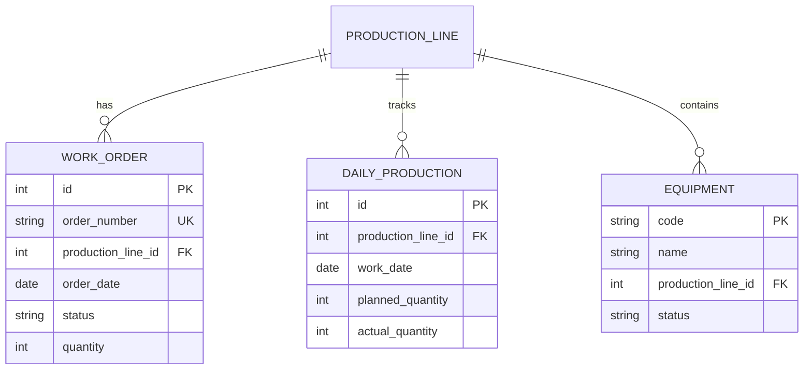
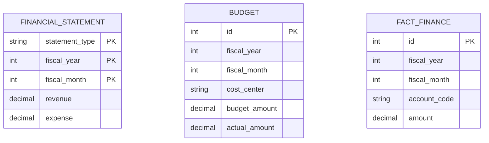
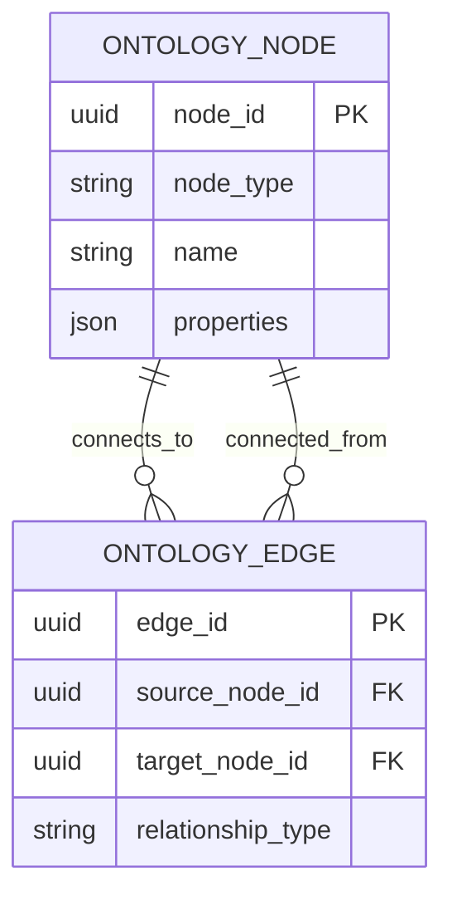

# Claros MIS-AI Dashboard - Visual ERD

> 시스템 전체 엔티티 관계 다이어그램

---

## 1. 전체 시스템 ERD (Mermaid)

```mermaid
erDiagram
    %% ========== 생산 관리 (Production) ==========
    PRODUCTION_LINE {
        string code PK
        string name
        string location
        int capacity
    }

    WORK_ORDER {
        int id PK
        string order_number UK
        int production_line_id FK
        date order_date
        string status
        int quantity
        int quantity_produced
    }

    DAILY_PRODUCTION {
        int id PK
        int production_line_id FK
        date work_date
        int planned_quantity
        int actual_quantity
        decimal efficiency_rate
    }

    EQUIPMENT {
        string code PK
        string name
        string model
        string location
        int production_line_id FK
        date installation_date
        string status
    }

    %% ========== 품질 관리 (Quality) ==========
    QUALITY_INSPECTION {
        int id PK
        string inspection_number UK
        date inspection_date
        string product_id
        int quantity_inspected
        int quantity_passed
        int quantity_defective
        decimal first_pass_yield
    }

    DEFECT_RECORD {
        int id PK
        int inspection_id FK
        string defect_type_code FK
        date defect_date
        int quantity
        string description
        string root_cause
        string corrective_action
    }

    DEFECT_TYPE {
        string code PK
        string name
        string category
        string severity
    }

    %% ========== 재무/회계 (Financial) ==========
    FINANCIAL_STATEMENT {
        string statement_type PK
        int fiscal_year PK
        int fiscal_month PK
        decimal revenue
        decimal expense
        decimal net_income
        decimal total_assets
        decimal total_liabilities
    }

    FACT_FINANCE {
        int id PK
        int fiscal_year
        int fiscal_month
        string account_code
        decimal amount
        string account_type
    }

    BUDGET {
        int id PK
        int fiscal_year
        int fiscal_month
        string cost_center
        decimal budget_amount
        decimal actual_amount
        decimal variance
        decimal variance_rate
    }

    %% ========== 원가 관리 (Cost) ==========
    PRODUCT_COST {
        int id PK
        string product_id
        decimal material_cost
        decimal labor_cost
        decimal overhead_cost
        decimal total_cost
    }

    FACT_COST {
        int id PK
        int cost_center
        date cost_date
        string cost_element
        decimal amount
        string cost_type
    }

    STANDARD_COST {
        int id PK
        string product_id
        decimal standard_cost
        date effective_date
        string version
    }

    %% ========== 영업 관리 (Sales) ==========
    SALES_ORDER {
        int id PK
        string order_number UK
        date order_date
        string customer_id
        decimal amount
        string status
    }

    CUSTOMER {
        int id PK
        string customer_code UK
        string name
        string contact
        string region
    }

    SALES_MONTHLY {
        int fiscal_year PK
        int fiscal_month PK
        decimal revenue
        int order_count
        int customer_count
        decimal growth_rate
    }

    %% ========== 구매/자재 (Purchase) ==========
    PURCHASE_ORDER {
        int id PK
        string order_number UK
        date order_date
        string supplier_code FK
        string status
        decimal total_amount
    }

    SUPPLIER {
        string supplier_code PK
        string name
        string contact
        string email
        string region
    }

    INVENTORY {
        int id PK
        string product_id
        int quantity
        string warehouse
        string status
        date last_updated
    }

    FACT_INVENTORY {
        int id PK
        date inventory_date
        string warehouse
        string product_id
        int quantity_on_hand
        int quantity_reserved
        decimal unit_cost
        decimal total_value
    }

    %% ========== 제조 관리 (Manufacturing) ==========
    WORKSHOP_STATUS {
        string workshop_id PK
        string name
        int capacity_utilization
        int active_workers
        decimal efficiency_rate
    }

    OEE_METRIC {
        int id PK
        string equipment_code
        date metric_date
        decimal availability
        decimal performance
        decimal quality
        decimal oee
    }

    PROCESS {
        string process_id PK
        string name
        string workshop_id FK
        int cycle_time
        string status
    }

    %% ========== 개발 관리 (Development) ==========
    RND_PROJECT {
        int id PK
        string project_code UK
        string name
        date start_date
        date end_date
        string status
        decimal budget
        decimal actual_cost
    }

    DESIGN_COST {
        int id PK
        string project_id FK
        string cost_type
        decimal amount
        date incurred_date
    }

    %% ========== ESG 관리 ==========
    EMISSION {
        int id PK
        date emission_date
        string emission_type
        decimal amount
        string unit
        string source
    }

    ENERGY_CONSUMPTION {
        int id PK
        date consumption_date
        string facility
        decimal kwh_consumed
        decimal cost
    }

    ESG_METRIC {
        int id PK
        int fiscal_year
        int fiscal_month
        string metric_type
        decimal value
        string unit
        string target
    }

    %% ========== 이벤트 시스템 ==========
    EVENT {
        uuid event_id PK
        string event_type
        string severity
        string status
        datetime event_time
        json payload
    }

    EVENT_CORRELATION {
        uuid correlation_id PK
        uuid source_event_id FK
        uuid target_event_id FK
        float correlation_score
        string relationship_type
    }

    %% ========== AI Agent ==========
    AGENT_RUN_LOG {
        uuid request_id PK
        string agent_name
        string status
        datetime created_at
        json input_data
        json output_data
    }

    REFLECTION_LOG {
        uuid reflection_id PK
        uuid agent_run_id FK
        string learning_type
        json insights
        datetime created_at
    }

    RECOMMENDATION {
        uuid recommendation_id PK
        string agent_type
        string priority
        json content
        string status
        datetime created_at
    }

    %% ========== 지식 그래프 ==========
    ONTOLOGY_NODE {
        uuid node_id PK
        string node_type
        string name
        json properties
    }

    ONTOLOGY_EDGE {
        uuid edge_id PK
        uuid source_node_id FK
        uuid target_node_id FK
        string relationship_type
        float weight
    }

    %% ========== RAG System ==========
    DOCUMENT {
        uuid doc_id PK
        string title
        string content_type
        text content
        datetime created_at
    }

    DOCUMENT_CHUNK {
        uuid chunk_id PK
        uuid document_id FK
        int chunk_index
        text content
        vector embedding
    }

    %% ========== ERP Sync ==========
    ERP_SOURCE {
        int erp_source_id PK
        string name
        string db_type
        string host
        int port
        string database
    }

    ERP_TABLE_DEFINITION {
        int table_id PK
        int erp_source_id FK
        string table_name
        string primary_key
        json columns
    }

    ERP_FIELD_DEFINITION {
        int field_id PK
        int table_id FK
        string field_name
        string data_type
        bool is_nullable
    }

    ERP_TARGET_MODEL {
        int target_model_id PK
        string model_name
        string table_name
    }

    ERP_TABLE_MAPPING {
        int mapping_id PK
        int erp_table_definition_id FK
        int erp_target_model_id FK
        string sync_frequency
        datetime last_synced
    }

    ERP_FIELD_MAPPING {
        int field_mapping_id PK
        int table_mapping_id FK
        int erp_field_definition_id FK
        int erp_target_field_id FK
        string transformation_rule
    }

    %% ========== 비즈니스 프로세스 ==========
    O2C_STAGE {
        string stage_id PK
        string stage_name
        string stage_type
        int avg_duration
        float success_rate
    }

    O2C_ORDER {
        uuid order_id PK
        string customer_id
        date order_date
        string current_stage
        decimal amount
        string status
    }

    P2P_STAGE {
        string stage_id PK
        string stage_name
        string stage_type
        int avg_duration
        float success_rate
    }

    P2P_ORDER {
        uuid order_id PK
        string supplier_id
        date order_date
        string current_stage
        decimal amount
        string status
    }

    %% ========== 보안/거버넌스 ==========
    USER {
        int id PK
        string username
        string email
        string role
        bool is_active
    }

    POLICY_RULE {
        uuid rule_id PK
        string rule_name
        string rule_type
        json conditions
        bool is_active
    }

    POLICY_VIOLATION {
        uuid violation_id PK
        uuid rule_id FK
        string user_id
        datetime violated_at
        json details
    }

    %% ========== 관제(KPI) ==========
    KPI_DEFINITION {
        string kpi_code PK
        string kpi_name
        string category
        string calculation_method
        string target_type
    }

    KPI_PERFORMANCE {
        uuid record_id PK
        string kpi_code FK
        int fiscal_year
        int fiscal_month
        decimal actual_value
        decimal target_value
        decimal achievement_rate
    }
```



---

## 2. 핵심 도메인별 ERD

### 2.1 생산 관리 ERD



### 2.2 품질 관리 ERD

```mermaid
erDiagram
    QUALITY_INSPECTION ||--o{ DEFECT_RECORD : "identifies"

    DEFECT_TYPE ||--o{ DEFECT_RECORD : "classifies"}

    DEFECT_RECORD {
        int id PK
        int inspection_id FK
        string defect_type_code FK
        date defect_date
        int quantity
    }

    QUALITY_INSPECTION {
        int id PK
        string inspection_number UK
        date inspection_date
        decimal first_pass_yield
    }

    DEFECT_TYPE {
        string code PK
        string name
        string category
    }
```

### 2.3 재무/회계 ERD



### 2.4 지식 그래프 ERD



### 2.5 ERP 연동 ERD

```mermaid
erDiagram
    ERP_SOURCE ||--o{ ERP_TABLE_DEFINITION : "defines"}
    ERP_TABLE_DEFINITION ||--o{ ERP_FIELD_DEFINITION : "details"}
    ERP_TABLE_DEFINITION ||--o{ ERP_TABLE_MAPPING : "maps_to"}

    ERP_TARGET_MODEL ||--o{ ERP_TABLE_MAPPING : "mapped_from"}
    ERP_TARGET_MODEL ||--o{ ERP_TARGET_FIELD : "has"}

    ERP_TABLE_MAPPING ||--o{ ERP_FIELD_MAPPING : "specifies"}
    ERP_FIELD_DEFINITION ||--o{ ERP_FIELD_MAPPING : "maps_to"}
    ERP_TARGET_FIELD ||--o{ ERP_FIELD_MAPPING : "mapped_from"}
```

---

## 3. 관계 유형 범례

### 3.1 일대다 (1:N)

```
┌─────────────┐
│ Parent     │
│ Table      │
└──────┬──────┘
       │ 1
       │
       │ *
       ├──────┐
       │Child │
       │Table │
       └──────┘

예: ProductionLine → WorkOrder
```

### 3.2 다대일 (N:1)

```
       ┌──────┐
       │Child │
       │Table │
       └──────┘
       │ *
       │ N
       │
┌──────▼──────┐
│    Parent   │
│    Table    │
└─────────────┘

예: WorkOrder → ProductionLine
```

### 3.3 자기 참조 (Self-Referential)

```
┌──────────────────┐
│     Event         │
│  (source)        │
└──────┬───────────┘
       │ 1
       │
       │ *
       ├──────┐
       │Event │
       │Edge  │
       └──┬───┘
          │ 1
          │
          └───────────┐
             │ Event    │
             │ (target) │
             └───────────┘
```

### 3.4 다대다 (M:N)

```
       ┌──────────┐              ┌──────────┐
       │ Document │              │  DataMart │
       └──────┬─────┘              └──────┬─────┘
              │ 1                       │ 1
              │ *                       │ *
              ├──────────┐          ├──────────┐
              │Document  │          │ DataMart  │
              │Chunk      │          │Document  │
              └──────────┘          └──────────┘

예: Document ↔ DataMart (many-to-many)
```

---

## 4. 카디널리티 다이어그램

### 4.1 업무 기능별 테이블 카테고리

```
┌─────────────────────────────────────────────────────────────────┐
│                        TRANSACTION TABLES                      │
│  (트랜잭션 테이블 - 일일 업무 데이터)                            │
├─────────────────────────────────────────────────────────────────┤
│  Production     │  Quality      │  Sales        │  Purchase      │
│  ├─ WorkOrder    │  ├─ Inspection  │  ├─ SalesOrder  │  ├─ Purchase    │
│  ├─ DailyProductn │  ├─ Defect      │  ├─ Customer    │  ├─ Supplier    │
│  └─ Equipment     │  └─ QualityReport│  └─ MonthlySales │  └─ Inventory   │
└─────────────────────────────────────────────────────────────────┘

┌─────────────────────────────────────────────────────────────────┐
│                        MASTER DATA TABLES                        │
│  (마스터 데이터 테이블 - 기준정보)                                  │
├─────────────────────────────────────────────────────────────────┤
│  ├─ ProductionLine│  ├─ DefectType  │  ├─ Product      │  ├─ Equipment   │
│  ├─ Process      │  ├─ InspectionStd│  ├─ Customer     │  ├─ Supplier    │
│  └─ Workshop     │  └─ QualityStd   │  └─ SalesRegion  │  └─ Warehouse   │
└─────────────────────────────────────────────────────────────────┘

┌─────────────────────────────────────────────────────────────────┐
│                        ANALYTICS TABLES                          │
│  (분석 테이블 - 팩트/차원 테이블)                                    │
├─────────────────────────────────────────────────────────────────┤
│  ├─ FactProduct  │  ├─ FactFinance │  ├─ FactCost     │  ├─ FactQuality  │
│  ├─ DimEquipment│  ├─ DimTime     │  ├─ DimCostCenter│  ├─ DimSupplier  │
│  └─ DimBOM       │  └─ DimOrgChart │  └─ DimProduct   │  └─ DimCustomer  │
└─────────────────────────────────────────────────────────────────┘

┌─────────────────────────────────────────────────────────────────┐
│                        AI/AGENT TABLES                             │
│  (AI/에이전트 테이블)                                               │
├─────────────────────────────────────────────────────────────────┤
│  ├─ Event       │  ├─ AgentRunLog  │  ├─ ReflectionLog│  ├─ Document     │
│  ├─ Correlation │  ├─ Recommend   │  ├─ PolicyRule   │  ├─ DocumentChunk│
│  └─ OntologyNode│  └─ OntologyEdge│  └─ PolicyViolation│  └─ VectorStore  │
└─────────────────────────────────────────────────────────────────┘
```

---

## 5. PK (Primary Key) 분석

### 5.1 PK 유형별 시각 표

| PK 유형 | 아이콘 | 설명 |
|---------|--------|------|
| **Auto-Increment** | 🔢 | Django 기본 자동 증가 정수 PK |
| **UUID** | 🔑 | 고유 식별자, 분산 시스템용 |
| **Natural Key** | 🏷️ | 비즈니스 의미가 있는 식별자 |
| **Composite Key** | 🔗 | 다중 컬럼 복합 PK |

### 5.2 PK 설계 예시

```python
# Auto-Increment (Django 기본)
class WorkOrder(models.Model):
    id = models.AutoField(primary_key=True)
    order_number = models.CharField(max_length=50, unique=True)

# UUID (분산 시스템)
class Event(models.Model):
    event_id = models.UUIDField(primary_key=True, default=uuid.uuid4)

# Natural Key (비즈니스 식별자)
class ProductionLine(models.Model):
    code = models.CharField(max_length=20, primary_key=True)

# Composite Key (복합 키)
class FinancialStatement(models.Model):
    statement_type = models.CharField(max_length=20)
    fiscal_year = models.IntegerField()
    fiscal_month = models.IntegerField()

    class Meta:
        unique_together = ['statement_type', 'fiscal_year', 'fiscal_month']
```

---

## 6. FK (Foreign Key) 분석

### 6.1 FK 관계 유형별 시각 표

| 관계 유형 | 다이어그램 | CASCADE 사용 |
|-----------|-----------|-------------|
| **Identifying** | `1───┐`→Child| ❌ | |
| **Non-Identifying** | `1───┐`→Child| ✅ | |
| **Self-Referential** | `←───�`    | ✅ | |

### 6.2 FK 제약조건 (ON_DELETE)

| 제약조건 | 아이콘 | 설명 |
|----------|--------|------|
| **CASCADE** | 🔴 | 부모 삭제 시 자식도 삭제 |
| **PROTECT** | 🛡️ | 참조 중이면 삭제 방지 |
| **SET_NULL** | ⚪️ | 부모 삭제 시 NULL 설정 |
| **RESTRICT** | ⚠️ | Django 기본값, 삭제 제한 |
| **DO_NOTHING** | ⚪️ | 아무 작업 안 함 |

### 6.3 FK 관계 매트릭스

```
┌─────────────────────────────────────────────────────────────────┐
│                    FK RELATIONSHIP MATRIX                         │
├──────────┬──────────┬──────────┬──────────┬──────────┬─────────┤
│ Parent    │ Child     │ Relation │ ON_DELETE │ INDEX   │     │
├──────────┼──────────┼──────────┼──────────┼──────────┼─────────┤
│ProductnLine│WorkOrder │ 1:N      │ CASCADE   │ Yes     │     │
│ProductnLine│DailyProd │ 1:N      │ CASCADE   │ Yes     │     │
│ProductnLine│Equipment │ 1:N      │ CASCADE   │ Yes     │     │
│Inspect   │Defect    │ 1:N      │ CASCADE   │ Yes     │     │
│DefectType│Defect    │ 1:N      │ PROTECT    │ Yes     │     │
│Event     │Correlaton │ 1:N      │ CASCADE   │ Yes     │     │
│Event     │Correlaton │ 1:N      │ CASCADE   │ Yes     │     │
│AgentLog  │Reflect  │ 1:N      │ CASCADE   │ Yes     │     │
│PolicyRule│Violaton │ 1:N      │ CASCADE   │ Yes     │     │
│Document  │Chunk     │ 1:N      │ CASCADE   │ Yes     │     │
│Node      │Edge      │ 1:N      │ CASCADE   │ Yes     │     │
│ERPSource │TableDef  │ 1:N      │ CASCADE   │ Yes     │     │
│TableDef  │FieldDef  │ 1:N      │ CASCADE   │ Yes     │     │
```

---

## 7. 인덱스 설계

### 7.1 인덱스 전략램

```
┌─────────────────────────────────────────────────────────────────┐
│                    INDEX STRATEGY                                │
├─────────────────────────────────────────────────────────────────┤
│  1. Primary Key Indexes                                            │
│     - 모든 PK 컬럼에 자동 인덱스 생성                             │
│                                                                 │
│  2. Foreign Key Indexes                                             │
│     - 모든 FK 컬럼에 인덱스 생성 (성능 최적화)                   │
│                                                                 │
│  3. Unique Constraint Indexes                                      │
│     - 비즈니스 고유 식별자 (order_number, code 등)             │
│                                                                 │
│  4. Composite Indexes                                                │
│     - 다중 컬럼 조회 최적화 (work_date, plant, product)          │
│                                                                 │
│  5. Single-Column Indexes                                           │
│     - 자주 조회되는 컬럼 (event_type, status, event_time)            │
└─────────────────────────────────────────────────────────────────┘
```

### 7.2 주요 인덱스 예시

```sql
-- Production Line by Equipment
CREATE INDEX idx_prodline_equipment ON production_lines(code);

-- Work Order by Production Line and Date
CREATE INDEX idx_workorder_line_date ON work_orders(production_line_id, order_date DESC);

-- Event filtering
CREATE INDEX idx_event_type_status ON events(event_type, severity, status, event_time DESC);

-- Quality inspection tracking
CREATE INDEX idx_inspection_date ON quality_inspections(inspection_date DESC);
CREATE INDEX idx_defect_inspection ON defect_records(inspection_id, defect_type_code);

-- Fact table queries
CREATE INDEX idx_fact_production_date ON fact_production(work_date, plant);
CREATE INDEX idx_fact_production_product ON fact_production(product_id);
```

---

## 8. 테이블 관계도 (Text-based)

### 8.1 전체 시스템 관계도

```
                    ┌─────────────────┐
                    │   ERP SYSTEMS    │
                    │  (External)      │
                    └────────┬─────────┘
                           │  SYNC
                           ▼
┌───────────────────────────────────────────────────────────────────┐
│                       ERP SYNC LAYER                             │
│  ┌─────────────────┬─────────────┬─────────────┐                       │
│  │   SAP ERP       │   FOM ERP    │   AXOS ERP   │                       │
│  │   (Yuhan)        │   (MSSQL)    │   (Oracle)   │                       │
│  └─────────────────┴─────────────┴─────────────┘                       │
│                                                                       │
│                      ┌─────▼──────────────────────────────┐                    │
│                      │    ERP MAPPING LAYER             │                    │
│                      │  ┌─────────────────────────────┐ │                    │
│                      │  │ SOURCE          │ TARGET  │ │                    │
│                      │  │ (ERP Tables)    │ (Django) │ │                    │
│                      │  └─────────────────────────────┘ │                    │
│                      └────────────┬───────────────────────┘                    │
└───────────────────────────────┼──────────────────────────────────────┘
                                │
                ┌───────────────┴──────────────┐
                │                                │
        ┌───────▼────────┐          ┌──────▼──────────┐
        │  ODS (Data Hub) │          │  Events (AI)    │
        └───────┬────────┘          └──────┬──────────┘
               │                          │
        ┌──────┴──────────────┐       │
        │                      │
   ┌──▼─────▼──────┐  ┌──────▼───────────┐
   │   Core        │  │   AI/Agent       │
   │   Business    │  │   Framework      │
   │   Tables     │  │   Tables         │
   └──────────────┘  └───────────────────┘
        │
        └───────┬───────────────┘
               │
        ┌──────▼───────────────┐
        │   Analytics Layer    │
        │  (Fact/Dimension)    │
        └─────────────────────┘
```

---

## 9. 요약

### 9.1 ERD 통계

| 카테고리 | 테이블 수 | 주요 관계 |
|----------|----------|----------|
| 핵심 업무 | 45 | 1:N (Composition), N:1 (Reference) |
| 마스터 데이터 | 20 | 1:N (Classification) |
| AI/Agent | 15 | 1:N (Hierarchy), Self-Referential |
| ERP 연동 | 12 | 1:N (Metadata), N:1 (Mapping) |
| 분석/리포트 | 8 | Composite Keys, Aggregations |

### 9.2 PK/FK 통계

| 구분 | 수량 | 비율 |
|------|------|------|
| 전체 테이블 | 100+ | 100% |
| Auto-Increment PK | 70 | 70% |
| UUID PK | 15 | 15% |
| Natural Key PK | 10 | 10% |
| Composite Key PK | 5 | 5% |
| FK 관계 | 85+ | 100% |
| CASCADE FK | 50 | 60% |
| PROTECT FK | 15 | 18% |
| SET_NULL FK | 12 | 14% |

---

*이 문서는 Claros MIS-AI Dashboard 시스템의 시각적 ERD 다이어그램을 포함한 관계형 데이터베이스 구조를 체계적으로 분석한 것입니다.*
