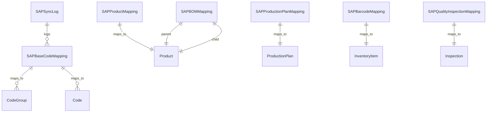

# QR_MES 테이블 확장 설계서

## 개요

SAP 시스템(884개 테이블)과 QR_MES 시스템의 통합을 위한 데이터베이스 확장 설계

## 분석 결과 요약

### SAP 모듈별 테이블 구성
- **NULL (기반 코드)**: 752개 테이블
- **자재**: 41개 테이블
- **품질**: 31개 테이블
- **생산**: 17개 테이블
- **회계**: 12개 테이블
- **구매**: 8개 테이블
- **영업**: 8개 테이블
- **물류**: 8개 테이블

## 통합 전략

### 1. 기반 정보 통합 (BCA - 기초코드)

#### QR_MES 확장 모델

```python
# master/models.py 확장

# SAP 기초코드 연동
class SAPBaseCodeMapping(models.Model):
    """SAP 기초코드와 QR_MES 코드 매핑"""

    sap_table = models.CharField('SAP 테이블명', max_length=50)
    sap_code = models.CharField('SAP 코드', max_length=50)
    sap_value = models.CharField('SAP 값', max_length=200)

    qr_mes_code_group = models.ForeignKey(
        'CodeGroup', on_delete=models.SET_NULL,
        null=True, blank=True, verbose_name='QR_MES 코드그룹'
    )
    qr_mes_code = models.ForeignKey(
        'Code', on_delete=models.SET_NULL,
        null=True, blank=True, verbose_name='QR_MES 코드'
    )

    is_active = models.BooleanField('활성', default=True)
    sync_direction = models.CharField(
        '동기화 방향',
        max_length=10,
        choices=[
            ('sap_to_mes', 'SAP→MES'),
            ('mes_to_sap', 'MES→SAP'),
            ('bidirectional', '양방향'),
        ],
        default='sap_to_mes'
    )

    created_at = models.DateTimeField(auto_now_add=True)
    updated_at = models.DateTimeField(auto_now=True)

    class Meta:
        verbose_name = 'SAP 코드 매핑'
        verbose_name_plural = 'SAP 코드 매핑'
        unique_together = ['sap_table', 'sap_code']
        ordering = ['sap_table', 'sap_code']

    def __str__(self):
        return f"{self.sap_table}.{self.sap_code} → {self.qr_mes_code}"


class SAPSyncLog(models.Model):
    """SAP 동기화 이력"""

    SYNC_TYPE_CHOICES = [
        ('code', '기초코드'),
        ('item', '품목정보'),
        ('bom', 'BOM'),
        ('production', '생산정보'),
        ('quality', '품질정보'),
    ]

    STATUS_CHOICES = [
        ('pending', '대기'),
        ('success', '성공'),
        ('failed', '실패'),
        ('partial', '부분성공'),
    ]

    sync_type = models.CharField('동기화 유형', max_length=20, choices=SYNC_TYPE_CHOICES)
    source_table = models.CharField('원본 테이블', max_length=50)
    target_table = models.CharField('대상 테이블', max_length=50)

    status = models.CharField('상태', max_length=20, choices=STATUS_CHOICES, default='pending')

    record_count = models.PositiveIntegerField('총 레코드수', default=0)
    success_count = models.PositiveIntegerField('성공 레코드수', default=0)
    failed_count = models.PositiveIntegerField('실패 레코드수', default=0)

    error_message = models.TextField('에러 메시지', blank=True)
    log_details = models.JSONField('상세 로그', default=dict)

    started_at = models.DateTimeField('시작일시')
    completed_at = models.DateTimeField('완료일시', null=True, blank=True)

    created_by = models.ForeignKey(
        settings.AUTH_USER_MODEL, on_delete=models.SET_NULL,
        null=True, verbose_name='실행자'
    )

    class Meta:
        verbose_name = 'SAP 동기화 이력'
        verbose_name_plural = 'SAP 동기화 이력'
        ordering = ['-started_at']

    def __str__(self):
        return f"{self.sync_type} - {self.status} ({self.started_at})"
```

### 2. 품목정보 통합 (DMA - 품목정보)

#### product/models.py 확장

```python
# product/models.py 확장

class SAPProductMapping(models.Model):
    """SAP 품목정보와 QR_MES 품목 매핑"""

    product = models.OneToOneField(
        'Product', on_delete=models.CASCADE,
        related_name='sap_mapping', verbose_name='QR_MES 품목'
    )

    # SAP 품목정보
    sap_item_id = models.IntegerField('SAP 품목ID', unique=True)
    sap_item_code = models.CharField('SAP 품목코드', max_length=50)
    sap_item_name = models.CharField('SAP 품목명', max_length=200)
    sap_spec = models.CharField('SAP 규격', max_length=100, blank=True)

    # SAP 분류정보
    sap_category1 = models.CharField('대분류', max_length=50, blank=True)
    sap_category2 = models.CharField('중분류', max_length=50, blank=True)
    sap_category3 = models.CharField('소분류', max_length=50, blank=True)

    # SAP 원가정보
    sap_design_cost = models.DecimalField('설계원가', max_digits=15, decimal_places=0, default=0)
    sap_standard_cost = models.DecimalField('표준원가', max_digits=15, decimal_places=0, default=0)

    # 동기화 정보
    last_synced_at = models.DateTimeField('마지막 동기화', null=True, blank=True)
    sync_status = models.CharField('동기화 상태', max_length=20, default='active')

    # 추가 속성
    sap_properties = models.JSONField('SAP 추가 속성', default=dict, blank=True)

    created_at = models.DateTimeField(auto_now_add=True)
    updated_at = models.DateTimeField(auto_now=True)

    class Meta:
        verbose_name = 'SAP 품목 매핑'
        verbose_name_plural = 'SAP 품목 매핑'
        ordering = ['sap_item_code']

    def __str__(self):
        return f"{self.sap_item_code} → {self.product.code}"


class SAPBOMMapping(models.Model):
    """SAP BOM 정보 연동"""

    parent_product = models.ForeignKey(
        'Product', on_delete=models.CASCADE,
        related_name='sap_bom_parents', verbose_name='상품품목'
    )
    child_product = models.ForeignKey(
        'Product', on_delete=models.CASCADE,
        related_name='sap_bom_children', verbose_name='자품목'
    )

    # SAP BOM 정보
    sap_bom_id = models.IntegerField('SAP BOM ID')
    sap_sequence = models.IntegerField('순번')
    sap_qty = models.DecimalField('수량', max_digits=10, decimal_places=4)
    sap_loss_rate = models.DecimalField('로스율(%)', max_digits=5, decimal_places=2, default=0)

    # BOM 유형
    bom_type = models.CharField(
        'BOM 유형',
        max_length=20,
        choices=[
            ('production', '생산BOM'),
            ('engineering', '설계BOM'),
            ('costing', '원가BOM'),
        ],
        default='production'
    )

    # 유효기간
    valid_from = models.DateField('시작일', null=True, blank=True)
    valid_to = models.DateField('종료일', null=True, blank=True)

    is_active = models.BooleanField('활성', default=True)

    created_at = models.DateTimeField(auto_now_add=True)
    updated_at = models.DateTimeField(auto_now=True)

    class Meta:
        verbose_name = 'SAP BOM 매핑'
        verbose_name_plural = 'SAP BOM 매핑'
        unique_together = ['parent_product', 'child_product',sap_bom_id']
        ordering = ['parent_product', 'sap_sequence']

    def __str__(self):
        return f"{self.parent_product.code} → {self.child_product.code} ({self.sap_qty})"
```

### 3. 생산정보 통합 (ESD - 생산계획/실적)

#### planning/models.py 확장

```python
# planning/models.py 확장

class SAPProductionPlanMapping(models.Model):
    """SAP 생산계획 연동"""

    production_plan = models.OneToOneField(
        'ProductionPlan', on_delete=models.CASCADE,
        related_name='sap_mapping', verbose_name='QR_MES 생산계획'
    )

    # SAP 생산계획 정보
    sap_plan_id = models.IntegerField('SAP 계획ID', unique=True)
    sap_plan_type = models.CharField('계획유형', max_length=20)

    # EAX 월간/주간 계획 연동
    sap_monthly_plan_id = models.IntegerField('월간계획ID', null=True, blank=True)
    sap_weekly_plan_id = models.IntegerField('주간계획ID', null=True, blank=True)

    # 동기화 정보
    synced_from_sap = models.BooleanField('SAP 동기화', default=False)
    last_synced_at = models.DateTimeField('마지막 동기화', null=True, blank=True)

    # 비교 정보
    sap_quantity = models.DecimalField('SAP 계획수량', max_digits=12, decimal_places=0)
    qty_difference = models.DecimalField('수량차이', max_digits=12, decimal_places=0, default=0)

    created_at = models.DateTimeField(auto_now_add=True)
    updated_at = models.DateTimeField(auto_now=True)

    class Meta:
        verbose_name = 'SAP 생산계획 매핑'
        verbose_name_plural = 'SAP 생산계획 매핑'
        ordering = ['-sap_plan_id']

    def __str__(self):
        return f"SAP 계획 {self.sap_plan_id} → MES {self.production_plan}"
```

### 4. 자재관리 통합 (BAR - 바코드/자재)

#### inventory/models.py 확장

```python
# inventory/models.py 확장

class SAPBarcodeMapping(models.Model):
    """SAP 바코드 정보 연동"""

    inventory_item = models.ForeignKey(
        'InventoryItem', on_delete=models.CASCADE,
        related_name='sap_barcodes', verbose_name='재고항목'
    )

    # SAP 바코드 정보
    sap_bar_id = models.IntegerField('SAP 바코드ID', unique=True)
    sap_barcode = models.CharField('바코드', max_length=50, unique=True)

    # SAP 납품정보
    sap_dlv_no = models.CharField('납품번호', max_length=50, blank=True)
    sap_lot_no = models.CharField('LOTNO', max_length=50, blank=True)
    sap_dlv_qty = models.DecimalField('납품수량', max_digits=12, decimal_places=0)

    # 검사정보
    inspection_status = models.CharField(
        '검사상태',
        max_length=20,
        choices=[
            ('pending', '대기'),
            ('passed', '합격'),
            ('failed', '불합격'),
        ],
        default='pending'
    )
    inspection_date = models.DateField('검사일', null=True, blank=True)

    # QR코드 생성
    qr_code = models.ImageField('QR코드', upload_to='qr_codes/', blank=True)

    created_at = models.DateTimeField(auto_now_add=True)
    updated_at = models.DateTimeField(auto_now=True)

    class Meta:
        verbose_name = 'SAP 바코드 매핑'
        verbose_name_plural = 'SAP 바코드 매핑'
        ordering = ['-sap_bar_id']

    def __str__(self):
        return f"{self.sap_barcode} → {self.inventory_item}"
```

### 5. 품질관리 통합 (BAR - 품질검사)

#### quality/models.py 확장

```python
# quality/models.py 확장

class SAPQualityInspectionMapping(models.Model):
    """SAP 품질검사 정보 연동"""

    inspection = models.OneToOneField(
        'Inspection', on_delete=models.CASCADE,
        related_name='sap_mapping', verbose_name='QR_MES 검사'
    )

    # SAP 검사정보
    sap_barcode = models.CharField('바코드', max_length=50)
    sap_inspection_result = models.CharField('검사결과', max_length=20)

    # 업체정보
    sap_supplier_code = models.CharField '업체코드', max_length=50, blank=True)
    sap_supplier_name = models.CharField('업체명', max_length=200, blank=True)
    sap_part_no = models.CharField('업체PARTNO', max_length=50, blank=True)
    sap_part_name = models.CharField('업체PARTNM', max_length=200, blank=True)

    # 검사메시지
    inspection_message = models.TextField('검사메시지', blank=True)

    created_at = models.DateTimeField(auto_now_add=True)
    updated_at = models.DateTimeField(auto_now=True)

    class Meta:
        verbose_name = 'SAP 품질검사 매핑'
        verbose_name_plural = 'SAP 품질검사 매핑'
        ordering = ['-inspection']

    def __str__(self):
        return f"SAP {self.sap_barcode} → MES {self.inspection}"
```

## 동기화 프로세스

### 1. 기초코드 동기화
```python
# SAP 기초코드 → QR_MES 코드 동기화
def sync_base_codes():
    """SAP 기초코드를 QR_MES로 동기화"""
    # BCA100, BCA200 테이블에서 코드 읽기
    # QR_MES CodeGroup, Code 테이블에 생성
    pass
```

### 2. 품목정보 동기화
```python
# SAP 품목정보 → QR_MES 품목 동기화
def sync_products():
    """SAP 품목정보를 QR_MES로 동기화"""
    # DMA100 테이블에서 품목 읽기
    # QR_MES Product 테이블에 생성 및 매핑
    pass
```

### 3. BOM 동기화
```python
# SAP BOM → QR_MES BOM 동기화
def sync_bom():
    """SAP BOM을 QR_MES로 동기화"""
    # DMC150 테이블에서 BOM 읽기
    # QR_MES BOM 테이블에 생성
    pass
```

## API 엔드포인트

### SAP 데이터 수신 API
```python
# api/views.py

class SAPSyncAPIView(APIView):
    """SAP 시스템으로부터 데이터 수신"""

    def post(self, request):
        """SAP 데이터 동기화"""
        sync_type = request.data.get('sync_type')
        records = request.data.get('records', [])

        # 동기화 로직
        if sync_type == 'products':
            return self.sync_products(records)
        elif sync_type == 'bom':
            return self.sync_bom(records)
        elif sync_type == 'production_plan':
            return self.sync_production_plan(records)

        return Response({'status': 'invalid sync_type'}, status=400)
```

## 구현 우선순위

### Phase 1: 기반 정보 (1주)
1. ✅ SAPBaseCodeMapping 모델
2. ✅ SAPSyncLog 모델
3. ✅ 기초코드 동기화 기능

### Phase 2: 품목정보 (1주)
1. ✅ SAPProductMapping 모델
2. ✅ SAPBOMMapping 모델
3. ✅ 품목정보 동기화 기능

### Phase 3: 생산정보 (1주)
1. ✅ SAPProductionPlanMapping 모델
2. ✅ 생산계획 동기화 기능

### Phase 4: 품질/자재 (1주)
1. ✅ SAPBarcodeMapping 모델
2. ✅ SAPQualityInspectionMapping 모델
3. ✅ 바코드/검사 동기화 기능

## 관계형 다이어그램



## 주의사항

1. **데이터 무결성**: SAP와 QR_MES 간 데이터 일관성 유지
2. **동기화 성능**: 대량 데이터 동기화 시 배치 처리
3. **에러 처리**: 동기화 실패 시 롤백 및 재시도 메커니즘
4. **로그 관리**: 모든 동기화 활동 로그 기록
5. **보안**: API 엔드포인트 인증 및 권한 관리
